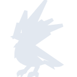
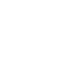

# cdprojekt

[← Back to main README](../../README.md)





## 16 px

### black
```
https://georgegach.github.io/compatible-icons/simple-icons/cdprojekt/16/black.png
```

### slate
```
https://georgegach.github.io/compatible-icons/simple-icons/cdprojekt/16/slate.png
```

### white
```
https://georgegach.github.io/compatible-icons/simple-icons/cdprojekt/16/white.png
```

## 64 px

### black
```
https://georgegach.github.io/compatible-icons/simple-icons/cdprojekt/64/black.png
```

### slate
```
https://georgegach.github.io/compatible-icons/simple-icons/cdprojekt/64/slate.png
```

### white
```
https://georgegach.github.io/compatible-icons/simple-icons/cdprojekt/64/white.png
```

## 128 px

### black
```
https://georgegach.github.io/compatible-icons/simple-icons/cdprojekt/128/black.png
```

### slate
```
https://georgegach.github.io/compatible-icons/simple-icons/cdprojekt/128/slate.png
```

### white
```
https://georgegach.github.io/compatible-icons/simple-icons/cdprojekt/128/white.png
```

## 512 px

### black
```
https://georgegach.github.io/compatible-icons/simple-icons/cdprojekt/512/black.png
```

### slate
```
https://georgegach.github.io/compatible-icons/simple-icons/cdprojekt/512/slate.png
```

### white
```
https://georgegach.github.io/compatible-icons/simple-icons/cdprojekt/512/white.png
```

## 1024 px

### black
```
https://georgegach.github.io/compatible-icons/simple-icons/cdprojekt/1024/black.png
```

### slate
```
https://georgegach.github.io/compatible-icons/simple-icons/cdprojekt/1024/slate.png
```

### white
```
https://georgegach.github.io/compatible-icons/simple-icons/cdprojekt/1024/white.png
```

## 16 px in base64

### black
```
data:image/png;base64,iVBORw0KGgoAAAANSUhEUgAAABAAAAAQCAYAAAAf8/9hAAAABmJLR0QA/wD/AP+gvaeTAAABEklEQVQ4jZXSTSuEURQH8J+UjbdJFkpS9uMDKCkbewsbGzsrn8Ded7D0ASzZWLGwVzSSlyKmUMY0DMMYi3vUk+Yx419Pt3vv+b8851w6YxG7XdS1RRFvmPsPaQJbGMMNzv7ruokSjvCCpTgfb1fc82tfxD4G4u4Jz9JvNDETda957iW0UI+1iq8gX6GGUwy2IxfwkXFsZb4yjjGf5wxrUfwZjpVYG3jIxM/FKFaDVI/4j9iWetIR/bjLxG7gEH3dkH9wEeSmNIF3nGC6W4FqJkElBMpSUzfQ20lgRWrYj0gNB9IIv6RJTHUSmcUlbqVm7mA9Et2H4HAeeUR6yueYDOehuCvE2Z9Yxh4WpAd1LU0nF9+G6FLZ6pVNzwAAAABJRU5ErkJggg==
```

### slate
```
data:image/png;base64,iVBORw0KGgoAAAANSUhEUgAAABAAAAAQCAYAAAAf8/9hAAAABmJLR0QA/wD/AP+gvaeTAAAB40lEQVQ4jYWTvU+TURTGf+e+bwMItR9EKVUbweggQQcTBycTBuPK7mpMTFh1YDT6TzgwacJqYuJidHFQo9GVGIIFeWuhHyAgbd/7OJQIBUrPeM55Ps5zc6FHFUub0z9X66+7zcMTwVFlUvIvDH+n244dbqysrF9ohe6Jt8SjQK1PwE5hJH2lG4E73GgFwayTuxn45htEVj6eBSiurZ3r6aAYVSZl9h7ZkIFhVBF14K8gDv32LYB8Pr99rAMv5pFlwGK18+kXXJJ0VSLVcgO/m3bqS7lcTh5xsFitpoOGKyNtI+vD1Lfv0yLEukMz53PptwdF/79CuOvuCYXAICYTqoMlzSxGCr25+4WR1IeuIQbeXjrjAWCIhsOcQRXvX/W7xtjFkdNHwB0nRFE02GBgATS6N2oKff6znro9MWGN48AdDnK53BZoBwDJY37LsBtDw7WvxVLlWk+CNo4zbXFzklnbossi93E5qj2VFJxIYGgGsbZ3W8pQE2NBsOrh8XJp49tSqTbelaAwmpkjcNPAItgvQSBpE/xzoQ3QWYfN/ahUUvuiB6pYrGdJ6JlgquU1FTp7t5uIr18eHt5YrFbT2iE1ns8sHcR0/MY4iO86gnGMh4HjO1BPNpsxwFgmUwNqhzP4B64z0MI/WPQjAAAAAElFTkSuQmCC
```

### white
```
data:image/png;base64,iVBORw0KGgoAAAANSUhEUgAAABAAAAAQCAYAAAAf8/9hAAAABmJLR0QA/wD/AP+gvaeTAAABG0lEQVQ4jZXSPSvFcRQH8PNPWVwPyaAkZecFKCmL3WCx2Exegd17MHoBRhYTg10RyUMRCuUhz1wfwz3qJvf+Ocuvfr/zffh9z4koKUxitayvEXgILxj7D6gfS+jFKfb/q7qIXWzhEVN53/dbf/HTckSsR0Ql324i4i4iXiKiGhEjERFFUTw1Ut9Vq+c87/GJKo7xgD20/wbuwjvuMrj6usA2xpv9fS6bP1LxNs83XGGkLLwezCboOe1fYxmVpuAkaMN5ne03bKK1FFxHcpjgKm7wih0M/5Xgvs7BbRJcZKgLaCkjmMnAvusBGznCz5zEYBnJKI5wlmGuYD4dXSZhZyNwt9oqH2AglTvyrQsDZerTWMNELtQJ2pphvgB8DKGbKOxmJwAAAABJRU5ErkJggg==
```

