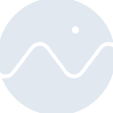

# cesium

[← Back to main README](../../README.md)

<table><tr>
  <td></td>
  <td></td>
  <td></td>
</tr></table>

## 16 px

### black
```
https://georgegach.github.io/compatible-icons/simple-icons/compat/cesium/16/black.png
```

### slate
```
https://georgegach.github.io/compatible-icons/simple-icons/compat/cesium/16/slate.png
```

### white
```
https://georgegach.github.io/compatible-icons/simple-icons/compat/cesium/16/white.png
```

## 64 px

### black
```
https://georgegach.github.io/compatible-icons/simple-icons/compat/cesium/64/black.png
```

### slate
```
https://georgegach.github.io/compatible-icons/simple-icons/compat/cesium/64/slate.png
```

### white
```
https://georgegach.github.io/compatible-icons/simple-icons/compat/cesium/64/white.png
```

## 128 px

### black
```
https://georgegach.github.io/compatible-icons/simple-icons/compat/cesium/128/black.png
```

### slate
```
https://georgegach.github.io/compatible-icons/simple-icons/compat/cesium/128/slate.png
```

### white
```
https://georgegach.github.io/compatible-icons/simple-icons/compat/cesium/128/white.png
```

## 512 px

### black
```
https://georgegach.github.io/compatible-icons/simple-icons/compat/cesium/512/black.png
```

### slate
```
https://georgegach.github.io/compatible-icons/simple-icons/compat/cesium/512/slate.png
```

### white
```
https://georgegach.github.io/compatible-icons/simple-icons/compat/cesium/512/white.png
```

## 1024 px

### black
```
https://georgegach.github.io/compatible-icons/simple-icons/compat/cesium/1024/black.png
```

### slate
```
https://georgegach.github.io/compatible-icons/simple-icons/compat/cesium/1024/slate.png
```

### white
```
https://georgegach.github.io/compatible-icons/simple-icons/compat/cesium/1024/white.png
```

## 16 px in base64

### black
```
data:image/png;base64,iVBORw0KGgoAAAANSUhEUgAAABAAAAAQCAYAAAAf8/9hAAAABmJLR0QA/wD/AP+gvaeTAAABOUlEQVQ4jZXTvS6EURAG4IcVGkI2kYiGTiMugcJP9FoX4RI0tCoRilW7AjWhppRgLYnY+FkE8ROL4psvPmstJpmcnDkz75x3znv4ankUcIhzPOEZFyhiNXLq2hiOUcX7D15FCeP1issNCmu9nAXJR+dGBW/YCypp7Bj5HBYxjKafuMUsChhAV8Q60C0Glu12hxNc1cRfa/aXOG0JpNRusYYKbjCDnjjLZfLOsBBAHjMd1rEdnIuYC6Bs52vMSl7jpTmSUypHGIp59GMUWwEu1k1Mog+vzXiIKy1hCu2R3ITBmMdhxPYlAhuK/X0ObdgIvr2+Wmt0KmAHu5hGZ5yXYT6G1kgHleB8nYlVsULyrqVfAOp5yacmjMUc/iPlkRq6JgL1L5/pW3Fq6XcuSnT/LJHxOQ6wnL02fABMdKCS/phYuwAAAABJRU5ErkJggg==
```

### slate
```
data:image/png;base64,iVBORw0KGgoAAAANSUhEUgAAABAAAAAQCAYAAAAf8/9hAAAABmJLR0QA/wD/AP+gvaeTAAAB6UlEQVQ4jZWTT0tUYRyFn/POlf7YOHOtNFKbprVILVsV5KK9i1bhphbhxmrRdwghCCIIbNWmRZ/ACoygZa0LMRXJCdLrNEXG3Pe0cEZvoUJn9XJ4n98fDj9R0MrKZr974gzoEqYM9BkURNPoO2Jev7k7MlJZ7zLqPlYb2Xhuz4owbBzYW1F4Jea6WRuqzu0UWG1k423zTDC4D/iXDA1yrteGqnPqjP0edOYgxtZHyceBEx1nWe1wIbgnzogwfHBH/5L8wri1Y0rD9Pi+lteyBeBc4X8LewPUi+jftZUbl7RrfANvJUC5AG9aPCdqPSRkzjWNfKozRwH2l2g/IAQnmHInixzpXSCOOuhijP4shacmTglVCk0yOTyR4pTQ6YCIADILAS8ajQESOgvxSgjhrVAbQNAGvbG4KlST3Q5CP7ZH0uPcTGCOdZcGRp17OdoLABE+OfgrjmPbQdBKHONDKP0MId42DPwTQK/EhOxHVqgQY0u5biEd2Q5CzYSgo8h3bNK9I2SAoGnZTaQKUO34Ufi1Fjc2qmGLD0K1vQrsJ9tL8TDnQz1Ns0S6Aaz9B9+ISTJZT9MsAAwNVl8SmTReAsV9u0I0XspLpWv1k+V5KFwjFM85XMaxbKkPY0ETqSn8qn3I9+ppmnWZP2q/5Z6eTgr8AAAAAElFTkSuQmCC
```

### white
```
data:image/png;base64,iVBORw0KGgoAAAANSUhEUgAAABAAAAAQCAYAAAAf8/9hAAAABmJLR0QA/wD/AP+gvaeTAAABWklEQVQ4jZWTsU7TURTGfy1sSiBNTBwaIc6GV3AQDTtP4SQPwMAiAyFhIgYGmB2c2Qm8g4m0tC5tSmhrUqQl/fNz6KHe1mrtt91z7vfd8517DiRQC+qxWlIbalftqddqWT1RC0yCuqZW1cy/I1Mr6ttJ5Po/iOOoD0Wi7OoUwoP6Naw8oqoW8sAeUJzo6ze6wBegk8SKwG5OLQEvk0QHaAFPgLRhGTCXnG+A3jywkAR/AJ+BJtAGNoHnkUvJNWAfEPUuPPXVU/UiPJfVj2p7rB8tdTt+4z4PPIRqCbgCVoEcsAK8Ac6BftzpA2fAOrAM9PPAbZT0CdgAnsblHPAK+B7iAN+ARjwC0MmpW8BP4APwgj/RAA6AxWjwe+DZsGp1R21OmYNmeG4lsUw9Ql2K5KyoqEvAcJRrM5Dr6usRo+q7UP2fZRolJyKP61x2MPc9ByvdUC/Vw2HZgV9eAjWL67NsfAAAAABJRU5ErkJggg==
```

