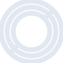
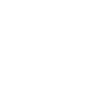

# circle

[← Back to main README](../../README.md)





## 16 px

### black
```
https://georgegach.github.io/compatible-icons/simple-icons/circle/16/black.png
```

### slate
```
https://georgegach.github.io/compatible-icons/simple-icons/circle/16/slate.png
```

### white
```
https://georgegach.github.io/compatible-icons/simple-icons/circle/16/white.png
```

## 64 px

### black
```
https://georgegach.github.io/compatible-icons/simple-icons/circle/64/black.png
```

### slate
```
https://georgegach.github.io/compatible-icons/simple-icons/circle/64/slate.png
```

### white
```
https://georgegach.github.io/compatible-icons/simple-icons/circle/64/white.png
```

## 128 px

### black
```
https://georgegach.github.io/compatible-icons/simple-icons/circle/128/black.png
```

### slate
```
https://georgegach.github.io/compatible-icons/simple-icons/circle/128/slate.png
```

### white
```
https://georgegach.github.io/compatible-icons/simple-icons/circle/128/white.png
```

## 512 px

### black
```
https://georgegach.github.io/compatible-icons/simple-icons/circle/512/black.png
```

### slate
```
https://georgegach.github.io/compatible-icons/simple-icons/circle/512/slate.png
```

### white
```
https://georgegach.github.io/compatible-icons/simple-icons/circle/512/white.png
```

## 1024 px

### black
```
https://georgegach.github.io/compatible-icons/simple-icons/circle/1024/black.png
```

### slate
```
https://georgegach.github.io/compatible-icons/simple-icons/circle/1024/slate.png
```

### white
```
https://georgegach.github.io/compatible-icons/simple-icons/circle/1024/white.png
```

## 16 px in base64

### black
```
data:image/png;base64,iVBORw0KGgoAAAANSUhEUgAAABAAAAAQCAYAAAAf8/9hAAAABmJLR0QA/wD/AP+gvaeTAAABa0lEQVQ4jX3TT0uUURQG8J+vQrgQdYq2+RnqE1SCizBa+g38TBXhul3QKh0ILEalDG3j3hxE0jKcRKvxbXGfqRnUOXC5/85z7jnPeS6DdhNL+IkavzPqnD2Pzz8b6Vs/xGuc4hOm0MjdN3zHXYzjCZr9gR7gD1bRznoL7zO2k0kbu7jAbA/cSHqreX0HG+gm9TrrNXzN/gtOeuW8wGGi7+AA+3iMG5jGAo4CPsRe9k/l9ZWkuBHwhMs2EVArvs1g1fiYmrt5+TpbiM82PqCuQthUaqqwPCTAm/gcB9Ot/G9lnXl8SICzzFUPU2E0ESeV9swNCTAXn0n8wBiFiKZCTEth+ToSD7CulN3EyShmFCEd4zZuYVERTDvgRwo3Iyn1F+7gpQA6Sm97fW65LKR1RSenijo7CpEosrxQFLaXcrbwLuNz0t4NuIv7DH6mWbzCOTYNfqajkHZPUec83l7Bkwaeufo7d3I33Q/4CxQyg4SOFybKAAAAAElFTkSuQmCC
```

### slate
```
data:image/png;base64,iVBORw0KGgoAAAANSUhEUgAAABAAAAAQCAYAAAAf8/9hAAAABmJLR0QA/wD/AP+gvaeTAAACVElEQVQ4jXWTTUucdxTFf+c6k6m2ZsapQxAlCg0uXIXUErILVnBVSCh04wfoIh+g/QSl0C67sR8gm2wCWSkBySbQvLhLoVlpZrSGB/UZpzodmed/unCmiOBd3c3v3JfDEReq1Tr+vCgXv8p8BxqT1LcBXAKfCj1WP36cmbl+MGQ0bHZa+dcq+RnWKWKLoEZSHYDwIUlH4Dvg0RHpwfSN2nOAANhu5UtRZh3xBqkHLMlcA/aBfZIrEkvGZ6DDwt7Y/ZgvA6jZbNddTk3EW6xFmx2JY8GiBwMEyeKVzC3DJKYlUVM/5sIV/4LVxfGFzQ6iDrpp4mGvU/3EPeomrZKYN0wCBwSyOStK6Sd9+PvoBPESxX3sLdDN0ZGz+Uaj0bn44CzLxrv98raDvwJ9lfALJd8LpDGsCeF3gkXQ95dhgEaj0UHpkey7dvpTpoo0FkAfqeakjiGK7vjGZXhY7sU6KJBySTVwEeChlQaIaI9eJRDR+RfAhcOAFA7QCHKOUlWQVEkrV25wrboCTgqqTm7bLgX41JBLsZDEHxC/ZVk2fhnOsmzcLtZAr0ELBDnwj5r7+e823xJ0ZSoDnw9ReuRerKdU7Y6MdlbAaz4/91DiMxKfWjzR3t7xZBHFtiEHTQMHFu9l3wXFYPkEem2oCs9abMncLirMCGD3Y75c2BtYuwQSumH7Hda5nUpV0AKwZ/mDrHvJXp6bmtj8P0wDkadYPYK3NjUxCBM+ANrAl4JKYX8zNzWxCRfSCNBstuuU/bPtVXQeZwDbJewTSY9Tjx9mZ2tHQ+Y/8kQxU7qybuUAAAAASUVORK5CYII=
```

### white
```
data:image/png;base64,iVBORw0KGgoAAAANSUhEUgAAABAAAAAQCAYAAAAf8/9hAAAABmJLR0QA/wD/AP+gvaeTAAABjElEQVQ4jX2Ty05UQRRF172SCAPCoxkzMfED9AuUThiJOjPxf5z4BeLAXzBxpHZiAqaFKAacMJZHlGijppv2AZflwN3h8rBPUqlbt87etWvXOVALtaE+UQ/8F4cZ5t9jtVHHFDXwHPAM6APvgUlgOtv7wDfgGjAG3CmKolU/+aZ6pC6pu/leV19nbETJrrqlHqvNAXg68pbUvrqprqqVJ1Gpb9QvWW+rXbVRAg+Bn8AV4GNkzwJ3gdGs7wNXgRmgk6v/AR6Q019G4qr6SR3nTKjjakdtJ7elHhBJ73LnSl04C66R3EvOhvpWtQSO4ngXKIEX/yMAnifnezBVWXtKM48NIfiVuRxgSuBSGCeAY2B+CMF8ciaAH8DIwMRWjGmrX4eYuKeupE5aahd1Me7u1N65E8Om1FH1tvo5BJupg331EeqM2guBUdC+oJBWAu6nOnvq5EBeM+W5HaLDPOtyxofI3gq4Um/A6WZqAk+B38Aap5upE9OuA5eBW0VRvDpncfpi0YvbuZe9qTrmL5VtDM3hGvnfAAAAAElFTkSuQmCC
```

