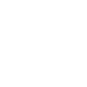

# clickhouse

[← Back to main README](../../README.md)




## 16 px

### black
```
https://georgegach.github.io/compatible-icons/simple-icons/clickhouse/16/black.png
```

### slate
```
https://georgegach.github.io/compatible-icons/simple-icons/clickhouse/16/slate.png
```

### white
```
https://georgegach.github.io/compatible-icons/simple-icons/clickhouse/16/white.png
```

## 64 px

### black
```
https://georgegach.github.io/compatible-icons/simple-icons/clickhouse/64/black.png
```

### slate
```
https://georgegach.github.io/compatible-icons/simple-icons/clickhouse/64/slate.png
```

### white
```
https://georgegach.github.io/compatible-icons/simple-icons/clickhouse/64/white.png
```

## 128 px

### black
```
https://georgegach.github.io/compatible-icons/simple-icons/clickhouse/128/black.png
```

### slate
```
https://georgegach.github.io/compatible-icons/simple-icons/clickhouse/128/slate.png
```

### white
```
https://georgegach.github.io/compatible-icons/simple-icons/clickhouse/128/white.png
```

## 512 px

### black
```
https://georgegach.github.io/compatible-icons/simple-icons/clickhouse/512/black.png
```

### slate
```
https://georgegach.github.io/compatible-icons/simple-icons/clickhouse/512/slate.png
```

### white
```
https://georgegach.github.io/compatible-icons/simple-icons/clickhouse/512/white.png
```

## 1024 px

### black
```
https://georgegach.github.io/compatible-icons/simple-icons/clickhouse/1024/black.png
```

### slate
```
https://georgegach.github.io/compatible-icons/simple-icons/clickhouse/1024/slate.png
```

### white
```
https://georgegach.github.io/compatible-icons/simple-icons/clickhouse/1024/white.png
```

## 16 px in base64

### black
```
data:image/png;base64,iVBORw0KGgoAAAANSUhEUgAAABAAAAAQCAYAAAAf8/9hAAAABmJLR0QA/wD/AP+gvaeTAAAAuUlEQVQ4jc3TPUoDURQF4A8nTJFOO0FI5xqmCdq4ATu3kR24oXQpBaukE6JpYiXWIoIgRJBJ8S4yzgwEh8DkwONw7z0c3t/JcIsxHnCDaxzjAxNcYI2rmI+wVEGJN5zhKeo5CnzGKqJXhuYXg+Dv4B9/Ua8bvaMWwb/Qv8Fgt6QVJ5gi72owxDlOezvCF57x0tXgHZccwjPu7RLz4Kw2r9eNXha7WOBeivCj9ElW2EgpvMOrFOuZSpy3pDYjgRuUGg8AAAAASUVORK5CYII=
```

### slate
```
data:image/png;base64,iVBORw0KGgoAAAANSUhEUgAAABAAAAAQCAYAAAAf8/9hAAAABmJLR0QA/wD/AP+gvaeTAAABAUlEQVQ4jc2RrU4DURSEZ869uyEYfhQVhaQCBcnaOgxPwDvwALwB2BLwOF4Ai+ABaitQiGahAkxJMTRh772DWEjKyoWkjJnkZOZLzjl8fJ6e0iyssLqcx+wISD2zbBRoQ694DACB7sor9VOqCsDGO52Na3yJTy8zQZhajEXy7hbAHskhhRMh3QEAYYciLiT1Adxvb63vfwOsxvCjNkQsKAEx4eesmTH8UssH+DalyeRtU5luSOatAGRYFfyupM5yVpD8O6AHkmUrQLe79grgAPgPb/yjI0p5bXANumsWmhkvxTOahdzF2TzaOZB6ZDaqzEovDACgoiu90kAKBWDjRcAnpNNh6jjReYgAAAAASUVORK5CYII=
```

### white
```
data:image/png;base64,iVBORw0KGgoAAAANSUhEUgAAABAAAAAQCAYAAAAf8/9hAAAABmJLR0QA/wD/AP+gvaeTAAAAwElEQVQ4jc3TMUpDQRSF4W/MI4WlnWBlYZ0ydu7BPbgPbRXs7dxAlqGtkM4iZAEigmAhkWPxJhjfE4JBiD8MZ+6Zy4GZ4ZYk51jgGqc4xAPucablBscYYVZKubUkLU9JDpJMa32XZJzkta5x9ZJkaoWm6nvVD9/p1j1v54eGX7H9gGZ9S58ke5hguFEAdnGE/e1cAW94xHyjgFLKM074D9/4Z484rDronHfrntfgQjvOL7jyNc5zXNa+5X6E2WrAJ1u0Tk/kgGxxAAAAAElFTkSuQmCC
```

