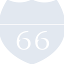
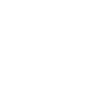

# cloud66

[← Back to main README](../../README.md)





## 16 px

### black
```
https://georgegach.github.io/compatible-icons/simple-icons/cloud66/16/black.png
```

### slate
```
https://georgegach.github.io/compatible-icons/simple-icons/cloud66/16/slate.png
```

### white
```
https://georgegach.github.io/compatible-icons/simple-icons/cloud66/16/white.png
```

## 64 px

### black
```
https://georgegach.github.io/compatible-icons/simple-icons/cloud66/64/black.png
```

### slate
```
https://georgegach.github.io/compatible-icons/simple-icons/cloud66/64/slate.png
```

### white
```
https://georgegach.github.io/compatible-icons/simple-icons/cloud66/64/white.png
```

## 128 px

### black
```
https://georgegach.github.io/compatible-icons/simple-icons/cloud66/128/black.png
```

### slate
```
https://georgegach.github.io/compatible-icons/simple-icons/cloud66/128/slate.png
```

### white
```
https://georgegach.github.io/compatible-icons/simple-icons/cloud66/128/white.png
```

## 512 px

### black
```
https://georgegach.github.io/compatible-icons/simple-icons/cloud66/512/black.png
```

### slate
```
https://georgegach.github.io/compatible-icons/simple-icons/cloud66/512/slate.png
```

### white
```
https://georgegach.github.io/compatible-icons/simple-icons/cloud66/512/white.png
```

## 1024 px

### black
```
https://georgegach.github.io/compatible-icons/simple-icons/cloud66/1024/black.png
```

### slate
```
https://georgegach.github.io/compatible-icons/simple-icons/cloud66/1024/slate.png
```

### white
```
https://georgegach.github.io/compatible-icons/simple-icons/cloud66/1024/white.png
```

## 16 px in base64

### black
```
data:image/png;base64,iVBORw0KGgoAAAANSUhEUgAAABAAAAAQCAYAAAAf8/9hAAAABmJLR0QA/wD/AP+gvaeTAAABZUlEQVQ4jZ3TS2sUQRQF4K/bGZ9BQaOEILgQwZWgS5eC5Mf4R0RX4kLiMiv/gmtBBPGFIokgRhKYJDoyUZNxJnHios5gOyKiB4pbfevcx7lVXSm4g6t4imdo4zLOYw+LeIhdXMQl3Mc1mMVKiP+yVjCzD9dxBRtoYYQvGGb/KbbGIF1s4TgOVXiDc36im2A4gqNJsJPKB/Eh31uwloNu7PfYQQK7WM/+c+PsGzpVCNuosD+VW+mijh1XHsQOU+hwK9p3/B++VugnaxMdfMQMTqbAqjLAs+kM+jV6E8HLeIBTkbKLR9E/NcHt1dhsOPZwD3N4rcymg8fKtb1XrniMzRp3Q5RkryLrNOYjr41jyitdDXcb8zVu4WWqT+GCMuUhziS41/AdCPcFbo9bOYEl5a7X8Dxtb8T3VvlPFpNkKZJ+wTSepP0/vf9+ONOTwWO0cTM6R43AUXw3wvkrZrGAd1kL8f2GH26wiwCaPNMeAAAAAElFTkSuQmCC
```

### slate
```
data:image/png;base64,iVBORw0KGgoAAAANSUhEUgAAABAAAAAQCAYAAAAf8/9hAAAABmJLR0QA/wD/AP+gvaeTAAACF0lEQVQ4jZWS3UpUYRSGn/ebvWs0ccwcGSf/KIToICgILOgwvJhuIOoGOg2DsCvoFjwWpAiSKCQ6sYbxJ0fFMRtzz57v7UAdnc5aZ4v1/z5LALXN/deIxxIf5bDSUScV4aGjbwFW0NcIy4mVW/Guzb1oFqfHhp6o1mhUydP3iHH+x0S9o+R+Qp4+R1w3+gkuAUG4ZRTAKdYBok/QB7SNJXQMVEJsP1Ntq/kNPNPtbO+ikJlIkK7YDALxpBgLikAD3Ab9TowHBdjsSQwjXQWHQMhspzJ7iNxQBg6BIqh02iwkghS5LiRJDQDjxCaTFIwzTvbeBR9jMuRMokNUfyLYtmmDsX1BJdN1Bd2IumEkDhPDNKjYq7A3hXawKsZli7ZMHSnHvgmE0xFHAdjv5ePvWEvRjNpOhHJFvZM4wHGguwEAYT9INM8BYKG3hrkAqwRaJm5C/GB7WIQf2L/Or3EzGL8BtQAUaCJ9ETqyGI94AVSUQopU6tgrEOqn01oxeiFMjA69xP4MstAA6I7sDDsrWFOI1I77mKxQUAZcBtkKnybHhuYFUK8fXHMhLiNmDNvAFqgNngJGgDWZZgz0y9zArCnXg4mJ0l5Xko2Ng5FccRHpNriXyjmeP9iricNctTq4wxkOgGp1cGe7UprFfoVYpxe9weu257crpdmz4otv0WO1RqPq/NILyY9OnslLSvKnk+Xyxr+5fwHmSRrcrj/57AAAAABJRU5ErkJggg==
```

### white
```
data:image/png;base64,iVBORw0KGgoAAAANSUhEUgAAABAAAAAQCAYAAAAf8/9hAAAABmJLR0QA/wD/AP+gvaeTAAABgklEQVQ4jZ3SzUrVURQF8N//cm8fJkl1DbFAKIRGQc1qHj1Mb1BvUKNoEDZ01Cs0DiKIkigimlgo2JeiZV28mavBf4sXkaA2HM45m7XW3nud00CS+7iGF1hAD1dxAcFbPME2LuEyHjVNc0OS6SRL+fdYSjLVxS2cwSdMoIOftffwDUdr/UKDLUzhZpPkHWbtxSqGdT6G49gpcnAEX+r+o1sAWMNJnKjqw+pgrWafxGYJTJRYp0myWi03OFRi3RLYFdqtvFX7EL8x1sXnaud/YrNJMijV0VjBV61Rk1VguUY5X53BoIP1feT3eIzTNco2nmpfY3wfdr2DjZFE8BDX8UbrzQqeaQ3+gO8j+I0OHhRQib3GAGcxV+P1tM4v1CiKM9fBXbyq6uO4qHV5iJkir4/kDhf2Je41kOSU9q/Pal/lYxk3gz4Wq7sxnKv7laZp1vaGT/pJnicZ/OX/DwrTd1Ak6SW5k2Q5yc4Icadyt5P0DiTvE5pOMp9ksdZ8kumDsH8AcocNF2duYgsAAAAASUVORK5CYII=
```

