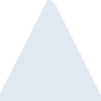

# cmake

[← Back to main README](../../README.md)





## 16 px

### black
```
https://georgegach.github.io/compatible-icons/simple-icons/cmake/16/black.png
```

### slate
```
https://georgegach.github.io/compatible-icons/simple-icons/cmake/16/slate.png
```

### white
```
https://georgegach.github.io/compatible-icons/simple-icons/cmake/16/white.png
```

## 64 px

### black
```
https://georgegach.github.io/compatible-icons/simple-icons/cmake/64/black.png
```

### slate
```
https://georgegach.github.io/compatible-icons/simple-icons/cmake/64/slate.png
```

### white
```
https://georgegach.github.io/compatible-icons/simple-icons/cmake/64/white.png
```

## 128 px

### black
```
https://georgegach.github.io/compatible-icons/simple-icons/cmake/128/black.png
```

### slate
```
https://georgegach.github.io/compatible-icons/simple-icons/cmake/128/slate.png
```

### white
```
https://georgegach.github.io/compatible-icons/simple-icons/cmake/128/white.png
```

## 512 px

### black
```
https://georgegach.github.io/compatible-icons/simple-icons/cmake/512/black.png
```

### slate
```
https://georgegach.github.io/compatible-icons/simple-icons/cmake/512/slate.png
```

### white
```
https://georgegach.github.io/compatible-icons/simple-icons/cmake/512/white.png
```

## 1024 px

### black
```
https://georgegach.github.io/compatible-icons/simple-icons/cmake/1024/black.png
```

### slate
```
https://georgegach.github.io/compatible-icons/simple-icons/cmake/1024/slate.png
```

### white
```
https://georgegach.github.io/compatible-icons/simple-icons/cmake/1024/white.png
```

## 16 px in base64

### black
```
data:image/png;base64,iVBORw0KGgoAAAANSUhEUgAAABAAAAAQCAYAAAAf8/9hAAAABmJLR0QA/wD/AP+gvaeTAAAA70lEQVQ4jZ3TS0oEMRAG4G9m4XHEhXoFF4IbcSF4Po/hC10LKngBBR1FbXHo1pGJi6Qhhm5n2oKiKyH/oyod/o4rHC440xtbaDDH6n8ILhHwhqOh4G28JIJXPGJtCMF1AgfU6Xu8LHgnUw/iDMIQFzcZOOAzq08WgXfFoeUEVVZPsNEHHnWo14WDgLM+gr1CvcKHOI9Ztv+E9S712+zQs3h9AfcdbZ2WBPt4z8Bz8S9s1w8FwSR3Mc7UqwSYidfWJOK7giDgvCU4wDRlabV1ME2913672JR6bDLLffmVQE1yF3AxSkX76paJccoVfP8AMNCA5V5l+LoAAAAASUVORK5CYII=
```

### slate
```
data:image/png;base64,iVBORw0KGgoAAAANSUhEUgAAABAAAAAQCAYAAAAf8/9hAAAABmJLR0QA/wD/AP+gvaeTAAABeklEQVQ4jZWSzUocURCFv3MFRzFR8qMbBXdCFCSL5BmyULJJFi58FkEXwY3o1hfIo+QB8gKRHjXdkdHuAXXC2Pe46HHsxlG0dlW36junigtPRJLmv5M0//lUT3js4U9WfAEtARvt7Hz1xYBg74JbiG6MOngR4OisWMMsVpkcFFaO/118fDYglHFX4g0A9oTxXIzsPwtwkna/ypq/y223AERYHuXiAaCk/OE7dUBS38DAxYNbNABHp/k3w0K9ZtHTfbKc/C0+jwTY1ljQttDMsAY9WRPDbjFLYG8kIEmL75G4UBvuCkrkS4mbe0t8SE7zTw2AbSF2auodQQSmQNfRXNaWes+Y9xqAdnaxEWC+ckkHeGuYBCC6JejVbWMNXQTbwYQtw2vjrquWMqDC5r/lcaitUK03S/ABgNpZsWn7UBijPjDTVKMDTCJdAa/Ag6PqTGZdSVacEHmHAKpPMzJEH8gdmUYqhOeEfylJcxt6wvHR4SYpDG43jri5BXvcrYvrbUeFAAAAAElFTkSuQmCC
```

### white
```
data:image/png;base64,iVBORw0KGgoAAAANSUhEUgAAABAAAAAQCAYAAAAf8/9hAAAABmJLR0QA/wD/AP+gvaeTAAABBUlEQVQ4jZ2SvUpDQRCFv5tCsbFQsNEX0EIs1FewEGy0sPD5fAz/EFtBBV/AFP4ngZBIYj4LJ2Sz5l4SDww7u8yZc2Z3oQLqnXpaVVNF3lO76kDd/E+DW3/RUM9mJe+rH9HgU31Wt2ZpcO8InVjPpyUfJOrGHTi1C/XBcXwl+UVeX8vIh8BaVtNN8g11p0y5mKDeyRyoXpU5OMrUW8A30Ab6yfm6uj1J/TFReYvnU63HX0hxmTs4BlYjfweWgIXYz2f3MO5CrSXqzVDvxbN11Zb65F9cDxucqO2I3OpwnLb66uhTqb6ou4VaB5YTu2XoAQ1gEWgCK8BNoRozDirIKWoRc0D/ByeoiPRRRB60AAAAAElFTkSuQmCC
```

