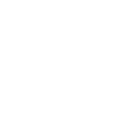

# codewars

[← Back to main README](../../README.md)

<table><tr>
  <td></td>
  <td></td>
  <td></td>
</tr></table>

## 16 px

### black
```
https://georgegach.github.io/compatible-icons/simple-icons/compat/codewars/16/black.png
```

### slate
```
https://georgegach.github.io/compatible-icons/simple-icons/compat/codewars/16/slate.png
```

### white
```
https://georgegach.github.io/compatible-icons/simple-icons/compat/codewars/16/white.png
```

## 64 px

### black
```
https://georgegach.github.io/compatible-icons/simple-icons/compat/codewars/64/black.png
```

### slate
```
https://georgegach.github.io/compatible-icons/simple-icons/compat/codewars/64/slate.png
```

### white
```
https://georgegach.github.io/compatible-icons/simple-icons/compat/codewars/64/white.png
```

## 128 px

### black
```
https://georgegach.github.io/compatible-icons/simple-icons/compat/codewars/128/black.png
```

### slate
```
https://georgegach.github.io/compatible-icons/simple-icons/compat/codewars/128/slate.png
```

### white
```
https://georgegach.github.io/compatible-icons/simple-icons/compat/codewars/128/white.png
```

## 512 px

### black
```
https://georgegach.github.io/compatible-icons/simple-icons/compat/codewars/512/black.png
```

### slate
```
https://georgegach.github.io/compatible-icons/simple-icons/compat/codewars/512/slate.png
```

### white
```
https://georgegach.github.io/compatible-icons/simple-icons/compat/codewars/512/white.png
```

## 1024 px

### black
```
https://georgegach.github.io/compatible-icons/simple-icons/compat/codewars/1024/black.png
```

### slate
```
https://georgegach.github.io/compatible-icons/simple-icons/compat/codewars/1024/slate.png
```

### white
```
https://georgegach.github.io/compatible-icons/simple-icons/compat/codewars/1024/white.png
```

## 16 px in base64

### black
```
data:image/png;base64,iVBORw0KGgoAAAANSUhEUgAAABAAAAAQCAYAAAAf8/9hAAAABmJLR0QA/wD/AP+gvaeTAAABV0lEQVQ4jaXTvU5UcRAF8N8uBFgWWBMiX2LUCoi0lMTS8AgYLHgYHoMOa1tLtDAxdBY2mpBACMrCBhKQLwGLe4BLgAam+WdyZs7cOWduBVuoe1gcVHBxB9DCYbAODNzHcBfBGr5hEn2oJn+afCykBCzHOhYxjYmQL6GGF+jCZxxcNrSXmjfxN011nGIDsxhNzXmwVt4rgl1sp3AM3dGgjhHsYA8n6FcSvVoiqKETPfidfDxYW2pr+IAFhXtXBKc4y+SpTN8N0WrqRqPDe7zEvzJBN76mYQTPFA4dubZzLSL3YwZ/yhr0YDlCzkWsXoVtz7N7HStZow2NMkEje1UiZl/WGlI4UcVwSI7RzFfeuoMTvMarNDfxPVPPFPZ9wmDwG3fQwM/s/STvMt4kb+IH3rm+i1unfIhf2McXzEePY3zEW8WFuo/gMs4VNu2FrKOkw42oeOTv/B+0BVeX356QWQAAAABJRU5ErkJggg==
```

### slate
```
data:image/png;base64,iVBORw0KGgoAAAANSUhEUgAAABAAAAAQCAYAAAAf8/9hAAAABmJLR0QA/wD/AP+gvaeTAAAB0klEQVQ4jZ2TS2/NURRH1zqacvtHmzTeFYwQY0MxFB+BMPBhfAwzxgxNJCVhYkZiQiKpNL3aai5pe6vV/TNo9cXIGZ69z9qPrONMfzAP6fifE1dGgBPggQBLyjASw2jg5D8BMtb+vmMm5EXwB2CRTcgzzGvI++D63vyDgC/oI/QG5CpFmj7G1gMvgEc0LyErfx6M7Kk9F1mFStMuuCGZBe6QTG3PVoQOXAK6XYAOqFpUp6RdJhmDGgY6wlnxW+S71dZjJkM6t/e2NUIyQHuEw0kdDfSJPfWKOCg51EIrqgc+SXwYmN8BqBvKJjAGXAeHyqBIP+GzSYtMqReE+w0uqr92ACFjqbwB++BZUucSNG2NliGaJDPAl5BJmrdT9XXvEo+21qYrzknupVnEY8rxqna+WeuFHfGtpkfVIWR8FxDGK3lIi8Ai4ThkI+G0Zja0Jjmj6UJ+BheAc395kLBOuAZcAk4DC9jeIT3IZtmWwOfCKbfiux6kMW7xsWANMyGuVZhu5CYwoW2B2vyA3EWnduyZ6Q+yp4Uh8knacplXLTwoKJKfylNotyBX96m/D7ADotBfJN8xy+JotJGcOZg6QljAA9/ZLQrSgV22LQZW9xdy5TcKqvXIm7ocvQAAAABJRU5ErkJggg==
```

### white
```
data:image/png;base64,iVBORw0KGgoAAAANSUhEUgAAABAAAAAQCAYAAAAf8/9hAAAABmJLR0QA/wD/AP+gvaeTAAABW0lEQVQ4jaXTsU5UURDG8d9dDLIssiZEEcSoFRpsKY2l8RE0WPgwPIad1raUYGFi7CxsNDHBGIUFspuICAjX4n7IIUCj05xMZuZ/znwzp6rreh0d/2bbVV3X9RmBLeygxjCunkc4C7CKt7iHcbTiX4k/GygJlvYFz3Efd/OCF2jjJkawgu2jggtF8Tf8TFEH+/iKx5hJzmFiWzn/AvrYSOIsRqNBB9PYxAB7mFCI3ioAbVzEGL7Hv5PYUHLbeIlFrJeAfRzk5vnc3g/oc/JmosNT3MLvEjCKNymYxnVU+OV4nKsReQKPsFZqMIblCLkQsS5pxnYjvXfwLm0MoVsCuumripjjaeuaZhItTAWyi15eeWoP9jCH2ynu4X1uPdCMbwmTiZ/Ygy4+pu/LOZfxIH4PH/DE8V6cWuUdfMIPvMaz6LGLV3io2VDnAY7sUDOmQWDDhQ4nrPrf7/wHRJlphY8xjGkAAAAASUVORK5CYII=
```

