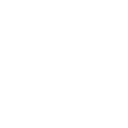

# cohost

[← Back to main README](../../README.md)

<table><tr>
  <td></td>
  <td></td>
  <td></td>
</tr></table>

## 16 px

### black
```
https://georgegach.github.io/compatible-icons/simple-icons/compat/cohost/16/black.png
```

### slate
```
https://georgegach.github.io/compatible-icons/simple-icons/compat/cohost/16/slate.png
```

### white
```
https://georgegach.github.io/compatible-icons/simple-icons/compat/cohost/16/white.png
```

## 64 px

### black
```
https://georgegach.github.io/compatible-icons/simple-icons/compat/cohost/64/black.png
```

### slate
```
https://georgegach.github.io/compatible-icons/simple-icons/compat/cohost/64/slate.png
```

### white
```
https://georgegach.github.io/compatible-icons/simple-icons/compat/cohost/64/white.png
```

## 128 px

### black
```
https://georgegach.github.io/compatible-icons/simple-icons/compat/cohost/128/black.png
```

### slate
```
https://georgegach.github.io/compatible-icons/simple-icons/compat/cohost/128/slate.png
```

### white
```
https://georgegach.github.io/compatible-icons/simple-icons/compat/cohost/128/white.png
```

## 512 px

### black
```
https://georgegach.github.io/compatible-icons/simple-icons/compat/cohost/512/black.png
```

### slate
```
https://georgegach.github.io/compatible-icons/simple-icons/compat/cohost/512/slate.png
```

### white
```
https://georgegach.github.io/compatible-icons/simple-icons/compat/cohost/512/white.png
```

## 1024 px

### black
```
https://georgegach.github.io/compatible-icons/simple-icons/compat/cohost/1024/black.png
```

### slate
```
https://georgegach.github.io/compatible-icons/simple-icons/compat/cohost/1024/slate.png
```

### white
```
https://georgegach.github.io/compatible-icons/simple-icons/compat/cohost/1024/white.png
```

## 16 px in base64

### black
```
data:image/png;base64,iVBORw0KGgoAAAANSUhEUgAAABAAAAAQCAYAAAAf8/9hAAAABmJLR0QA/wD/AP+gvaeTAAABD0lEQVQ4jb3TzS6DURAG4Kf9BB+JtLGwkNhYSCTcgoVrsHELFkJs3ImNO+nGisSKtQoWpKKq4qd+qhbfoJG2BDHJ5JwzM++ZOTPv4Z+kgGInR66DLcEcljCFEeTD94ILbGIDzXZgH1ZQRh2tHnqLHaRv4HHs4e4LYLs+RSXGIut3ge16BFs/BLdQhbNfXNDIoYGB6MUJDqI5j/G8CQzhMPwprjCJUbiM2+pYRiXODziP/alsrLU417COUj6AZPMfjopuwv4sm30i48w9rmPdxUKCGcxiENMyolQjMBflFyKmEj2bx34kk2I7svZqWB3HWPPBzHcq57GI1cjWH/ZmAMsy6pZ8om83Keryef5cXgHlt4K7hc/qagAAAABJRU5ErkJggg==
```

### slate
```
data:image/png;base64,iVBORw0KGgoAAAANSUhEUgAAABAAAAAQCAYAAAAf8/9hAAAABmJLR0QA/wD/AP+gvaeTAAABk0lEQVQ4jb2TvWpUcRTEf3PujbC7ZMmaaIhBI4ofoIJdSCU+g9ik8QE0jQ+SxiaFWlj6AFaWdoKNrUY2H6w3LOTuGhKT3fsfC2NYxGAUccpz+MEcZg78D33a3p5ot8vWr3b6eWA72yx6d5L80CmuidRECjBYydB1Ss/mzrVWJFUaAfPNolyq4BEwJdQ81pK9K8V7Bv27AljvdmcZZq+MrgC1k5wlMcS8yFaLnelIvAFdB8ZOAh8qhE9HlgYvgUt/AI76GA8prv4dDMk0cuzWURZmzfAhQjXbB4Jp4IKhjlmVWLOpASVwWXgyCO8ewn1LyyHdtL0AWjBMGurGHTItG99GzBOat9JzSe8C1AOQyJTcMP4K3hHuSRoCKYhMFTLsAX1gL1e8Tfvc1/rn8inwwJAjd1xRhOQEII8LzQI1zAawJWm/yvJ7F880OgA5gy9LHmveMOmWrBkFM+ZHRUeKGjQxydKTual6cZQDgO3Y2OovpuTHEhPAqe/VpULqgT+iWDl/tvlaUvXbeNrtsnXc8/xzfQOPwK5nJASYCwAAAABJRU5ErkJggg==
```

### white
```
data:image/png;base64,iVBORw0KGgoAAAANSUhEUgAAABAAAAAQCAYAAAAf8/9hAAAABmJLR0QA/wD/AP+gvaeTAAABKklEQVQ4jb3TzUqWURTF8d/zKsGbFEoDB0KDgrqMLiKaNOkCHETRpDtxkDfQNTiuoFHzDIxIlMgM+7CyfwMfwcASJFqTc/ZeZ7HP2Xsd/geq+WrhJG444fAMbmAZ13ERk5H+iXdYxcowDAfHhbPVvWq92u3v+FQ9q6ZH4qXqRfX5FOFxfK9Wh2oRT3DlDO3ZmODxGcVwYYJrZxTD3CyOj+c1XmKKb1jEZZzHq5Gf4gOu4pLq/diU3eputTXG+9X2uH9bLVc7Y7xTPazWJtgdq89gDl+xN+Z/OJz9jEPPfMHHcX2OW0P1CHcwi01soaMmYWm89htsYx83h2HYBNW0elrtnTL33WqjelAdOfPQymPiNu5jHudG/mB8yjpWsPabff+EaqE/fJ5/jl9xGx9WE/KqbAAAAABJRU5ErkJggg==
```

