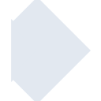
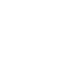

# collaboraonline

[← Back to main README](../../README.md)





## 16 px

### black
```
https://georgegach.github.io/compatible-icons/simple-icons/collaboraonline/16/black.png
```

### slate
```
https://georgegach.github.io/compatible-icons/simple-icons/collaboraonline/16/slate.png
```

### white
```
https://georgegach.github.io/compatible-icons/simple-icons/collaboraonline/16/white.png
```

## 64 px

### black
```
https://georgegach.github.io/compatible-icons/simple-icons/collaboraonline/64/black.png
```

### slate
```
https://georgegach.github.io/compatible-icons/simple-icons/collaboraonline/64/slate.png
```

### white
```
https://georgegach.github.io/compatible-icons/simple-icons/collaboraonline/64/white.png
```

## 128 px

### black
```
https://georgegach.github.io/compatible-icons/simple-icons/collaboraonline/128/black.png
```

### slate
```
https://georgegach.github.io/compatible-icons/simple-icons/collaboraonline/128/slate.png
```

### white
```
https://georgegach.github.io/compatible-icons/simple-icons/collaboraonline/128/white.png
```

## 512 px

### black
```
https://georgegach.github.io/compatible-icons/simple-icons/collaboraonline/512/black.png
```

### slate
```
https://georgegach.github.io/compatible-icons/simple-icons/collaboraonline/512/slate.png
```

### white
```
https://georgegach.github.io/compatible-icons/simple-icons/collaboraonline/512/white.png
```

## 1024 px

### black
```
https://georgegach.github.io/compatible-icons/simple-icons/collaboraonline/1024/black.png
```

### slate
```
https://georgegach.github.io/compatible-icons/simple-icons/collaboraonline/1024/slate.png
```

### white
```
https://georgegach.github.io/compatible-icons/simple-icons/collaboraonline/1024/white.png
```

## 16 px in base64

### black
```
data:image/png;base64,iVBORw0KGgoAAAANSUhEUgAAABAAAAAQCAYAAAAf8/9hAAAABmJLR0QA/wD/AP+gvaeTAAAAqUlEQVQ4jaWTsQ6CMBCGP5lciTyEYXeT8OyGR9A4w4ziCot14GqaerYF/qRJ097/Xe/awq9KoANuQK7sB3UEWsAAb4Ec1pjtSIacgMEzu5ArkXLOwAQ8AhC1J5kzHyV4UBLsmJvb+OVkXmAh2UKQiwvxARZigGcEkv8DIIAkaYBeMmlXZ4A7UAMvDdDLWsz8Lc8F7BPMFXpvtj8k2PiUNchis5X9zknH/gBf9UaZlNGbcQAAAABJRU5ErkJggg==
```

### slate
```
data:image/png;base64,iVBORw0KGgoAAAANSUhEUgAAABAAAAAQCAYAAAAf8/9hAAAABmJLR0QA/wD/AP+gvaeTAAABH0lEQVQ4ja2TPU8CQRRFzx1IMDEhGimJ25q1tkT/tWhJ+A3QYwgURFGICUR2r8VGXHdnjYWvm5l3z5v3JSo2W25TcRgitt5rkCRn66pP2UL5sFhsrtDhHulSKFXH4/l8c/EbQGXxR8gehJLSo42n4dC66/e7z42Ap+XbDYFH7POIi1E+8U63sXQCgFtZx7lPgUgUC4drdTyezV5rAY41kLyzbeyXGKSpJkeAEZJ6hjwGMUgozdvZqAwJVUdJPSTH0jEIQpq3s9FXOjUAFNWP3cesHblbgQK41v+irXnR1qS7/vEDFUFXQsGN4vpMfBfROgGiYpCNp95rUB2oAKCstVfQOxAVo3zStBf/M8oxyF/ENQAU6xzIhg7eNM1/2T4BuJSmk26gwtoAAAAASUVORK5CYII=
```

### white
```
data:image/png;base64,iVBORw0KGgoAAAANSUhEUgAAABAAAAAQCAYAAAAf8/9hAAAABmJLR0QA/wD/AP+gvaeTAAAAvUlEQVQ4jaXTOwrCQBhF4ZM0Claii5BYW4prF5fgo9Za1ErQJsfCiYxhxudtEjJzv/CTCbSiVupOXan99vrLqCN16z11QAa/lP0KUSfq0XRqdZkbpwzXDtADDok9BTAGFimkjO4vgMAxg1QBeRqnbG0cAvUbZB4jbaBBJD9Og/RzAAH4KClgH96U+nQCG2BWFMUpBezDs3flx3gx0P2gPI3LMXAFzi/K61A+JdbDrn+Ocgb5rhwhze+cPf9xbn6x0hST2tMpAAAAAElFTkSuQmCC
```

