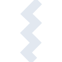
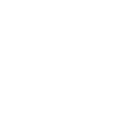

# commonworkflowlanguage

[← Back to main README](../../README.md)

<table><tr>
  <td></td>
  <td></td>
  <td></td>
</tr></table>

## 16 px

### black
```
https://georgegach.github.io/compatible-icons/simple-icons/compat/commonworkflowlanguage/16/black.png
```

### slate
```
https://georgegach.github.io/compatible-icons/simple-icons/compat/commonworkflowlanguage/16/slate.png
```

### white
```
https://georgegach.github.io/compatible-icons/simple-icons/compat/commonworkflowlanguage/16/white.png
```

## 64 px

### black
```
https://georgegach.github.io/compatible-icons/simple-icons/compat/commonworkflowlanguage/64/black.png
```

### slate
```
https://georgegach.github.io/compatible-icons/simple-icons/compat/commonworkflowlanguage/64/slate.png
```

### white
```
https://georgegach.github.io/compatible-icons/simple-icons/compat/commonworkflowlanguage/64/white.png
```

## 128 px

### black
```
https://georgegach.github.io/compatible-icons/simple-icons/compat/commonworkflowlanguage/128/black.png
```

### slate
```
https://georgegach.github.io/compatible-icons/simple-icons/compat/commonworkflowlanguage/128/slate.png
```

### white
```
https://georgegach.github.io/compatible-icons/simple-icons/compat/commonworkflowlanguage/128/white.png
```

## 512 px

### black
```
https://georgegach.github.io/compatible-icons/simple-icons/compat/commonworkflowlanguage/512/black.png
```

### slate
```
https://georgegach.github.io/compatible-icons/simple-icons/compat/commonworkflowlanguage/512/slate.png
```

### white
```
https://georgegach.github.io/compatible-icons/simple-icons/compat/commonworkflowlanguage/512/white.png
```

## 1024 px

### black
```
https://georgegach.github.io/compatible-icons/simple-icons/compat/commonworkflowlanguage/1024/black.png
```

### slate
```
https://georgegach.github.io/compatible-icons/simple-icons/compat/commonworkflowlanguage/1024/slate.png
```

### white
```
https://georgegach.github.io/compatible-icons/simple-icons/compat/commonworkflowlanguage/1024/white.png
```

## 16 px in base64

### black
```
data:image/png;base64,iVBORw0KGgoAAAANSUhEUgAAABAAAAAQCAYAAAAf8/9hAAAABmJLR0QA/wD/AP+gvaeTAAAAy0lEQVQ4jZ3RPWoCYRSF4YdJUohI0oR0biJdIAuQYGWVVQjuQnfhHhQCWUCwCViJhUUafwtLxZ9o8U2jTCZ8c+vznnPvueTPHT6xQC1LkOTAt+jjNTV6/ifsYm7QwwZrtGNg6KTwLz5iYbjHN/ZYolnEpIwv7LBCK0uUV2IilJcIp/zEpFeEE46YoxEDQxcHbBX4AKHEYbrBDPUiJg9XJm9ZorwS98IHTqmuHJNewkDoYYH3GJjLEjuxMDxiJKw/xUsRkyeMMUH1L9EZsKcsPsgayDUAAAAASUVORK5CYII=
```

### slate
```
data:image/png;base64,iVBORw0KGgoAAAANSUhEUgAAABAAAAAQCAYAAAAf8/9hAAAABmJLR0QA/wD/AP+gvaeTAAABbElEQVQ4jZWPMUscURRGz32zT13ChmUFdYVEIW0IqF1AsLXwH4iVlUUiIWXaFLFOkdYqEEgXQRAEe1sRYqG7o+7MjjIzW7juuvNu+jCzjK+87zvnfhfGvFNV27qNj/wgCa866XpexhTBqlqZCdMDEbOqqtaIWRm37H/Y87vpn1Yn6beDJG51km+lYQA/TPbaQdr3g9S1O8nhuGzuCUPrvoq6cyADlv0g/vgswZtGI7UyWAVOEepgvrTD3qfSAgDP84wKFjAoTpBWaUEURbXHkT3B6RIid5nqzqvZ2u/SggdX+Y7wDuFJkP3F+XouXCgYWf0AegZYVbd1E/U2igRS9HEZx3VvwAkib1G6Tt32YrNxUKoBQHUweAIzRFERMYK+yMtV8oa+71eHTB2DLinco9nuQnP6V142t4FOvPwhsKIwQt3+67nGz6KmuQLrzGenXAhMinibN2Hv/bMEzWYtykxlDeUvaF+y0XWR4B8785wLoLBCzAAAAABJRU5ErkJggg==
```

### white
```
data:image/png;base64,iVBORw0KGgoAAAANSUhEUgAAABAAAAAQCAYAAAAf8/9hAAAABmJLR0QA/wD/AP+gvaeTAAAA1klEQVQ4jZ3RMS5EURjF8RO8QiYyGtHZhE5iASIqlVVI7MLswh5IJBYgGolKFAoNhkJJZpifwq1e3ry48zW3uOf8v3PPTXoGDa4wxl6XZqnHvJLkIslukibJdt+ytnkZ5/jEB07/bS6AUTHPcFllLoAhbjHFG44XgQxwjQnecdKlm1tiuWvKOUvyVLN9rTzhB684rEkfnOEbX9U/UABD3JUELzhYBLLegux36fpKnCaZJFF0g5rtq7gpPYxxVJO+XeKoylwAG7j3N8/YWQSyiQc8Ymue7hdN3OKHp7Qk0wAAAABJRU5ErkJggg==
```

