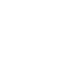

# contentstack

[← Back to main README](../../README.md)




## 16 px

### black
```
https://georgegach.github.io/compatible-icons/simple-icons/contentstack/16/black.png
```

### slate
```
https://georgegach.github.io/compatible-icons/simple-icons/contentstack/16/slate.png
```

### white
```
https://georgegach.github.io/compatible-icons/simple-icons/contentstack/16/white.png
```

## 64 px

### black
```
https://georgegach.github.io/compatible-icons/simple-icons/contentstack/64/black.png
```

### slate
```
https://georgegach.github.io/compatible-icons/simple-icons/contentstack/64/slate.png
```

### white
```
https://georgegach.github.io/compatible-icons/simple-icons/contentstack/64/white.png
```

## 128 px

### black
```
https://georgegach.github.io/compatible-icons/simple-icons/contentstack/128/black.png
```

### slate
```
https://georgegach.github.io/compatible-icons/simple-icons/contentstack/128/slate.png
```

### white
```
https://georgegach.github.io/compatible-icons/simple-icons/contentstack/128/white.png
```

## 512 px

### black
```
https://georgegach.github.io/compatible-icons/simple-icons/contentstack/512/black.png
```

### slate
```
https://georgegach.github.io/compatible-icons/simple-icons/contentstack/512/slate.png
```

### white
```
https://georgegach.github.io/compatible-icons/simple-icons/contentstack/512/white.png
```

## 1024 px

### black
```
https://georgegach.github.io/compatible-icons/simple-icons/contentstack/1024/black.png
```

### slate
```
https://georgegach.github.io/compatible-icons/simple-icons/contentstack/1024/slate.png
```

### white
```
https://georgegach.github.io/compatible-icons/simple-icons/contentstack/1024/white.png
```

## 16 px in base64

### black
```
data:image/png;base64,iVBORw0KGgoAAAANSUhEUgAAABAAAAAQCAYAAAAf8/9hAAAABmJLR0QA/wD/AP+gvaeTAAABF0lEQVQ4jYXTvy5EURAG8N/u3iDrTxQUQqJQUFBJJBIeQOctPIDnUHoHPTXRoFGwBaHVClkbZK0/xT03e/fs2fUlk8l8c+bLnJlzKnqRYTLiPvFhACpRfI6liKtiEV8pgSz4XWxiAfOlfAdHwQ/t4BrLifw35vA+SCDDUzj4GuXGsDWsuOjgEz+J3Bv2MRPxp7iN2/xNWDOIxPxlubiGBtaCUKtk7XDFNl5KfB17oeakhntshFarQbS4XhaEO7oDr8nnM43H+B3cYCXi2sGP6EclFtjGesQ94wATCYFqLJDCKs7k24qR6qoHs/JttBJ2Rfcpp5DhEOPy4Ra4wzEu6P9MZUzhQf8/aGCnCP6bQR2jEdeUrxb8Ac0GQ6EEeC/vAAAAAElFTkSuQmCC
```

### slate
```
data:image/png;base64,iVBORw0KGgoAAAANSUhEUgAAABAAAAAQCAYAAAAf8/9hAAAABmJLR0QA/wD/AP+gvaeTAAABn0lEQVQ4jX2TvW4TURCFzxlvnMhALFlAgmGdggIKukQikXgA6OAtKOh4BVpKREtJTw9Kg2go+JGQgijYWI43wsQbS06wd+dQxdq7Tny6OXPnuzP3aoiSJEVJkl0pe2aj0ziOT3CBWA6SdLgL6XZ4wuzw+urGFjk9DxABQO/P8eNp4TsQbwG4Oaslcpe/3QTyhR0kafYZ8jvVpIBiyU9utNvt8UWAKEmHXcoLAcMKe8XdHiwqBoBIjqsgfK41cmTIt373s4dl31i8j9daX2cAI5YEWhXgUG5mrwVdDsaSfQKwM7toPz16ItkLEK2AIBeAhgCSNi4RJgTHjmJ3Y731lADQTbM3Eu4LaoCslw6vAHTA/4EWfLkK9WV4Hpj7/aMvgt0Nh9EEEACroyJRjALDas/k2gwfQwMaXwJeqwIoC9s6T0n/7z3IPsB0OteBWF8IODgYXZsw/0Vg7pcA+95Zb25H84kzuqLuYfaK4iUEAP4Q9Y7yj0Blmcr6ORis1qe1PULBHpD2LV5rPprFi0bo9XqN6bSxXPY6neYxyeIs/g9hRa5YZgZ/IwAAAABJRU5ErkJggg==
```

### white
```
data:image/png;base64,iVBORw0KGgoAAAANSUhEUgAAABAAAAAQCAYAAAAf8/9hAAAABmJLR0QA/wD/AP+gvaeTAAABKklEQVQ4jYWTvUpDQRCFv3O5RIk/iGghChYWWthZqKCNnZ2+hb2vYGvpO9hZ2CtptBALf0AQ7GwFSUBDTDwWuZGbcRNPs8ycmW9nl11Rku0cmKBfTUmfDJACoAYshZoMWJT0lQLkReMesAksAPMlvw2cFuvgCWzfAssJvwPMSfoYBMhtvxaF78EbBbaGNQPIdhP4TngN4BCYCfkLSfe/ke2O06rbbiTy13GCfeAImA47GajSvafyMVpFXJN0kEk6A26KO2iV4QWkXaw9VYApYN32TnwHd8BKmKRVaoxSBGwDa6HoDTgGxhOATIlkn2yvApdAM2FXhgJszwIvdJ9z1KOkjXxIcw6cAGMB8AScA1cQPlMATALP/P0HD5J2e8F/R6gCIyFdl9TpBT/YlZCuohhbSAAAAABJRU5ErkJggg==
```

