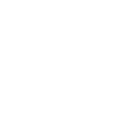

# coolermaster

[← Back to main README](../../README.md)




## 16 px

### black
```
https://georgegach.github.io/compatible-icons/simple-icons/coolermaster/16/black.png
```

### slate
```
https://georgegach.github.io/compatible-icons/simple-icons/coolermaster/16/slate.png
```

### white
```
https://georgegach.github.io/compatible-icons/simple-icons/coolermaster/16/white.png
```

## 64 px

### black
```
https://georgegach.github.io/compatible-icons/simple-icons/coolermaster/64/black.png
```

### slate
```
https://georgegach.github.io/compatible-icons/simple-icons/coolermaster/64/slate.png
```

### white
```
https://georgegach.github.io/compatible-icons/simple-icons/coolermaster/64/white.png
```

## 128 px

### black
```
https://georgegach.github.io/compatible-icons/simple-icons/coolermaster/128/black.png
```

### slate
```
https://georgegach.github.io/compatible-icons/simple-icons/coolermaster/128/slate.png
```

### white
```
https://georgegach.github.io/compatible-icons/simple-icons/coolermaster/128/white.png
```

## 512 px

### black
```
https://georgegach.github.io/compatible-icons/simple-icons/coolermaster/512/black.png
```

### slate
```
https://georgegach.github.io/compatible-icons/simple-icons/coolermaster/512/slate.png
```

### white
```
https://georgegach.github.io/compatible-icons/simple-icons/coolermaster/512/white.png
```

## 1024 px

### black
```
https://georgegach.github.io/compatible-icons/simple-icons/coolermaster/1024/black.png
```

### slate
```
https://georgegach.github.io/compatible-icons/simple-icons/coolermaster/1024/slate.png
```

### white
```
https://georgegach.github.io/compatible-icons/simple-icons/coolermaster/1024/white.png
```

## 16 px in base64

### black
```
data:image/png;base64,iVBORw0KGgoAAAANSUhEUgAAABAAAAAQCAYAAAAf8/9hAAAABmJLR0QA/wD/AP+gvaeTAAABV0lEQVQ4ja3TsU4UYRQF4G+GVdiAJpIgFZQk2FoY38LOxIcwPAA172CHiQUldL4BgdBhZaNZogSBKCuoO+wOFHsmTgMN/Mnknzv3nHPvPfP/3HEVN3xfxGu8TLyNDRzcJvYEq/iKKs8n9PEHg+RWMdsmzmErhN84xFtc4BjfsId3uMRV9q1w9VBjFyc4xyjkRmQXH5IbYBihXomFBEsZ4zIC/QAnWt2WwV4lXijzMsJ+EhPG5j7Fw4gs4nlww+RHOCsy9wN08B2PsI43yU2hi+mQOynSwaiDmcz1K6DJ7AUeR7zpqj3OEFWRtuuIdNNaEQML/MR8DJwMpm46aDwok5QqjYEXWEuRfohnLRMr+NFyts7cg1Q8xWf8wxfjA1X5/xuPSizjPf6m5V5rzq7xOShCnIonVTjPWljTWInAMKBjfExndXIrweLmy7SEV3iReAebGed+1zUIu3Leo3hVigAAAABJRU5ErkJggg==
```

### slate
```
data:image/png;base64,iVBORw0KGgoAAAANSUhEUgAAABAAAAAQCAYAAAAf8/9hAAAABmJLR0QA/wD/AP+gvaeTAAAB7UlEQVQ4jaWTPWtUURRF17pvxklMUIKoQU1AC0FbC8kfEOzs7CVWdvkR2lmJjTZ2llb+BRG0sksjJjEZCMR8Sybv3W0xo5VWHrjNYd9z9ln3XPjP8G/Jzc2dxa4pDwNLE9GH0nZvr169sP7PAt++7c5l4BPJMnhFQ2pWkUVjD21CtoKvm1NeLiyc3wFwa+vg4qn1NXKf5AQ9VJ6lq8+wHCOj1GwRPpeGRwk9SAvlfT9l2bXh7hpwDfiE3CBMAdPgjtSzoRxDvgZXC3lQsS9pgCbJegEWIAncFOYgp4EuZD/akjS/x0xShDA+qAtlTKJ0xi8JEZsiCpcIZ4A2uEi6O0o3tq9AB+4VyCGVaskSyWakU18Yj4HvMSNS+1quZwy9N3HQQJ3tgbOYk4RddaZWBimZYeziHJZ+SENUaYJgAFvCyLXhboCqnCRMK12CCUdFTPgBXoZ6iAzAaaQSekJXJnxKwmAMigbct9BWOKLwFBJkX6zKHjGTe6MCbP8uAgQ5JDlLckbsG1b+vAL0apzVTBp7UEpbbqFvhJ+Aqa6NIQtkupJtVHUETEn6CSP0ja23/6zycDicaRk8Dq4AVyKVuIf5TLg32fsNyfMeJ6/m5+eP/vmZNrb3b6atD1K4C2Dlo73y7trFc6t/0/9X/AK6IPi0/RyvNQAAAABJRU5ErkJggg==
```

### white
```
data:image/png;base64,iVBORw0KGgoAAAANSUhEUgAAABAAAAAQCAYAAAAf8/9hAAAABmJLR0QA/wD/AP+gvaeTAAABeklEQVQ4jaWTvU5UURSFv3O5oOOoCSZIIxQWJNpaGN/CzsSHIMSa2newg85SO9/AmNBpRaMZohaTqMwwGGbm8lnMuuaGQMVOds65Z6+1f9Y9B65p5bJDdRN4ATzL0UfgbSnl6MpM6qq6q35Tp/Ev6kg9Vc8S21XvdYlr6vsQxupPdVudqEP1u3qgvlFnLmwWzlpRB8AD4AB4CNwEesAv4BZwCnwFDoHnwDKwFD+qgA1AYAtYBWZAA4yAeYCtVcGa740qmwb4nMBSxL0PrCTJJvAkuHniDXBc1HHaqoEfwB1gD3gJjDsj9UOuU6QGmhq4DZwBfwK6kbUAdzszlwvjzIFpUQXOk6SX1gowyfobWAdOkrwXfA00rQZVgqRKK+AEeB1tRiEed0ScVsDwgsInLH7fStp/1Wm7HbktPK6AR8A+8DctDzqEXgoUYBpBl7PfBx7/R6p9dUcdqPPczKH6QT2PD4Lpt7yrHtMWi1v3NEefgHellMPL8Neyf/MT5uwxx5IkAAAAAElFTkSuQmCC
```

