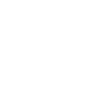

# copaairlines

[← Back to main README](../../README.md)




## 16 px

### black
```
https://georgegach.github.io/compatible-icons/simple-icons/copaairlines/16/black.png
```

### slate
```
https://georgegach.github.io/compatible-icons/simple-icons/copaairlines/16/slate.png
```

### white
```
https://georgegach.github.io/compatible-icons/simple-icons/copaairlines/16/white.png
```

## 64 px

### black
```
https://georgegach.github.io/compatible-icons/simple-icons/copaairlines/64/black.png
```

### slate
```
https://georgegach.github.io/compatible-icons/simple-icons/copaairlines/64/slate.png
```

### white
```
https://georgegach.github.io/compatible-icons/simple-icons/copaairlines/64/white.png
```

## 128 px

### black
```
https://georgegach.github.io/compatible-icons/simple-icons/copaairlines/128/black.png
```

### slate
```
https://georgegach.github.io/compatible-icons/simple-icons/copaairlines/128/slate.png
```

### white
```
https://georgegach.github.io/compatible-icons/simple-icons/copaairlines/128/white.png
```

## 512 px

### black
```
https://georgegach.github.io/compatible-icons/simple-icons/copaairlines/512/black.png
```

### slate
```
https://georgegach.github.io/compatible-icons/simple-icons/copaairlines/512/slate.png
```

### white
```
https://georgegach.github.io/compatible-icons/simple-icons/copaairlines/512/white.png
```

## 1024 px

### black
```
https://georgegach.github.io/compatible-icons/simple-icons/copaairlines/1024/black.png
```

### slate
```
https://georgegach.github.io/compatible-icons/simple-icons/copaairlines/1024/slate.png
```

### white
```
https://georgegach.github.io/compatible-icons/simple-icons/copaairlines/1024/white.png
```

## 16 px in base64

### black
```
data:image/png;base64,iVBORw0KGgoAAAANSUhEUgAAABAAAAAQCAYAAAAf8/9hAAAABmJLR0QA/wD/AP+gvaeTAAABNklEQVQ4ja3TwU4UQRQF0NPTDGSIToi6kQ0Y40ZcsOIL+BL/gB8k7t1A4oqEDUKIQiM6CIzSMy769tjBEBLkJZVUVd677977qgpco/awKAtMH1gMev9T/CgAcxoPrvATC3iukTXCGH0UyV/IuYeyBdnGRYpuNIbWuMzdNPvfnfNsdU2c4hgTfMAmhljE1wD0MY9BGMwV+IQjvMTryBoF9BwrKR7c5UOV7mP8CP1pun7GFnY6tG8iqcKowPeYc4a9gLzCm7CpQ/uiY+IsCuziIzbwFoc4xUGSJ6H/DGuR87QLsI9lfIv2QRKehAHNiKt4shpzZ3Gdrq3222vs70gnONFM658xtvGlw2YvwFXYvsM6llp2LcCvuD6MqbVm/ouRcpX7M83Dex9DyyLu6ui972v30uwFyj9qsGjDSpNnnQAAAABJRU5ErkJggg==
```

### slate
```
data:image/png;base64,iVBORw0KGgoAAAANSUhEUgAAABAAAAAQCAYAAAAf8/9hAAAABmJLR0QA/wD/AP+gvaeTAAABoElEQVQ4jaWSsU6TYRiFn/P1L781QBQYRAc1xhijgxOTi4nxQrwIr8krcHZzcHUiMZFGYyFAi4W0gv0eh1YJhgnPePKek5Nz3vQHR1OoM66E0mnAFnI1PVKuqDzP8L8GDWSKToCTJK24nqAwxvwEu4RQgdiS0kUL0AFotH4oJVvKTXEGoERsAzcAIhMKXU2DXkyQ5MWCE9xNUqu+D3k557heYRw9C6VrXEJ6gY7QpD8YfoJ8AzaRB0ITGAMQRiR3sZ5BepeXaDaBV5JHCbMSGsJ6koq2WN8A2+cSZ+AEOQSOszMYHoXSSj0M2Yb8AO9DHoKNMktYAo6FNtC92AH5EvwI2Qo8B78a9oPvarVLSi2xV2Et8kSchqz8MUh/MPqM3CYOMWOgR2ElsKw0i7uTwIEwIrmHrv412Pk+mpbivpTNxb7/4jQwE3qAyAElv9BbixlpNXfmiwFkNzo0jMXtWGaGAyDgU8izwMaf60XEnGLdo2SV6qnhmrAW85i4HJhUOAo5JPWt5HUgQif9weh4/l2lITKPK5cjKKWEPXEDSuc3dBrVyLiQYf0AAAAASUVORK5CYII=
```

### white
```
data:image/png;base64,iVBORw0KGgoAAAANSUhEUgAAABAAAAAQCAYAAAAf8/9hAAAABmJLR0QA/wD/AP+gvaeTAAABSElEQVQ4ja3Tv2pUYRAF8N/djYYNMYhaGBsVsVELK5/AJ/ENfMFgb6NgFbDxDyHBa9zsGjfJbo7FnU0usiBEB6b4YObMOWfma5LMsHC1GDZJcsVmMPiX5v8CsIYZfuEn1nEbwQQnuIam6tfrPcAQJNlJMk0X8ySLyuNcxnGSs6yIvonBHs7xBi+xhQ0c4KymX8eoGKw1ST7gK7bxqGRNCvQH7lfzaKUJSdpic5LkqOgnyUGSz0leJ3nXYz0vSW2SSZNkXOZ8xy6O8BCPi82iaE97Jl5Ek+Q93uIFnuALvuFTFZ8X/Vt4WnJu9AE+4h4OS/uoCjaLgVpxW548KHMvAGY1cdvqwzotGSPdplrMcXcJ8Odf2O+x2a3mVndMz/AcN5fslgCnul1vYVxNG5Wbuksdl9E7eFWGDpsk05q81Pu3rz2oYXcw/A2FIuCylUSdygAAAABJRU5ErkJggg==
```

