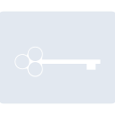
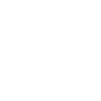

# coppel

[← Back to main README](../../README.md)





## 16 px

### black
```
https://georgegach.github.io/compatible-icons/simple-icons/coppel/16/black.png
```

### slate
```
https://georgegach.github.io/compatible-icons/simple-icons/coppel/16/slate.png
```

### white
```
https://georgegach.github.io/compatible-icons/simple-icons/coppel/16/white.png
```

## 64 px

### black
```
https://georgegach.github.io/compatible-icons/simple-icons/coppel/64/black.png
```

### slate
```
https://georgegach.github.io/compatible-icons/simple-icons/coppel/64/slate.png
```

### white
```
https://georgegach.github.io/compatible-icons/simple-icons/coppel/64/white.png
```

## 128 px

### black
```
https://georgegach.github.io/compatible-icons/simple-icons/coppel/128/black.png
```

### slate
```
https://georgegach.github.io/compatible-icons/simple-icons/coppel/128/slate.png
```

### white
```
https://georgegach.github.io/compatible-icons/simple-icons/coppel/128/white.png
```

## 512 px

### black
```
https://georgegach.github.io/compatible-icons/simple-icons/coppel/512/black.png
```

### slate
```
https://georgegach.github.io/compatible-icons/simple-icons/coppel/512/slate.png
```

### white
```
https://georgegach.github.io/compatible-icons/simple-icons/coppel/512/white.png
```

## 1024 px

### black
```
https://georgegach.github.io/compatible-icons/simple-icons/coppel/1024/black.png
```

### slate
```
https://georgegach.github.io/compatible-icons/simple-icons/coppel/1024/slate.png
```

### white
```
https://georgegach.github.io/compatible-icons/simple-icons/coppel/1024/white.png
```

## 16 px in base64

### black
```
data:image/png;base64,iVBORw0KGgoAAAANSUhEUgAAABAAAAAQCAYAAAAf8/9hAAAABmJLR0QA/wD/AP+gvaeTAAAAp0lEQVQ4jc3TOwoCMRRG4W98gQ8sbBS10CW4JN2JlXtwYbZaqVgIjoWgwliYAZlCZNL4QyApzrnJTUJkEizQLclfE9xRLyl4JMhKwpBVImAQLagV1ldcwrzvh97kgicOYUw+RK0vbAPVvIl73NDBGtsv1XcYY4lRLrjhhA1mSNELO/tMHXOsMEWzeI3ncIwGhmgXBEcMgriG7D/ewSOCf8Z+pjSi+DsvxgIkprQmhVoAAAAASUVORK5CYII=
```

### slate
```
data:image/png;base64,iVBORw0KGgoAAAANSUhEUgAAABAAAAAQCAYAAAAf8/9hAAAABmJLR0QA/wD/AP+gvaeTAAAA5ElEQVQ4ja2TwUrDUBBFz3156UKhYDYWFfTXLBRc+wd+hj/lLyjZJLjQttk14d0uLKUBi/DirGYW587cYQYmhur2e2nCPAcOuFPdrndAmTlAHybAADFMgAGYLBBPC0MnewMC+Rr0p70IIBiABmgsPQh3EDaQLs6BQjNDEX86+9Noh7kvgl6T/G67BP0C8oF9Z/GCuT0IcBWgd9BbslcibDEVYhhZTC6t9CgXz9gVAtXt2if6X5Aa0Ay4AS7HO1IrvAAPoAh4tERwBarO+/bikB25f7mDPhc2DBH8lPtMIm1zmx9jDwJCVXeWVTC4AAAAAElFTkSuQmCC
```

### white
```
data:image/png;base64,iVBORw0KGgoAAAANSUhEUgAAABAAAAAQCAYAAAAf8/9hAAAABmJLR0QA/wD/AP+gvaeTAAAAsElEQVQ4jc3TvWoCQRSG4Wf9g0RJYWMwKeIl5JL0TqxyD16YrVZGLALRQsgunBTOgmwhstP4wcBM8b5n5swMmSkiYoGXlvypiIg/9FsKyiIioiUM0cmAQbag11if8JvmE3f0phZU+E7j40r0fIMdoFs3cYczRlhhc6P6Fu9Y4q0WnHHAGp84Ypx2dp0+5vjCDE/Na/xJxxhgimFDsMdrEvcQj/EOygy+yv1Mx4zil/wDtfs8jsLn2pcAAAAASUVORK5CYII=
```

