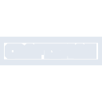
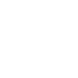

# craftsman

[← Back to main README](../../README.md)





## 16 px

### black
```
https://georgegach.github.io/compatible-icons/simple-icons/craftsman/16/black.png
```

### slate
```
https://georgegach.github.io/compatible-icons/simple-icons/craftsman/16/slate.png
```

### white
```
https://georgegach.github.io/compatible-icons/simple-icons/craftsman/16/white.png
```

## 64 px

### black
```
https://georgegach.github.io/compatible-icons/simple-icons/craftsman/64/black.png
```

### slate
```
https://georgegach.github.io/compatible-icons/simple-icons/craftsman/64/slate.png
```

### white
```
https://georgegach.github.io/compatible-icons/simple-icons/craftsman/64/white.png
```

## 128 px

### black
```
https://georgegach.github.io/compatible-icons/simple-icons/craftsman/128/black.png
```

### slate
```
https://georgegach.github.io/compatible-icons/simple-icons/craftsman/128/slate.png
```

### white
```
https://georgegach.github.io/compatible-icons/simple-icons/craftsman/128/white.png
```

## 512 px

### black
```
https://georgegach.github.io/compatible-icons/simple-icons/craftsman/512/black.png
```

### slate
```
https://georgegach.github.io/compatible-icons/simple-icons/craftsman/512/slate.png
```

### white
```
https://georgegach.github.io/compatible-icons/simple-icons/craftsman/512/white.png
```

## 1024 px

### black
```
https://georgegach.github.io/compatible-icons/simple-icons/craftsman/1024/black.png
```

### slate
```
https://georgegach.github.io/compatible-icons/simple-icons/craftsman/1024/slate.png
```

### white
```
https://georgegach.github.io/compatible-icons/simple-icons/craftsman/1024/white.png
```

## 16 px in base64

### black
```
data:image/png;base64,iVBORw0KGgoAAAANSUhEUgAAABAAAAAQCAYAAAAf8/9hAAAABmJLR0QA/wD/AP+gvaeTAAAAdUlEQVQ4je3QsQrCMBSF4a9VB5FOvpLvD76Ak7OiQwdbU5d7oWSNY38Ih+Tk3BPCRjMdLq0D3ijY44kBCw7V3YI5zlN7uOMba47wEoHUUvnpXfuYkqHdqvEWOsVLrfzc6/AInaIheeGMIz4YqwI4NX/ixh/4ATmLIO5m/jpYAAAAAElFTkSuQmCC
```

### slate
```
data:image/png;base64,iVBORw0KGgoAAAANSUhEUgAAABAAAAAQCAYAAAAf8/9hAAAABmJLR0QA/wD/AP+gvaeTAAAAqElEQVQ4je2QMU4DUQwFZ5aNFAoOQMdhOAMH5wBIiAZEQRQQTaI/FGEjaChIm2ls+fnZsuHMyfj4srk9acDT82Y7ZFgz8hZeGUGrX406GuyRFbCHVsE0R1vzGsRYAxfflgCrVIiUOuiBKvcTMClBi7jwcAjTDnAcXItuBcBMrge8T067Yr+4q53yquOS+BA/0eMClepmbuIOYBD482hoSY71/vvrM3/xBdr4Sc1ABDcqAAAAAElFTkSuQmCC
```

### white
```
data:image/png;base64,iVBORw0KGgoAAAANSUhEUgAAABAAAAAQCAYAAAAf8/9hAAAABmJLR0QA/wD/AP+gvaeTAAAAeElEQVQ4je3QMQ7CMAyF4S+lSCDExMR9uP/AATgCiA4MFNUsjoSyhrH/8my/JycyK92UiLj0LpiwYMQDRwS2TXbBJ+dVhxETzhnaYZN1oKTWPtKv3nXA0JiVW+qcYT9+7ZWIuOdgzq9VnjhhjzdezQNw6D7iyh/4AiGHJDc9m4mlAAAAAElFTkSuQmCC
```

