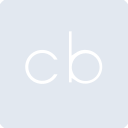

# crunchbase

[← Back to main README](../../README.md)

<table><tr>
  <td></td>
  <td></td>
  <td></td>
</tr></table>

## 16 px

### black
```
https://georgegach.github.io/compatible-icons/simple-icons/compat/crunchbase/16/black.png
```

### slate
```
https://georgegach.github.io/compatible-icons/simple-icons/compat/crunchbase/16/slate.png
```

### white
```
https://georgegach.github.io/compatible-icons/simple-icons/compat/crunchbase/16/white.png
```

## 64 px

### black
```
https://georgegach.github.io/compatible-icons/simple-icons/compat/crunchbase/64/black.png
```

### slate
```
https://georgegach.github.io/compatible-icons/simple-icons/compat/crunchbase/64/slate.png
```

### white
```
https://georgegach.github.io/compatible-icons/simple-icons/compat/crunchbase/64/white.png
```

## 128 px

### black
```
https://georgegach.github.io/compatible-icons/simple-icons/compat/crunchbase/128/black.png
```

### slate
```
https://georgegach.github.io/compatible-icons/simple-icons/compat/crunchbase/128/slate.png
```

### white
```
https://georgegach.github.io/compatible-icons/simple-icons/compat/crunchbase/128/white.png
```

## 512 px

### black
```
https://georgegach.github.io/compatible-icons/simple-icons/compat/crunchbase/512/black.png
```

### slate
```
https://georgegach.github.io/compatible-icons/simple-icons/compat/crunchbase/512/slate.png
```

### white
```
https://georgegach.github.io/compatible-icons/simple-icons/compat/crunchbase/512/white.png
```

## 1024 px

### black
```
https://georgegach.github.io/compatible-icons/simple-icons/compat/crunchbase/1024/black.png
```

### slate
```
https://georgegach.github.io/compatible-icons/simple-icons/compat/crunchbase/1024/slate.png
```

### white
```
https://georgegach.github.io/compatible-icons/simple-icons/compat/crunchbase/1024/white.png
```

## 16 px in base64

### black
```
data:image/png;base64,iVBORw0KGgoAAAANSUhEUgAAABAAAAAQCAYAAAAf8/9hAAAABmJLR0QA/wD/AP+gvaeTAAAA1klEQVQ4jbXSv0oDQRDH8c8GFSFg7PwDgVRWYp9n8N3yEr6Bna1iZWswIUVsTGGKKCaYHBht5uA4FHIXHFiY/e38vszsLgyxwnfFtcIwRbKnXmQpaLWjsUHNFG/bAAaYVwGssSxp+1j4Zdyd0v4F1wHo4iL0O4xxgEucFE35syzRwwSfeMQ7bnAb2gRX+Mp9xQ4W0eoxEs5CT2gXznYD1iyPcIgj9CN/iDES7qP2A6e5OacXL2aGEV5xjk5oazwFuI3WX4DKsck/+H9AtoU/a+C5JiTD+AcGmEGGf2HnPAAAAABJRU5ErkJggg==
```

### slate
```
data:image/png;base64,iVBORw0KGgoAAAANSUhEUgAAABAAAAAQCAYAAAAf8/9hAAAABmJLR0QA/wD/AP+gvaeTAAABEElEQVQ4jbWSMUsCABCFv3eZCUIYBFkQODUKjY6N0R+IfmJje1M0NUdFhCJEQUNCiSZ5r0HCzCIVuvHuvY97x6n90LlB1IAi89WApBVIi5gBiha1AC9iBkCiGDPonhCd34Z/A+xr4HUeQGL6XxsyJUTX4O/iwoRQ3Ds5QeoLGuC6AeMzMpqhXDUcgDZ/AOjNcGzlodCanXcW71L0cK5b7BueIU6Fjz63HwPsboiSiaqxCO3IAiykbeGSiGp6uIzUA5UnABaVhA3Jl0BFxIVxA0kiz40Kab+IpS1weSqCRivt2bo12YLhLqgKXrGVtq9CVCzXQePg7cfO1GXnqVke6d8BGixqthkE6ZbN3JCRmeYHab52IBPVNpYAAAAASUVORK5CYII=
```

### white
```
data:image/png;base64,iVBORw0KGgoAAAANSUhEUgAAABAAAAAQCAYAAAAf8/9hAAAABmJLR0QA/wD/AP+gvaeTAAAA20lEQVQ4jbXSvUpDQRDF8d8GFUFQA4IfELCyEnsfQXyB4CNa2ltJKmtREUkaGy2uoEFzEcciGwlXhdwbnGr37Jw/M8tJEXGLXSypVyUGKSJGDczfkBQR0dAMWjP0POF5HsANXusAPvFe0ZYxxI91Fyr3B5xlwCEOsn6BPlZxjO3fACOcoos27vGBN2zgCAXOcTKZfhowzKNuIWEv6wmdqbfFDF2pAtaxiat8vsxrJPRy7wt2Jmao5qDAHR6xb5zQwvhjrzO4g7W/ALVrlhz8P6Ccw1+2MGgIKdH/AosCPOIF6ceQAAAAAElFTkSuQmCC
```

