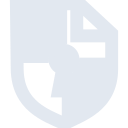
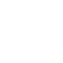

# cryptpad

[← Back to main README](../../README.md)





## 16 px

### black
```
https://georgegach.github.io/compatible-icons/simple-icons/cryptpad/16/black.png
```

### slate
```
https://georgegach.github.io/compatible-icons/simple-icons/cryptpad/16/slate.png
```

### white
```
https://georgegach.github.io/compatible-icons/simple-icons/cryptpad/16/white.png
```

## 64 px

### black
```
https://georgegach.github.io/compatible-icons/simple-icons/cryptpad/64/black.png
```

### slate
```
https://georgegach.github.io/compatible-icons/simple-icons/cryptpad/64/slate.png
```

### white
```
https://georgegach.github.io/compatible-icons/simple-icons/cryptpad/64/white.png
```

## 128 px

### black
```
https://georgegach.github.io/compatible-icons/simple-icons/cryptpad/128/black.png
```

### slate
```
https://georgegach.github.io/compatible-icons/simple-icons/cryptpad/128/slate.png
```

### white
```
https://georgegach.github.io/compatible-icons/simple-icons/cryptpad/128/white.png
```

## 512 px

### black
```
https://georgegach.github.io/compatible-icons/simple-icons/cryptpad/512/black.png
```

### slate
```
https://georgegach.github.io/compatible-icons/simple-icons/cryptpad/512/slate.png
```

### white
```
https://georgegach.github.io/compatible-icons/simple-icons/cryptpad/512/white.png
```

## 1024 px

### black
```
https://georgegach.github.io/compatible-icons/simple-icons/cryptpad/1024/black.png
```

### slate
```
https://georgegach.github.io/compatible-icons/simple-icons/cryptpad/1024/slate.png
```

### white
```
https://georgegach.github.io/compatible-icons/simple-icons/cryptpad/1024/white.png
```

## 16 px in base64

### black
```
data:image/png;base64,iVBORw0KGgoAAAANSUhEUgAAABAAAAAQCAYAAAAf8/9hAAAABmJLR0QA/wD/AP+gvaeTAAABN0lEQVQ4jY3TPy9EQRQF8B8RJDZWIlQanYREpVBqNKLQ+Q5qH0F8AVERQqnSCo1EQYiCRKuQRdjE//92FTMvxrMrTnIyb+a+e+6dc98j4AjVOnxHBRcYkUNjXF/zgQSbeEEr1jBRS+AvlOK6gjssYSovUPmHUDvmhCvNYjoN7qrvwSIe8JbwA4fQFAWqNSpeohsdmBR8yDCf5dQTeEARnxgXDBxL4u/ZQypwHQnNkT1xP4hj31514SytuI3TXBersZN74c6vfnpzwPcUSmhDIRGYwWPkbewoxXMqsBeTh5MXhtAZWfQbR+mmG1fYSc4WcBOZH+0l+vOK2bzn0IBe4Yu7R1kwsCpMZr1GR1piB4/YRx9G8ZRUfouxQi2BTGQ5VizjJBE4F/6H1nrJKQawIfhSxlY8+4Uvpd1myw+cFIsAAAAASUVORK5CYII=
```

### slate
```
data:image/png;base64,iVBORw0KGgoAAAANSUhEUgAAABAAAAAQCAYAAAAf8/9hAAAABmJLR0QA/wD/AP+gvaeTAAAB4klEQVQ4jYWSvU/TURiFn3NrSlWklQYtiYokLiYkxMHByT/AMLApTi4OOjg5ubgQnZyIiZOJsrm5auJqdFADTp1sDZRfCKXYhmLhHod+8hE5003Oe577vu+9AihVNpeAKY6QYNdSCjuJ9p3L42c/DfqhU7VzVLjjfSTGpiET0LvySnX2MOA/cvRK5/TGeCsGXpdWNx7uA8jE40ByGFFgQailEJ6V1zYfD3bgY+KRwByE50hZ26eAOYATbV/G+xmGNcE5BeWiw22IzV7b0svupW2AD6RxHUJW8p5hBmJm4nzuVtctVaotSfQBbdq60DpAxGk5po0uAAimS5XaMsT2rqwxxO8ewNKuTONiIXu1e8uvSu2t8KyEbQq2xySl6RAN5f4SzYrt00mSDHcBMWrepmHTAGoS6X1D2tt9gPQFGN52+kZvUfi6IC+RB7KHHsZa6gH+WouIekBPu76CbypQNzSA1GBWKIG9hR7gSuFMAn4Pni6tVhdsK8K8o55gUsCG3fsr0cTPE+P5n/0RgJ0/uQfgH8C9crL11TEMEVwEp4BRCQEtpG+Z0Lrb72ZAxaKHhoa3XoFnJBFxEmDCcBKoyPqw2xy5Pzmp5pGArkqVjSmUeiH7mk2Q+G7io0uF0eWDtf8Ap/TWZi6RLAIAAAAASUVORK5CYII=
```

### white
```
data:image/png;base64,iVBORw0KGgoAAAANSUhEUgAAABAAAAAQCAYAAAAf8/9hAAAABmJLR0QA/wD/AP+gvaeTAAABT0lEQVQ4jY2TPy9DURyGn4rQRINEdLLYJCQmg9FiEYPNdzD7COILNCZCajRZhUXSgRBDJVaDoKGJP/WvVY/BqR63Jd7kzbn3nnOe3++8JxcAtejvqqkf6rU6RUIdYXxLTkTaBV6BNLClzrUD/KXLMOaBB2BdXUgCPv4B6gVyQA1YVhe/Z9SDPzJYUytqNfK7egLQ2WC0qVgCskA/MM9XDg2tNPb8BqgAfUAdmAXSqVRqJuq41niOAbfBAF3BQ+F9XD2lmdUgcBFnsK+exy2om+Hsj+HMb4lsjqF5C5dAj5qJGEvAU/B96CjWSww4BDLAZLRgAhgI7qNVxbjdrHqjFqJvq+pdcFIldfQHLrrvnJpSh9WFkEE5/A+qdXW7pR+1Wy2oT+qROqJOq89R5WqYy7QAIshGqFhWzyLAlZpX0203J0Bj6k7IpazuqWPt1n4CGIp/w1FSxrYAAAAASUVORK5CYII=
```

