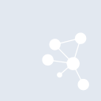
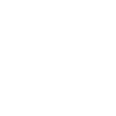

# cytoscapedotjs

[← Back to main README](../../README.md)

<table><tr>
  <td></td>
  <td></td>
  <td></td>
</tr></table>

## 16 px

### black
```
https://georgegach.github.io/compatible-icons/simple-icons/compat/cytoscapedotjs/16/black.png
```

### slate
```
https://georgegach.github.io/compatible-icons/simple-icons/compat/cytoscapedotjs/16/slate.png
```

### white
```
https://georgegach.github.io/compatible-icons/simple-icons/compat/cytoscapedotjs/16/white.png
```

## 64 px

### black
```
https://georgegach.github.io/compatible-icons/simple-icons/compat/cytoscapedotjs/64/black.png
```

### slate
```
https://georgegach.github.io/compatible-icons/simple-icons/compat/cytoscapedotjs/64/slate.png
```

### white
```
https://georgegach.github.io/compatible-icons/simple-icons/compat/cytoscapedotjs/64/white.png
```

## 128 px

### black
```
https://georgegach.github.io/compatible-icons/simple-icons/compat/cytoscapedotjs/128/black.png
```

### slate
```
https://georgegach.github.io/compatible-icons/simple-icons/compat/cytoscapedotjs/128/slate.png
```

### white
```
https://georgegach.github.io/compatible-icons/simple-icons/compat/cytoscapedotjs/128/white.png
```

## 512 px

### black
```
https://georgegach.github.io/compatible-icons/simple-icons/compat/cytoscapedotjs/512/black.png
```

### slate
```
https://georgegach.github.io/compatible-icons/simple-icons/compat/cytoscapedotjs/512/slate.png
```

### white
```
https://georgegach.github.io/compatible-icons/simple-icons/compat/cytoscapedotjs/512/white.png
```

## 1024 px

### black
```
https://georgegach.github.io/compatible-icons/simple-icons/compat/cytoscapedotjs/1024/black.png
```

### slate
```
https://georgegach.github.io/compatible-icons/simple-icons/compat/cytoscapedotjs/1024/slate.png
```

### white
```
https://georgegach.github.io/compatible-icons/simple-icons/compat/cytoscapedotjs/1024/white.png
```

## 16 px in base64

### black
```
data:image/png;base64,iVBORw0KGgoAAAANSUhEUgAAABAAAAAQCAYAAAAf8/9hAAAABmJLR0QA/wD/AP+gvaeTAAAAyUlEQVQ4jdXSO0qDQRTF8V8ejSBWKQ0GsglL3YC1C8iy3IMgBMEuKdLaGhARH2iCD0jSiJKxyCV8WuQbk8oDF4bhzv+eMzMVJBuousnh/wuY4usvgHd8xnqEY5znAu5whFNc4xXD2Af1EsAcz3hDM6xfoJEDGOEWlxHjKfqr2MmJ8IhDnKCGPvYjylKrHOxigL2YuI0xHopNFeVf+QVdHISTD7SLDamkJriyeMqEHs4sLjblAIo1Ryec3CDlRPite8zQwtY6gB/6BmbWQWNxYDqFAAAAAElFTkSuQmCC
```

### slate
```
data:image/png;base64,iVBORw0KGgoAAAANSUhEUgAAABAAAAAQCAYAAAAf8/9hAAAABmJLR0QA/wD/AP+gvaeTAAABA0lEQVQ4jdWSsUoDYRCEv9kLiKCHEEHBJAgWvkJKfQHBRnw4Ox/AQkSwtLC1FlLoaTAR9QLaiOEfCw0koMlBKrdbmP12ZlkVvYGZo2Ke4X8KELyBh5UABmRKgs+f8T6hQ4jzSgDZRcpij6QTpA6kF9s3KBUjTW26A6XAPduvQFNoaLjAWp0JMPQlbknpGihBjxY1TAD57Aim21pf2TVxpCDDvlQ2bBt3xmV/A0Tjrje4gnSAyQVL/Xr9SYqHCVmFV362fQbsKJTJ+jDemu1gtEFeCKId0gamYaeu0SmmrASwtWx5298Hd7KOW2v5PmJQNcKkI7g3vAObwOLUP/jVETTH+y+1y20BJthlAgAAAABJRU5ErkJggg==
```

### white
```
data:image/png;base64,iVBORw0KGgoAAAANSUhEUgAAABAAAAAQCAYAAAAf8/9hAAAABmJLR0QA/wD/AP+gvaeTAAAAyUlEQVQ4jdXSO0qDQRiF4edP0ggiCJaKQjZhYaEbsHYBLss9WIlgaWFrHQgi3iNekNiIkmMziFro/KbyrYbh+945B6ZJElPQmWb5/wrGeGsjeMRrOY+whf1awRk2sYsh7jEo96D3i2CCGzxgqUQ/wEKNYIRTHJca12W+g7maCpdN02xgB10cYrVU+eCnBItJjrBcXpzFLS4+DzUVX/kOe1gvSV7QbyMY46os9UqVJ6xhXtoxSbKdpJvkJElqEnznHM9YwcxfBF94BySweQgqgEIKAAAAAElFTkSuQmCC
```

