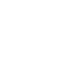

# datagrip

[← Back to main README](../../README.md)




## 16 px

### black
```
https://georgegach.github.io/compatible-icons/simple-icons/datagrip/16/black.png
```

### slate
```
https://georgegach.github.io/compatible-icons/simple-icons/datagrip/16/slate.png
```

### white
```
https://georgegach.github.io/compatible-icons/simple-icons/datagrip/16/white.png
```

## 64 px

### black
```
https://georgegach.github.io/compatible-icons/simple-icons/datagrip/64/black.png
```

### slate
```
https://georgegach.github.io/compatible-icons/simple-icons/datagrip/64/slate.png
```

### white
```
https://georgegach.github.io/compatible-icons/simple-icons/datagrip/64/white.png
```

## 128 px

### black
```
https://georgegach.github.io/compatible-icons/simple-icons/datagrip/128/black.png
```

### slate
```
https://georgegach.github.io/compatible-icons/simple-icons/datagrip/128/slate.png
```

### white
```
https://georgegach.github.io/compatible-icons/simple-icons/datagrip/128/white.png
```

## 512 px

### black
```
https://georgegach.github.io/compatible-icons/simple-icons/datagrip/512/black.png
```

### slate
```
https://georgegach.github.io/compatible-icons/simple-icons/datagrip/512/slate.png
```

### white
```
https://georgegach.github.io/compatible-icons/simple-icons/datagrip/512/white.png
```

## 1024 px

### black
```
https://georgegach.github.io/compatible-icons/simple-icons/datagrip/1024/black.png
```

### slate
```
https://georgegach.github.io/compatible-icons/simple-icons/datagrip/1024/slate.png
```

### white
```
https://georgegach.github.io/compatible-icons/simple-icons/datagrip/1024/white.png
```

## 16 px in base64

### black
```
data:image/png;base64,iVBORw0KGgoAAAANSUhEUgAAABAAAAAQCAYAAAAf8/9hAAAABmJLR0QA/wD/AP+gvaeTAAAA8klEQVQ4jcXSPUoEQRQE4G9k0UAQfwL/0EDEUJAF2UBEz7CYmngHU1MTTyB4BAMDD2AgiCKmarDjzwQqrAbCIghjsG9kAydxgi1ouujm1atX3QlyFTBQpRhqsT/jIPgU1rGEiTh7wDEusIwtLCKhO0ILa8hwi0PsoB3Fq7hCimvcRV1eOCjcjGAGszjDB06xhzo+MRqjf2GoLIPh6JrhJgThBbto4o3yENs4wQI2wvY3JrEf/Nd2gXfco4MjbGMcm8ETrOApeE2QHK+4DKGx6DSHwR7rKR4xH2u6V+DfqPyR+i9QvEKG8z/uG7phlqL/If4A8+oxUB3baQgAAAAASUVORK5CYII=
```

### slate
```
data:image/png;base64,iVBORw0KGgoAAAANSUhEUgAAABAAAAAQCAYAAAAf8/9hAAAABmJLR0QA/wD/AP+gvaeTAAABM0lEQVQ4jcWSTSvEcRSFn3P/EwslLwsv01hIlkpKVuIrEMv5GLa2SrZ27G0sLHyAWSiR7G0YlKHGlCmp//yOxaAIqVk429t9uj3nqnrXMB0kOlkGKABgbixtAYQ9nMS87EmkQQChK8M++DhgKqEVYAKsNkDkROtUKdsj1Ay7Elm203LalHnCrBpvh1iyqSO3tz4uAKKlgnGvYRQo5nmrIqlhfGixLpgBmhZ9EpGSXiR3/+SgRxGzhG6T0nmIIoBNzWItwbLCDz9KFK5bPgDGMwoLMmeCXGJIiY0sOf8sEVDwmBIX4Geh3bDLhgGjRUHZknCaNlwjyaYgQNW7hoXugZM2KvWbGMKUkLvaJVELuERUbcZAY+AR3gF/Lv2bdPxI/w94a8G3ko6+Dm3mgNJvgP+X+ApaloWDzoxf2wAAAABJRU5ErkJggg==
```

### white
```
data:image/png;base64,iVBORw0KGgoAAAANSUhEUgAAABAAAAAQCAYAAAAf8/9hAAAABmJLR0QA/wD/AP+gvaeTAAAA+0lEQVQ4jcXSPysFUBzG8c/VjUHJn8G/GCSjkpJB4jXIavEerFaLV6C8BIPBCzAokawY/L0DCoOSUo/BkavcxR3uU6fzdE6/55zzPb9KkmhCbc0UQ7XMd9gsfgDzmEBfWbvGDg4xiWWMoyJfukwyl6SW5CzJVpLVJE9JrpPMJDlOcpXkJMl5qUvVj6rowhCGsY8X7GEd03hFd3n6OzoaMejEDGo4LYFwjzUs4ZHGEJ+wizEs4AQf6MdG8b8gwjMu8IZtrKAXi8VXMIXb4qtQKX3wgKMS1FNOGkF73dWvcIPRMgbrA/6tphup9QHfv1DDwR/7s75gNlTrIX4Cx85tFPGg98EAAAAASUVORK5CYII=
```

