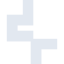
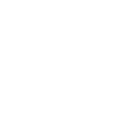

# deepcool

[← Back to main README](../../README.md)





## 16 px

### black
```
https://georgegach.github.io/compatible-icons/simple-icons/deepcool/16/black.png
```

### slate
```
https://georgegach.github.io/compatible-icons/simple-icons/deepcool/16/slate.png
```

### white
```
https://georgegach.github.io/compatible-icons/simple-icons/deepcool/16/white.png
```

## 64 px

### black
```
https://georgegach.github.io/compatible-icons/simple-icons/deepcool/64/black.png
```

### slate
```
https://georgegach.github.io/compatible-icons/simple-icons/deepcool/64/slate.png
```

### white
```
https://georgegach.github.io/compatible-icons/simple-icons/deepcool/64/white.png
```

## 128 px

### black
```
https://georgegach.github.io/compatible-icons/simple-icons/deepcool/128/black.png
```

### slate
```
https://georgegach.github.io/compatible-icons/simple-icons/deepcool/128/slate.png
```

### white
```
https://georgegach.github.io/compatible-icons/simple-icons/deepcool/128/white.png
```

## 512 px

### black
```
https://georgegach.github.io/compatible-icons/simple-icons/deepcool/512/black.png
```

### slate
```
https://georgegach.github.io/compatible-icons/simple-icons/deepcool/512/slate.png
```

### white
```
https://georgegach.github.io/compatible-icons/simple-icons/deepcool/512/white.png
```

## 1024 px

### black
```
https://georgegach.github.io/compatible-icons/simple-icons/deepcool/1024/black.png
```

### slate
```
https://georgegach.github.io/compatible-icons/simple-icons/deepcool/1024/slate.png
```

### white
```
https://georgegach.github.io/compatible-icons/simple-icons/deepcool/1024/white.png
```

## 16 px in base64

### black
```
data:image/png;base64,iVBORw0KGgoAAAANSUhEUgAAABAAAAAQCAYAAAAf8/9hAAAABmJLR0QA/wD/AP+gvaeTAAAArElEQVQ4jaXTPQrCQBAF4M+fS4jHSEpru3R6Ba/kEVJY2grWSi5ibSMYokUiLHETEvJgWGZ25vHesEscGUp8sO/oAfOeu0/f4BCCQVg25wqboJ6MJUiRYzFWQWhhkOcuBSFyXIL8NpbghWeQV0OUZHirbbSj9x2ECmYdPUmjqo07Hr+hNbYRkhQH/wuusMO5Tx21/JitUm07usQuHHEN8mIsQYFTuzj5L0wm+AKHUSLnv54uVQAAAABJRU5ErkJggg==
```

### slate
```
data:image/png;base64,iVBORw0KGgoAAAANSUhEUgAAABAAAAAQCAYAAAAf8/9hAAAABmJLR0QA/wD/AP+gvaeTAAABAklEQVQ4jaWTsUoDQRCGv9k7ziZYSECDSMRXSEprOzu1TyP4RJaWKSxtBWslD+FFJBcM4SAIEe9mLGSFXI64R/5uZme++XeWhRql2fx8PM2LcZZbOskv62q83IYz29QYAghSDPD68dmR4vv0jyr0gsZ7gJRffXFuiBEBWGg3q1do0FZxUNFQcY8+SKx4bgRwsDTThY9VTYMBBigMRBj4XBlFV8D9/wBDpKbAOXppNl9W86UkLyf7rakAvM1mh6bJmSorDCfaB66pLlhRE73oHuw9xABH7fY7cFedkk7yhQg367YoPbLuFeol3JryBL9+LN4ZNQKoudFxZ3dtmVv/ha0BPyYbV0LA34oUAAAAAElFTkSuQmCC
```

### white
```
data:image/png;base64,iVBORw0KGgoAAAANSUhEUgAAABAAAAAQCAYAAAAf8/9hAAAABmJLR0QA/wD/AP+gvaeTAAAAsklEQVQ4jaWTPQ6CQBCFv1EvYTwGlNZ2dHIFr+QRKCxtTaw1XMTahkTCs1CTCS4LG75uZmdf3tsfCCCpkNTqQxma+bGIrCm2cYrAJFYAktbA1vWzJAEgBypgmerAR5iUeciBpwIurr6lCjTA09XdqI3vvb8UJvoOvAMbmMkkNYH+3cwe9nWwAXYBkRw48H/AHbA3s3PMHZLKgVitpKIfYYwjcHV1nSpQm9mp35z9F2YLvAHtyGer1XJtqQAAAABJRU5ErkJggg==
```

