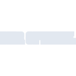

# derspiegel

[← Back to main README](../../README.md)





## 16 px

### black
```
https://georgegach.github.io/compatible-icons/simple-icons/derspiegel/16/black.png
```

### slate
```
https://georgegach.github.io/compatible-icons/simple-icons/derspiegel/16/slate.png
```

### white
```
https://georgegach.github.io/compatible-icons/simple-icons/derspiegel/16/white.png
```

## 64 px

### black
```
https://georgegach.github.io/compatible-icons/simple-icons/derspiegel/64/black.png
```

### slate
```
https://georgegach.github.io/compatible-icons/simple-icons/derspiegel/64/slate.png
```

### white
```
https://georgegach.github.io/compatible-icons/simple-icons/derspiegel/64/white.png
```

## 128 px

### black
```
https://georgegach.github.io/compatible-icons/simple-icons/derspiegel/128/black.png
```

### slate
```
https://georgegach.github.io/compatible-icons/simple-icons/derspiegel/128/slate.png
```

### white
```
https://georgegach.github.io/compatible-icons/simple-icons/derspiegel/128/white.png
```

## 512 px

### black
```
https://georgegach.github.io/compatible-icons/simple-icons/derspiegel/512/black.png
```

### slate
```
https://georgegach.github.io/compatible-icons/simple-icons/derspiegel/512/slate.png
```

### white
```
https://georgegach.github.io/compatible-icons/simple-icons/derspiegel/512/white.png
```

## 1024 px

### black
```
https://georgegach.github.io/compatible-icons/simple-icons/derspiegel/1024/black.png
```

### slate
```
https://georgegach.github.io/compatible-icons/simple-icons/derspiegel/1024/slate.png
```

### white
```
https://georgegach.github.io/compatible-icons/simple-icons/derspiegel/1024/white.png
```

## 16 px in base64

### black
```
data:image/png;base64,iVBORw0KGgoAAAANSUhEUgAAABAAAAAQCAYAAAAf8/9hAAAABmJLR0QA/wD/AP+gvaeTAAAAaElEQVQ4je3PwQmDABAEwIlEu0ghFpB+bMlW8kgFwb9gFSomnw2IoF8/Liy73O0dd1w4Hzc0GFFhwYAOz/S/0QJz5u7JdhLY8rVT37LdW/BZ+f5oyf+FCWXOgjfq+AGP1QtFuEQvnI4faWEts9OLUvsAAAAASUVORK5CYII=
```

### slate
```
data:image/png;base64,iVBORw0KGgoAAAANSUhEUgAAABAAAAAQCAYAAAAf8/9hAAAABmJLR0QA/wD/AP+gvaeTAAAAlElEQVQ4je2PsU3DYBhE332/8QDpMwgFJWswA6zEKkgZwT2WC5fQQnyXIopAsqKUafzq09072Lg/+py/X5XlJ2o92DFT37dhcZ5tCwhVwlRlOQJYraMwyaBx/sr/xgRAH1Kebs5H77VSEkje/YUYr/vnpQt6U5bfqD2ATRU6clCnx3OBJ6v2lwturTBFYcxKYOMenAC3MkAnngtNqQAAAABJRU5ErkJggg==
```

### white
```
data:image/png;base64,iVBORw0KGgoAAAANSUhEUgAAABAAAAAQCAYAAAAf8/9hAAAABmJLR0QA/wD/AP+gvaeTAAAAaUlEQVQ4je3PwQmDAAyF4U/RbuEgDtB9dKSu0kMnEO+CU1gxveQgpfbqxR/Ce4TkkXBxPkVEdFhww4YZI+4oEKkl1tyrcnYUv3ke9L95HAUMOz/9S6jQ4406z4IX2vQzmt0LZdaWenE6H3mHkFTu6pjvAAAAAElFTkSuQmCC
```

