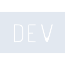

# devdotto

[← Back to main README](../../README.md)

<table><tr>
  <td></td>
  <td></td>
  <td></td>
</tr></table>

## 16 px

### black
```
https://georgegach.github.io/compatible-icons/simple-icons/compat/devdotto/16/black.png
```

### slate
```
https://georgegach.github.io/compatible-icons/simple-icons/compat/devdotto/16/slate.png
```

### white
```
https://georgegach.github.io/compatible-icons/simple-icons/compat/devdotto/16/white.png
```

## 64 px

### black
```
https://georgegach.github.io/compatible-icons/simple-icons/compat/devdotto/64/black.png
```

### slate
```
https://georgegach.github.io/compatible-icons/simple-icons/compat/devdotto/64/slate.png
```

### white
```
https://georgegach.github.io/compatible-icons/simple-icons/compat/devdotto/64/white.png
```

## 128 px

### black
```
https://georgegach.github.io/compatible-icons/simple-icons/compat/devdotto/128/black.png
```

### slate
```
https://georgegach.github.io/compatible-icons/simple-icons/compat/devdotto/128/slate.png
```

### white
```
https://georgegach.github.io/compatible-icons/simple-icons/compat/devdotto/128/white.png
```

## 512 px

### black
```
https://georgegach.github.io/compatible-icons/simple-icons/compat/devdotto/512/black.png
```

### slate
```
https://georgegach.github.io/compatible-icons/simple-icons/compat/devdotto/512/slate.png
```

### white
```
https://georgegach.github.io/compatible-icons/simple-icons/compat/devdotto/512/white.png
```

## 1024 px

### black
```
https://georgegach.github.io/compatible-icons/simple-icons/compat/devdotto/1024/black.png
```

### slate
```
https://georgegach.github.io/compatible-icons/simple-icons/compat/devdotto/1024/slate.png
```

### white
```
https://georgegach.github.io/compatible-icons/simple-icons/compat/devdotto/1024/white.png
```

## 16 px in base64

### black
```
data:image/png;base64,iVBORw0KGgoAAAANSUhEUgAAABAAAAAQCAYAAAAf8/9hAAAABmJLR0QA/wD/AP+gvaeTAAAAuUlEQVQ4jcXSPWtCQRCF4ccPLooaYwjapNTf458PwSpCSECExKRQI36luKOGBQu9hafZnWHm3bOzy61VQqco4BPLK/vrJeyLOKgm8QQb3KMid0d+zRmeIleOnHICeMUCz1jjA/Nw+RI1Y6wODSngDgPUkKGHLprh6Fc+r+45wM5pJnuMsI34Ed9o/+9LAZuw/BOAfqw7PGAon89R6Su84yuKM0zRCMsZ3mLfOge4WNU4sdBHKvSVb68/u9EoFoWNnioAAAAASUVORK5CYII=
```

### slate
```
data:image/png;base64,iVBORw0KGgoAAAANSUhEUgAAABAAAAAQCAYAAAAf8/9hAAAABmJLR0QA/wD/AP+gvaeTAAAA5ElEQVQ4jc2SwUqCYRREz/yKVET5S1iLdtnz9JY9UUSLSAwCN5ZBppV9p4UFKq10UbO8cM7AcOGvk8FgXG8jaKbFLXG6EW12m4QOZLP6QHPtNEyYI22hQRiBIDXyRHIKjCxUqagBqhVhcid5hVwBH8iDZAKRVNeL0vSpePthVgTiAXpeKDuQFnAc0gX2Aw1gZpgGur8K0AK42KRYLDfo57f8iGQcPVzmVgXJXJhEnxGrVL0kIgXppHABtpeR9RG70T5wZvICzpAGcU84QS6T1LjUeT8cyxZpIo9bPZLv9DZ+pH+RL5tGYIW5EboKAAAAAElFTkSuQmCC
```

### white
```
data:image/png;base64,iVBORw0KGgoAAAANSUhEUgAAABAAAAAQCAYAAAAf8/9hAAAABmJLR0QA/wD/AP+gvaeTAAAAu0lEQVQ4jcXSyWqCQRAE4E8jP4a4xBD04lGfx5cPkpNCiCABsxzccJkc7IQw4MH8B+vS00V3ddHTXBuVlFKnrMAC63/231ZSSqmMg1qWz7HHPW6wCL6DD/SDqwanmglMsMITdphhiYRx1Eyx/WnIBVoYoo4CPXTRCEcbp311zwkcY5qIzzhE/ohPtP/25QL7sPwVAoOIRzxg5LSfX+S/8Ir3KC7whruwXOAl3s1zAhejFhNLHVKpU74+vgHQ7joET5Kj/gAAAABJRU5ErkJggg==
```

