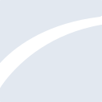

# devexpress

[← Back to main README](../../README.md)

<table><tr>
  <td></td>
  <td></td>
  <td></td>
</tr></table>

## 16 px

### black
```
https://georgegach.github.io/compatible-icons/simple-icons/compat/devexpress/16/black.png
```

### slate
```
https://georgegach.github.io/compatible-icons/simple-icons/compat/devexpress/16/slate.png
```

### white
```
https://georgegach.github.io/compatible-icons/simple-icons/compat/devexpress/16/white.png
```

## 64 px

### black
```
https://georgegach.github.io/compatible-icons/simple-icons/compat/devexpress/64/black.png
```

### slate
```
https://georgegach.github.io/compatible-icons/simple-icons/compat/devexpress/64/slate.png
```

### white
```
https://georgegach.github.io/compatible-icons/simple-icons/compat/devexpress/64/white.png
```

## 128 px

### black
```
https://georgegach.github.io/compatible-icons/simple-icons/compat/devexpress/128/black.png
```

### slate
```
https://georgegach.github.io/compatible-icons/simple-icons/compat/devexpress/128/slate.png
```

### white
```
https://georgegach.github.io/compatible-icons/simple-icons/compat/devexpress/128/white.png
```

## 512 px

### black
```
https://georgegach.github.io/compatible-icons/simple-icons/compat/devexpress/512/black.png
```

### slate
```
https://georgegach.github.io/compatible-icons/simple-icons/compat/devexpress/512/slate.png
```

### white
```
https://georgegach.github.io/compatible-icons/simple-icons/compat/devexpress/512/white.png
```

## 1024 px

### black
```
https://georgegach.github.io/compatible-icons/simple-icons/compat/devexpress/1024/black.png
```

### slate
```
https://georgegach.github.io/compatible-icons/simple-icons/compat/devexpress/1024/slate.png
```

### white
```
https://georgegach.github.io/compatible-icons/simple-icons/compat/devexpress/1024/white.png
```

## 16 px in base64

### black
```
data:image/png;base64,iVBORw0KGgoAAAANSUhEUgAAABAAAAAQCAYAAAAf8/9hAAAABmJLR0QA/wD/AP+gvaeTAAAAz0lEQVQ4jaXSwUpCQRSH8Z/hRuwdkl7ATQ/gok1v0UO49xV8jDZtbNm+heCidkEEZiolQthCpHJcOPdyEZHrdODAMMz3zf8wAx8IiT2rxEVqratHAgEzLPGNYRnBynbMEe5iP+MPtcy6dz4McI16lFVxhVs8Yb5PMMcDLgopznGDVyx2zueLX7zEG7Jq4B6TA0kFfKGH00LULsYHwFywRGcn7mPcL/MXtAtwC28lwVyQ1SWmR8K5oIn3BDjAGYaJcID+P+DA9gmTBSf4kV6fG/Drr1CGZvZIAAAAAElFTkSuQmCC
```

### slate
```
data:image/png;base64,iVBORw0KGgoAAAANSUhEUgAAABAAAAAQCAYAAAAf8/9hAAAABmJLR0QA/wD/AP+gvaeTAAABTklEQVQ4jZ2QO08UYRSGn/dzQjARA4QMw2XBkEhDQWdtoT+BhpoW/4GFjRWJhaUdlhQWhNhT8wdo5DKL7ghhl1twY+Z7KWSTRQiwc6pTnOc57znKGyeFcUqFsn0UqsIAkoaTnpfCYYBLw5nR3iMEakMsUMgVtW60Ppk925ZU5nn+VPuNlu/E4MjSPjF+7lN7LcuyC9tJ/fD0rcu4hPQSM3FLIHQM3nbk3dT44BbAXtGaUeSjxasAI4aBznz3CSWwS2C5lg5+B9j51XzxJOgL1hzymID/414LdAJs9of2Ypqm59dRV2KMC5jx29hNwR8pfqqNDn3oxK0XrW8mzAr1P/TiBIX3tdHnK/8in70OLleNavdt7S51moOi9aY0X4HsUWS3oF4056O1AUz0AgPox8/mdCI2kaZ6hQGSJIQ1cCUYIBjPVoUBAvbfqrDh9xVjGIzGCDp2NQAAAABJRU5ErkJggg==
```

### white
```
data:image/png;base64,iVBORw0KGgoAAAANSUhEUgAAABAAAAAQCAYAAAAf8/9hAAAABmJLR0QA/wD/AP+gvaeTAAAA40lEQVQ4jZ3SPUoDYRSF4TOSRhTsbBU3YKO9hU124SLs3YLLsLHR0t5CsDCdIEL8JcZA0CKIP4+FcRjEaGYOfM3le1/OhVugl2QxzfJYQEM4ST5aNQFJ+klGSZ6TdKcRvCTpJblOcjh+50VRvGM2JqePU2xhLknQQhv76GDwm2CAY6yVvVnBHi7xVP1cFbzhAu0KuIwj3E2q+S0Y4gDzlaq7uP1jxVIwws6Pumfj+b8JtivwBq6mAUtBBd7EfR24FGAVN3VhvlZYQrcJDAVOkqzXPOkyBYZJFpoKZpK8NoWTPHwC6EkaY9f2/koAAAAASUVORK5CYII=
```

