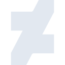

# deviantart

[← Back to main README](../../README.md)





## 16 px

### black
```
https://georgegach.github.io/compatible-icons/simple-icons/deviantart/16/black.png
```

### slate
```
https://georgegach.github.io/compatible-icons/simple-icons/deviantart/16/slate.png
```

### white
```
https://georgegach.github.io/compatible-icons/simple-icons/deviantart/16/white.png
```

## 64 px

### black
```
https://georgegach.github.io/compatible-icons/simple-icons/deviantart/64/black.png
```

### slate
```
https://georgegach.github.io/compatible-icons/simple-icons/deviantart/64/slate.png
```

### white
```
https://georgegach.github.io/compatible-icons/simple-icons/deviantart/64/white.png
```

## 128 px

### black
```
https://georgegach.github.io/compatible-icons/simple-icons/deviantart/128/black.png
```

### slate
```
https://georgegach.github.io/compatible-icons/simple-icons/deviantart/128/slate.png
```

### white
```
https://georgegach.github.io/compatible-icons/simple-icons/deviantart/128/white.png
```

## 512 px

### black
```
https://georgegach.github.io/compatible-icons/simple-icons/deviantart/512/black.png
```

### slate
```
https://georgegach.github.io/compatible-icons/simple-icons/deviantart/512/slate.png
```

### white
```
https://georgegach.github.io/compatible-icons/simple-icons/deviantart/512/white.png
```

## 1024 px

### black
```
https://georgegach.github.io/compatible-icons/simple-icons/deviantart/1024/black.png
```

### slate
```
https://georgegach.github.io/compatible-icons/simple-icons/deviantart/1024/slate.png
```

### white
```
https://georgegach.github.io/compatible-icons/simple-icons/deviantart/1024/white.png
```

## 16 px in base64

### black
```
data:image/png;base64,iVBORw0KGgoAAAANSUhEUgAAABAAAAAQCAYAAAAf8/9hAAAABmJLR0QA/wD/AP+gvaeTAAAA7ElEQVQ4jY3SzyqEYRQG8F9jwkiUkZKlhUuwthI7ZWPpGlyAcgluAFdg7wqsrUxJmg0LUhZiTD6b+ep0fPP2nTr1nn/Pec55D+3kFtVER9ivA50WxTvYDPZvDHbDu4f1VNzBOVbb0NzFG56T/gT6FYYRsJtAelgpNBnjGq/TGHymblmfsBSL8hJLSx3hCh/ROZPey7jDAvoJYIijyRhFmcdjA/0BLnGBrRLAKb4aAGr9xl6dnGdexDHmCg2qaGSAM2yU6GWJd9DHYfKN/f/z2WkA21hLyfc4kO4fL00AWd5xgodCTvGQBrgpFcMfD1k9HwkMKXcAAAAASUVORK5CYII=
```

### slate
```
data:image/png;base64,iVBORw0KGgoAAAANSUhEUgAAABAAAAAQCAYAAAAf8/9hAAAABmJLR0QA/wD/AP+gvaeTAAABbUlEQVQ4jY2SQWpTYRSFv3NfSY1oWkyppKGCSLOF4kRwBwpuwDU4cOTEiY7dgZMOnDhz0A1UXIAYKURISksotBYUiel/HPn6v+dr6h39/7n3HM49XPEf9e3w9GOIbQCk30o82uytfACIq8iTw5OHReheCSSnvL/09zEej9updbOXN0OK5PQGe60EJXCDgFudB7J3kGYlZpBjzTnDnhaOT/8IAAjatm/lmKv9OdL7jV7nuFHgqkrmYNaav6isWRtYFOoswm+3ut2zHCwdRGiEvJPOHYTuYwa1VQ7Of66+qquqDoxGvhbt758Fd2uTX0neI3AxL173+51hxUHp5Prpczk2qvEBZoA0IDFL4XfAEGoZTKfTG2GegpcvC8I15YqDX15+Ce5fRm6qUmAyOeumlJ6gC0xobnGcE4RbzZdYeNuwnqdq+Yukx8nZ/QuW0o+jxhVysqQT42eb6yv7i1aoHk7o4m8P79xe3V1EBvgDU0mF6Rm7IVIAAAAASUVORK5CYII=
```

### white
```
data:image/png;base64,iVBORw0KGgoAAAANSUhEUgAAABAAAAAQCAYAAAAf8/9hAAAABmJLR0QA/wD/AP+gvaeTAAABA0lEQVQ4jZXSzSqFURTG8d86yUcZISUjKQM3IBNlyEy5AddgYiJlZOwOTEzN3QC5ACFlpCSljI7TyTJxsm3veeMZ7b3W8/z3R4s/KDMv81u9zNwc9Dp/CK9jsSh9lP2RwjiBuSrfwTFmhh0wUqzXcIpe5anDz7hqAsAEpoadhj7OIuKlvOJ/9Ij9slAD2oA9nETEW1mMwSIzl7D3BVnFUgV4wHJEdBsBBWgc11ioWne4QOIoIm4b75mZB5nZzeF6z8yNxjdn5iR2MNZI/7KVm/rTDjHfEv6lchKnse3nbPTxUmVGGwFYwWxlvsGWav7x1ASo9YrdiLhv8bQO0m1EnLeF4RPDwmvEb7MxbQAAAABJRU5ErkJggg==
```

