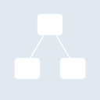
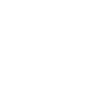

# diagramsdotnet

[← Back to main README](../../README.md)





## 16 px

### black
```
https://georgegach.github.io/compatible-icons/simple-icons/diagramsdotnet/16/black.png
```

### slate
```
https://georgegach.github.io/compatible-icons/simple-icons/diagramsdotnet/16/slate.png
```

### white
```
https://georgegach.github.io/compatible-icons/simple-icons/diagramsdotnet/16/white.png
```

## 64 px

### black
```
https://georgegach.github.io/compatible-icons/simple-icons/diagramsdotnet/64/black.png
```

### slate
```
https://georgegach.github.io/compatible-icons/simple-icons/diagramsdotnet/64/slate.png
```

### white
```
https://georgegach.github.io/compatible-icons/simple-icons/diagramsdotnet/64/white.png
```

## 128 px

### black
```
https://georgegach.github.io/compatible-icons/simple-icons/diagramsdotnet/128/black.png
```

### slate
```
https://georgegach.github.io/compatible-icons/simple-icons/diagramsdotnet/128/slate.png
```

### white
```
https://georgegach.github.io/compatible-icons/simple-icons/diagramsdotnet/128/white.png
```

## 512 px

### black
```
https://georgegach.github.io/compatible-icons/simple-icons/diagramsdotnet/512/black.png
```

### slate
```
https://georgegach.github.io/compatible-icons/simple-icons/diagramsdotnet/512/slate.png
```

### white
```
https://georgegach.github.io/compatible-icons/simple-icons/diagramsdotnet/512/white.png
```

## 1024 px

### black
```
https://georgegach.github.io/compatible-icons/simple-icons/diagramsdotnet/1024/black.png
```

### slate
```
https://georgegach.github.io/compatible-icons/simple-icons/diagramsdotnet/1024/slate.png
```

### white
```
https://georgegach.github.io/compatible-icons/simple-icons/diagramsdotnet/1024/white.png
```

## 16 px in base64

### black
```
data:image/png;base64,iVBORw0KGgoAAAANSUhEUgAAABAAAAAQCAYAAAAf8/9hAAAABmJLR0QA/wD/AP+gvaeTAAAA30lEQVQ4ja3TQS5EQRDG8d8bYjIiVjYkZNyCLW7AwgWwdB5HGEfgDDYWs54VFrPxMIjwLKYkndEtw6jkpbvy/atefal0hXss+1vUFZqC+ITXuC9gKQfNF4pvcIy7yNdwhtUc3GS+QYYb5NhWYYKpo2Shg1O8Rd7GYqlJzsIjrjDCC67x8BsLt1iJSdrGax7mwLTBR/xxaLzC9UTbwHNoo2C/WTjHHrawg36i9bGL7WB6iaaJjgcT010k0OWEth81/7fGCidxwhw2E66LQ7xHfvTF/vQWpoqZLbRQz1BffwJpoEZyW2qrDQAAAABJRU5ErkJggg==
```

### slate
```
data:image/png;base64,iVBORw0KGgoAAAANSUhEUgAAABAAAAAQCAYAAAAf8/9hAAAABmJLR0QA/wD/AP+gvaeTAAABLklEQVQ4ja2Szy4DYRTFf+fTkJa0XUiKpMqyD0Ss7LASL2PDI0i8Ae8hVtqiI5GYNloRZo7FqDQ1gnKW3/nz3ZN71Y7iHlBmCtjuF742e4D1DKDArM3CpEJSuZBnFbqVtZvYEcCMw0pCcgRa/qRtR7E/B9CqL1XXxt86UXxlaExqQ/74P0duBVCxFT0cFBReAJLAnF9dQj8MMOm8zHZC2rQVZF8iFfO0X1RQV2IRVJSYE6FsuP8mwCl4qEw4MKqPTbQqeMo4DzPtRAVZp2ngOFiPCS4FdAhuvrMXhv2gMExJ55Wyg9gcD3AKJ41a9WwU2I5610AWIN00apXzEde5iys2G4D+bY3C3mt1Y2Ufakbyuv1BrrWj3pbtBMBmB7Kl5l7ib/DnCsF2f1qz7f4bUXqDMQjZpagAAAAASUVORK5CYII=
```

### white
```
data:image/png;base64,iVBORw0KGgoAAAANSUhEUgAAABAAAAAQCAYAAAAf8/9hAAAABmJLR0QA/wD/AP+gvaeTAAAA7ElEQVQ4ja2RMUpDQRRFz/+KEpFUNgpKLN2BtuoOtHADaul6sgRdgtlHQKtUamHjhx8RMcci78OgMxCMt5rHPffNvDeV+gb0+ZuaSrVgtsBHnNeAzRy0Wgg/AVfAS9Q7wBDY/kWa1yTDTXJgXRpuUZVG6Kk3wGfU68BGDiwtsQUegAOgBh6BfTKLLI3wDGwBvbi9D7zmwLTBDJgG2AK7ibcHvIc3DXauZKF36ql6qB6r48QbqyfqUTC3ndE1mKnn6dPU+6TB6Id3Fpn/+8YKuFarqFeYb73TQL0AvqK+jEzxGxfW0iPUQLNEvvkGk+/BgeXkgGwAAAAASUVORK5CYII=
```

