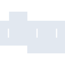
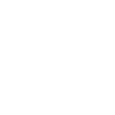

# digg

[← Back to main README](../../README.md)





## 16 px

### black
```
https://georgegach.github.io/compatible-icons/simple-icons/digg/16/black.png
```

### slate
```
https://georgegach.github.io/compatible-icons/simple-icons/digg/16/slate.png
```

### white
```
https://georgegach.github.io/compatible-icons/simple-icons/digg/16/white.png
```

## 64 px

### black
```
https://georgegach.github.io/compatible-icons/simple-icons/digg/64/black.png
```

### slate
```
https://georgegach.github.io/compatible-icons/simple-icons/digg/64/slate.png
```

### white
```
https://georgegach.github.io/compatible-icons/simple-icons/digg/64/white.png
```

## 128 px

### black
```
https://georgegach.github.io/compatible-icons/simple-icons/digg/128/black.png
```

### slate
```
https://georgegach.github.io/compatible-icons/simple-icons/digg/128/slate.png
```

### white
```
https://georgegach.github.io/compatible-icons/simple-icons/digg/128/white.png
```

## 512 px

### black
```
https://georgegach.github.io/compatible-icons/simple-icons/digg/512/black.png
```

### slate
```
https://georgegach.github.io/compatible-icons/simple-icons/digg/512/slate.png
```

### white
```
https://georgegach.github.io/compatible-icons/simple-icons/digg/512/white.png
```

## 1024 px

### black
```
https://georgegach.github.io/compatible-icons/simple-icons/digg/1024/black.png
```

### slate
```
https://georgegach.github.io/compatible-icons/simple-icons/digg/1024/slate.png
```

### white
```
https://georgegach.github.io/compatible-icons/simple-icons/digg/1024/white.png
```

## 16 px in base64

### black
```
data:image/png;base64,iVBORw0KGgoAAAANSUhEUgAAABAAAAAQCAYAAAAf8/9hAAAABmJLR0QA/wD/AP+gvaeTAAAA3klEQVQ4jc3STU4CQRAF4G9wFqMhahQX6Mq1R3Dn0TyerjyChgUJSJAoAeXHxVSbDjJGVvqSTle96ldVXd38NYrMPkeV+VP0d0n2gCHWGOD+N6JWZq9xuktFKPGEGY4zfoUrPGIe3B7aeMMiuKqIyi9Y4iRLMo0CsxDksVEkPEpXeEavoctxdJKjF5pvM2jCasP/OlvGfhhrGw5wucFdJKOlHkoZaxL8JPx57Pn/SLF26uCmofI1btXDfY9O0nWWeEVV4q4hwRk+1C+wUH+yTojTM46L7Vqwj+4P8X+CT3mMMSUu3QbqAAAAAElFTkSuQmCC
```

### slate
```
data:image/png;base64,iVBORw0KGgoAAAANSUhEUgAAABAAAAAQCAYAAAAf8/9hAAAABmJLR0QA/wD/AP+gvaeTAAABJ0lEQVQ4jc2QTU4CURCEvxoeBgk/RpSIhgWHcOXOo3kp7+ApEEwkAgaJENCZVy4cUAkEd1qr7urqSnXDX0OrojccnjsWS6s+Ksw7zcpgn0FYV1nxVnABNDCjgtIucLnPIPkqbaDxy+RrqD+Y9AwLwZHhFEDwZKgCQ2CZawtCFRNnoDTXlYKhbfyCla0+YmgK5kZn2AvjVNKx8eeaebZcANUTAElj5IftGT0B3W9wD5LGGz/AO+9MiBvUWhvytiZU2+6gMqbzg0EXzsWJ8MwiRBFA09x+ahRMXFoEoPRtfRpFsFX5TODkOvGGP2DFK8ENkQzxBpTz+6MimRJebUqh3arfbQvefXw5TYjviBRIMSPECSZDpLZBmmjbMkC/3z+MB9XWrvn/wQe6L3g1EY49jgAAAABJRU5ErkJggg==
```

### white
```
data:image/png;base64,iVBORw0KGgoAAAANSUhEUgAAABAAAAAQCAYAAAAf8/9hAAAABmJLR0QA/wD/AP+gvaeTAAAA60lEQVQ4jc2SzW7CMBCEv4UcAoIWQTm0nHgObn20Ph499RFAHFCBiiJA/IQOh6yrKCRSbjCS5fWsZ7xeG+4NC4GkNyDO5PZmNq/sJOlL0lIpFpI+q+hqWQ+gV/lEh0maAgegA/Sd/wbawAI4OlcHWsAOSJyLTZKAX+ACdDPmeyBy8ySX+3HD53CFFTArqXINTHLczDU3PSjDX279vzfy+clHEZrAMMcNQlAjbUrkY+P8xtdHn7P/I+RaoYL3kpNHwAdpc09eSbjOBdgCcWRm4yK1pD5wJn2BBFgCLy4Oz7i2IrEbNIDXsvzj4Aqt/E73YUyRRwAAAABJRU5ErkJggg==
```

