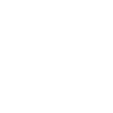

# docker

[← Back to main README](../../README.md)




## 16 px

### black
```
https://georgegach.github.io/compatible-icons/simple-icons/docker/16/black.png
```

### slate
```
https://georgegach.github.io/compatible-icons/simple-icons/docker/16/slate.png
```

### white
```
https://georgegach.github.io/compatible-icons/simple-icons/docker/16/white.png
```

## 64 px

### black
```
https://georgegach.github.io/compatible-icons/simple-icons/docker/64/black.png
```

### slate
```
https://georgegach.github.io/compatible-icons/simple-icons/docker/64/slate.png
```

### white
```
https://georgegach.github.io/compatible-icons/simple-icons/docker/64/white.png
```

## 128 px

### black
```
https://georgegach.github.io/compatible-icons/simple-icons/docker/128/black.png
```

### slate
```
https://georgegach.github.io/compatible-icons/simple-icons/docker/128/slate.png
```

### white
```
https://georgegach.github.io/compatible-icons/simple-icons/docker/128/white.png
```

## 512 px

### black
```
https://georgegach.github.io/compatible-icons/simple-icons/docker/512/black.png
```

### slate
```
https://georgegach.github.io/compatible-icons/simple-icons/docker/512/slate.png
```

### white
```
https://georgegach.github.io/compatible-icons/simple-icons/docker/512/white.png
```

## 1024 px

### black
```
https://georgegach.github.io/compatible-icons/simple-icons/docker/1024/black.png
```

### slate
```
https://georgegach.github.io/compatible-icons/simple-icons/docker/1024/slate.png
```

### white
```
https://georgegach.github.io/compatible-icons/simple-icons/docker/1024/white.png
```

## 16 px in base64

### black
```
data:image/png;base64,iVBORw0KGgoAAAANSUhEUgAAABAAAAAQCAYAAAAf8/9hAAAABmJLR0QA/wD/AP+gvaeTAAAA60lEQVQ4jbXSvUpDQRAF4E9ItJGAARsFO5F0AQWfwVdIKfggPoJvYGVhbWltYWUTgkIwIWLwByLBHxCTWNwJXBbFXCEHhp2FOefM7CxzxjIq/yWvoI9H1H4rKiX3ehCH2MAEIyzM4rgUbq94CpFnvGA7ahZxhd20gwNsohyO5XAvhfs+9tDFFk6wg8FU6D4ID/iM8yM6yndyjDHecIdbOMNXxCiX/xRtvIfZGNfCcVIwejhEVcxRhDxEI//6nYICF5K1nsY8s5DbWJNgFa0/RAa4xHpKnqKKIzRlq+nJdn6Dc9kfKIRKOufc8A12pHLetZKyCwAAAABJRU5ErkJggg==
```

### slate
```
data:image/png;base64,iVBORw0KGgoAAAANSUhEUgAAABAAAAAQCAYAAAAf8/9hAAAABmJLR0QA/wD/AP+gvaeTAAABg0lEQVQ4jbWSP2tTARTFf+fmJWmiTZpirYJtXRycdHDu5EdwdisOfgBHP4GDq4OT6OogCH4D62oHeVJMU9KaEl5ikNBX3jsO/kEKqRH0TPdyzzmXw73wPzEYDM6nw2HrLE7MGnS7o860rKX1vPLxU39yfRYv+b3ZH2Q3KegU1peoeN3GKAqB/miQpq67GL8h1IySaWnqMjlygosGwM6Oa4sXxtuy7q1dar+FH869w9FWaa5JbCEFthGC75XFs8Q6QHRL8wTc9zG3NjaWMgHsHWZ90GWJgVHHpTOJlmACLBhy40TmJaG7mCkiw5xUugfZK4kbIIPPAYqgCapINCxVJRYgaog2dgOpCSxijtT9nOWyqmed6jRk7xM8JY/HCegrsDS3GCbID9ZWl58DRJjx32xHvL+y2nnxsw3ENuB5tLZ3HSd3JP3iR1JW7hs+CM02ESPQu6gWm+srK/1TkaDXGy9T5aHhNriJSGTKsuQ4gr0i9OjqxfbruWOmw2HL9sz3/af4Bm8aohI1J6bnAAAAAElFTkSuQmCC
```

### white
```
data:image/png;base64,iVBORw0KGgoAAAANSUhEUgAAABAAAAAQCAYAAAAf8/9hAAAABmJLR0QA/wD/AP+gvaeTAAABEklEQVQ4jbWRzSrEcRSGn5/5MAajmbKQspOsKMoN2MzeysJCuQ65ALdhbaHcgcWs7Ozko6gZ9ddQMjKPzcGYohk17/L0nvc5HzBKqVNq5b/NVfVebarLv/nyfU2rQBVoAwuAwDuQBiGOB+1Zbalt9UF9VNfCU1TP1Y0fE6h7wCJQCGIh6Pmg76p14BpYAo7U9ZRSliLgDpgDmrFCBlSAJ6AEdCLsGNgBXsLzllNPgJUgTgaxDOSAiZimBBSBmaiVgWmghdpxeN2qB2oNNRuyua1u917/asiAM/XrrWNAI/YfRJfAVkrp26/Oqhdq9w9qpjbU+f7EzzfWgH1gMy6cB7rAK3ADHKaUTgecEtRK754j1Qc8/k6Vm8w/8QAAAABJRU5ErkJggg==
```

