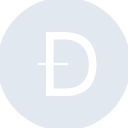

# dogecoin

[← Back to main README](../../README.md)

<table><tr>
  <td></td>
  <td></td>
  <td></td>
</tr></table>

## 16 px

### black
```
https://georgegach.github.io/compatible-icons/simple-icons/compat/dogecoin/16/black.png
```

### slate
```
https://georgegach.github.io/compatible-icons/simple-icons/compat/dogecoin/16/slate.png
```

### white
```
https://georgegach.github.io/compatible-icons/simple-icons/compat/dogecoin/16/white.png
```

## 64 px

### black
```
https://georgegach.github.io/compatible-icons/simple-icons/compat/dogecoin/64/black.png
```

### slate
```
https://georgegach.github.io/compatible-icons/simple-icons/compat/dogecoin/64/slate.png
```

### white
```
https://georgegach.github.io/compatible-icons/simple-icons/compat/dogecoin/64/white.png
```

## 128 px

### black
```
https://georgegach.github.io/compatible-icons/simple-icons/compat/dogecoin/128/black.png
```

### slate
```
https://georgegach.github.io/compatible-icons/simple-icons/compat/dogecoin/128/slate.png
```

### white
```
https://georgegach.github.io/compatible-icons/simple-icons/compat/dogecoin/128/white.png
```

## 512 px

### black
```
https://georgegach.github.io/compatible-icons/simple-icons/compat/dogecoin/512/black.png
```

### slate
```
https://georgegach.github.io/compatible-icons/simple-icons/compat/dogecoin/512/slate.png
```

### white
```
https://georgegach.github.io/compatible-icons/simple-icons/compat/dogecoin/512/white.png
```

## 1024 px

### black
```
https://georgegach.github.io/compatible-icons/simple-icons/compat/dogecoin/1024/black.png
```

### slate
```
https://georgegach.github.io/compatible-icons/simple-icons/compat/dogecoin/1024/slate.png
```

### white
```
https://georgegach.github.io/compatible-icons/simple-icons/compat/dogecoin/1024/white.png
```

## 16 px in base64

### black
```
data:image/png;base64,iVBORw0KGgoAAAANSUhEUgAAABAAAAAQCAYAAAAf8/9hAAAABmJLR0QA/wD/AP+gvaeTAAABFElEQVQ4jZXTPUrDQRAF8J8hElEUEwiieAntrCRi4xm8jpfw8wCeQewsLHKDKAki5ougRjRN0CIb2Wz8h/hgmrczb2dm3zKJEq7wgDYGIdqBu0BRBg7RwBDfGTFEHQd/FTdnFKbRRCVuu5EkdPEURe8PkTrWhZnTtqtYDPOWsIdbvCXjnAvLSdWrOIo6ucM2bpK8mrDhLIFBxN1jB52Ia+Wwmiy0gxY+8YLnwG/hEV9R7lrO/FhAPtz8izz6WIq4MjawjE0UAv8azgpRbn8sUM649SOM1MMxToL4GO9wafYzrmAX1yb9MMSZkFRPBFIjdU2/VF0wEiNv/9fK++m8FfN/pqniMYpG9qwZeSH+zjWcxm3DD5GWlwaN9djiAAAAAElFTkSuQmCC
```

### slate
```
data:image/png;base64,iVBORw0KGgoAAAANSUhEUgAAABAAAAAQCAYAAAAf8/9hAAAABmJLR0QA/wD/AP+gvaeTAAAB2klEQVQ4jZWTvU5UURSFv3Xmkos/gzOaETGjgImJlVLbEAidD2CIiYm+A7GzslJewc7Y+QbKaG1BrE2MVyQ64s91xqCjc8+ygGEuOBTu6uScvdZea+99RCk2Nr6f9FhcBc1jqsAEAKID6kJsuaeV6enatwFGg8NmO18q7IciNI0DoyMab7iv2zPN2toewWY7X+qbR4LJQ4AHox3t5Zmpeku7stdB5/eezReCf5ZEHsPUywzGWUyZCx6LqyI09/EHsk+naxf8S5f1W1cC4ZqgtdOLAa3OJT09CKD5UZ4nP3aWlOq1k/iqcLGqfnHT9styGaOFAFQPM2r7OFJT6GpMKk8cWAE+D1VQDbvjGobYUlQb4rbEB/AmgOyzReI3eNAbsD1x2Lj+VSMp3U4SSS7fJ4guMD7MpOHgScVw1PaUpHRHmPM/gUYFpbDH0U2ALtAYVVXSDzluGX21khtBxT1KuyKpE8DPgXgQ3D4z8dQ9XxxT71I0t6TirvDiUCgRvKYsy+uMsy4zXbIxXKQISEeAU/t6YmdxnDkBvH2fLyrh8f+sclGpXJ9tVF8EgJlmbc32Mva7UXbKso2zARhKvxEgy/J6SLkPWgCq0T6xm9RB6gg/66e+M1uv5wPMX5vA0eyCCKvcAAAAAElFTkSuQmCC
```

### white
```
data:image/png;base64,iVBORw0KGgoAAAANSUhEUgAAABAAAAAQCAYAAAAf8/9hAAAABmJLR0QA/wD/AP+gvaeTAAABOElEQVQ4jZWTzS6DQRSGnzYVP1Xxk0ZIwy2IHZumYuMaXIc7cBMUFyBxB2JnKb2BEiKirRJUsGkei45kTD5/T/ItvnfmvHPOmTMQoU6rB+q52lHfw9cJ2p46RRbqunql9v2evnqprmUFt34ITGmpNYCcOg00gIXI8x54i/6LQJr6FbBEqDlN+0wdUqdCX1bUE/UpKadOaE7KmbqhdtVr9VStqMfJvmYeKGV2dcA4UAFWgSNgC+hG66UsgzugDbwCt8BN0OeBi6Q3E/kfTk/JAQXAWCwAPWAk0srALDAGzAHDQX8Ma8PR3t6nQfmbU19CSQ/AJrAdzD95Rt3/5RqL6rJ6qD4k17ibczDbDWAxck4HaRSYSbIbDBKAuub/R7n6xU6t+ffHVCWLUHNdbaptvz7nprqjTsYxH1nV5d0+UH0qAAAAAElFTkSuQmCC
```

