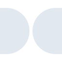
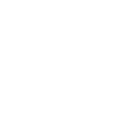

# dolby

[← Back to main README](../../README.md)





## 16 px

### black
```
https://georgegach.github.io/compatible-icons/simple-icons/dolby/16/black.png
```

### slate
```
https://georgegach.github.io/compatible-icons/simple-icons/dolby/16/slate.png
```

### white
```
https://georgegach.github.io/compatible-icons/simple-icons/dolby/16/white.png
```

## 64 px

### black
```
https://georgegach.github.io/compatible-icons/simple-icons/dolby/64/black.png
```

### slate
```
https://georgegach.github.io/compatible-icons/simple-icons/dolby/64/slate.png
```

### white
```
https://georgegach.github.io/compatible-icons/simple-icons/dolby/64/white.png
```

## 128 px

### black
```
https://georgegach.github.io/compatible-icons/simple-icons/dolby/128/black.png
```

### slate
```
https://georgegach.github.io/compatible-icons/simple-icons/dolby/128/slate.png
```

### white
```
https://georgegach.github.io/compatible-icons/simple-icons/dolby/128/white.png
```

## 512 px

### black
```
https://georgegach.github.io/compatible-icons/simple-icons/dolby/512/black.png
```

### slate
```
https://georgegach.github.io/compatible-icons/simple-icons/dolby/512/slate.png
```

### white
```
https://georgegach.github.io/compatible-icons/simple-icons/dolby/512/white.png
```

## 1024 px

### black
```
https://georgegach.github.io/compatible-icons/simple-icons/dolby/1024/black.png
```

### slate
```
https://georgegach.github.io/compatible-icons/simple-icons/dolby/1024/slate.png
```

### white
```
https://georgegach.github.io/compatible-icons/simple-icons/dolby/1024/white.png
```

## 16 px in base64

### black
```
data:image/png;base64,iVBORw0KGgoAAAANSUhEUgAAABAAAAAQCAYAAAAf8/9hAAAABmJLR0QA/wD/AP+gvaeTAAAAuElEQVQ4jc3SQY5BQRDG8V9wBSbjIETcxGkkbjAhNuIehK0zsLAZicWzYzvjWWgi9GsyG1NJJZ2qf32pqi7+g22xxgozNBNsC/PArkOt/M4z9CPFQ+wi/EMgxx7dm+JeiMXYaDDHN6r4wKaIqyTmraODMj6LoJRAGW2UwjtqpYQAHIU5/yLwg0Xw35TIsyXWJJZY1MEeI+d/zzDG4dUOMnxFuEHIPdzB5ZSXmKCRGLeJaWCvp/xeOwFP4Vgg9DwV8wAAAABJRU5ErkJggg==
```

### slate
```
data:image/png;base64,iVBORw0KGgoAAAANSUhEUgAAABAAAAAQCAYAAAAf8/9hAAAABmJLR0QA/wD/AP+gvaeTAAABK0lEQVQ4jcWSS0oDQRiEq3raRRYhBBTSksfGG7gQ8RquFDyBNxBRjHdwI4KICB4koHgJM2Ies8jDRSCPLhfRmIwzBF3ovyz+/qrqp4H/HtZbvVdIAy+MAyIEeFQq5B6Sll9a/e2J9+cCioawIDOsN7taIIKR5O/LLn84r9cb3QsAuyBW53UTdxG0JuAgbHVOZ87tTlUG+/HH0wqxBF9JEFoFmwNDY/3oCWQxac8midMkXB/T71n4gDROSPRJBwAKQOwIMICCtK1vN1hAeHiDFOtlAIJjkjUJNYKTXyRQw8rcDWFvRd/4KaDvxUvnstFGIduWx5Wkt6WAj7KRoOuKy5196hWXPyF4QyCKA2ZfWeKIBs/0OC653GOSW9jsbYmoEipLWAGZSav2d/MOKzh5us+uFWEAAAAASUVORK5CYII=
```

### white
```
data:image/png;base64,iVBORw0KGgoAAAANSUhEUgAAABAAAAAQCAYAAAAf8/9hAAAABmJLR0QA/wD/AP+gvaeTAAAAxElEQVQ4jcWSQWoCQRBFX8/kChr0IBHJTTyNkBtIxI3kHgnJNmdIFm4UXIy7cRt9LuzFmJluZueHhqb61af6U3B3qXt1o/6qn+okw07Vr8hu1D22VamvHc0r9fAf7jJQrdV5o/kl1lpKGahu1YH6qO5S0EMmnjEwA0pglIJyBiXwDBTx3qkiYwBwBswBOYM/4DueU5LqEeIwF2JqghpYhxAOIYQKeAOOfSeo1EUHt4xvN2qu8o/6rj5lvjtRPyJ7XeW76wJ4rWUnIzM30QAAAABJRU5ErkJggg==
```

