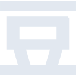

# douban

[← Back to main README](../../README.md)

<table><tr>
  <td></td>
  <td></td>
  <td></td>
</tr></table>

## 16 px

### black
```
https://georgegach.github.io/compatible-icons/simple-icons/compat/douban/16/black.png
```

### slate
```
https://georgegach.github.io/compatible-icons/simple-icons/compat/douban/16/slate.png
```

### white
```
https://georgegach.github.io/compatible-icons/simple-icons/compat/douban/16/white.png
```

## 64 px

### black
```
https://georgegach.github.io/compatible-icons/simple-icons/compat/douban/64/black.png
```

### slate
```
https://georgegach.github.io/compatible-icons/simple-icons/compat/douban/64/slate.png
```

### white
```
https://georgegach.github.io/compatible-icons/simple-icons/compat/douban/64/white.png
```

## 128 px

### black
```
https://georgegach.github.io/compatible-icons/simple-icons/compat/douban/128/black.png
```

### slate
```
https://georgegach.github.io/compatible-icons/simple-icons/compat/douban/128/slate.png
```

### white
```
https://georgegach.github.io/compatible-icons/simple-icons/compat/douban/128/white.png
```

## 512 px

### black
```
https://georgegach.github.io/compatible-icons/simple-icons/compat/douban/512/black.png
```

### slate
```
https://georgegach.github.io/compatible-icons/simple-icons/compat/douban/512/slate.png
```

### white
```
https://georgegach.github.io/compatible-icons/simple-icons/compat/douban/512/white.png
```

## 1024 px

### black
```
https://georgegach.github.io/compatible-icons/simple-icons/compat/douban/1024/black.png
```

### slate
```
https://georgegach.github.io/compatible-icons/simple-icons/compat/douban/1024/slate.png
```

### white
```
https://georgegach.github.io/compatible-icons/simple-icons/compat/douban/1024/white.png
```

## 16 px in base64

### black
```
data:image/png;base64,iVBORw0KGgoAAAANSUhEUgAAABAAAAAQCAYAAAAf8/9hAAAABmJLR0QA/wD/AP+gvaeTAAAA4ElEQVQ4jZ3TsUrDMRAG8F+kKHRREYo+gqO7m7OjuPgILs4+hOBbODs5OBQ620HF+gAKFpx0UCno8L9KDP0Xm4MjyZe7L9/lkoRbfKuzBOMgqPFxwjE6lQomKSYn2Fsw+Rpn08WgQv7ADOmvGOKz5dQV7GBjCpQEHzjCSwtBDzc5sNQS+G8rFXRxhcmc+O48gvXwhRWca2o71NT5gMsidh/bmod3IbpQ2kjTorsZe/exN8rB8hKHMa5hK8N7WI35ny50cJCtn/CGTZyiH/hukLzjOc9J6n/ir4JHfFXmL/8AbUVA9u9CDr8AAAAASUVORK5CYII=
```

### slate
```
data:image/png;base64,iVBORw0KGgoAAAANSUhEUgAAABAAAAAQCAYAAAAf8/9hAAAABmJLR0QA/wD/AP+gvaeTAAABRElEQVQ4jZ2TPS9DURzGf//rqqSRIOK2EpPNaGYzm0QsvoTZ5gs08S3MJoNBYq4BQdKB66WnRNymJDS35zFQ6a2S9P6nc55zfs95zpvFLjkFiVxlFgIlsJl8BjyFJr/jbSTMQwfqpAZw55pbgpVhYIPDufJEJQTw+DWwpWEMhCaBSn/0Z9CJEXwMhvyYxKKZTXe1rIHxnjK6OV8abwwyqLlWVAg6VXruLBgm9qDKJBAUQ6UHcSNJB85WJ5SnaPaHgYkpYIp/nlUv/GMg+V0IqphtGESICwXsZ0DPKsaC4BFpD/zxL/fbevMydoli93LWPxa75nnsEt3Wm5e9euYQzTj5bkxeP73NdvWaa0WGJgBkVDNbuKkn692Ol+7NaEkqB2l7+6aeHH2t4pdlRCZeJT30Mha7JOdP/E7g5a8Cs3Ye2EuFT+LGjiZuvXPZAAAAAElFTkSuQmCC
```

### white
```
data:image/png;base64,iVBORw0KGgoAAAANSUhEUgAAABAAAAAQCAYAAAAf8/9hAAAABmJLR0QA/wD/AP+gvaeTAAAA7klEQVQ4jZ3TsS6EQRQF4G9kQ7INIhaPoNTr1ErReASN2kNIvIVapVBItrYFYj0ACaKiQDY5iv0lv7U29r/JZHLPnXPm3LmZkuQK0SxKCytYbijwXJLso9VQYFAgyQG2piSfl1KOVALdTB9dY6y/oIePP26dwwaWvoFRgXfslVIex7GTdHBZx2b+1+7fMeqgjbMkgwnn25MEFqs1tYNjw9520cEtTkfObmMdTzhB95dakn41ousxtZuq1q/jo4/Yq/aFJGs1cgfzVfpjCq0kO7X8Hq9YxWGSiwrfrFp7w0OdU5I0/YlDB7jDZ0P+7BdMHo70mgY6qQAAAABJRU5ErkJggg==
```

