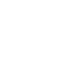

# drone

[← Back to main README](../../README.md)




## 16 px

### black
```
https://georgegach.github.io/compatible-icons/simple-icons/drone/16/black.png
```

### slate
```
https://georgegach.github.io/compatible-icons/simple-icons/drone/16/slate.png
```

### white
```
https://georgegach.github.io/compatible-icons/simple-icons/drone/16/white.png
```

## 64 px

### black
```
https://georgegach.github.io/compatible-icons/simple-icons/drone/64/black.png
```

### slate
```
https://georgegach.github.io/compatible-icons/simple-icons/drone/64/slate.png
```

### white
```
https://georgegach.github.io/compatible-icons/simple-icons/drone/64/white.png
```

## 128 px

### black
```
https://georgegach.github.io/compatible-icons/simple-icons/drone/128/black.png
```

### slate
```
https://georgegach.github.io/compatible-icons/simple-icons/drone/128/slate.png
```

### white
```
https://georgegach.github.io/compatible-icons/simple-icons/drone/128/white.png
```

## 512 px

### black
```
https://georgegach.github.io/compatible-icons/simple-icons/drone/512/black.png
```

### slate
```
https://georgegach.github.io/compatible-icons/simple-icons/drone/512/slate.png
```

### white
```
https://georgegach.github.io/compatible-icons/simple-icons/drone/512/white.png
```

## 1024 px

### black
```
https://georgegach.github.io/compatible-icons/simple-icons/drone/1024/black.png
```

### slate
```
https://georgegach.github.io/compatible-icons/simple-icons/drone/1024/slate.png
```

### white
```
https://georgegach.github.io/compatible-icons/simple-icons/drone/1024/white.png
```

## 16 px in base64

### black
```
data:image/png;base64,iVBORw0KGgoAAAANSUhEUgAAABAAAAAQCAYAAAAf8/9hAAAABmJLR0QA/wD/AP+gvaeTAAABM0lEQVQ4jY3TTSutYRQG4Gv7zkfKRwZKRymFATNSRkyVf+B/YGZ6/sEZn6Hh6aQMZKRkoBDaiHYRJcUA5+xt8K7N681ru+sePGvd93pa61kPX6MD7TU0H9CARWzjDJfBU2xhHoU88wQO8YhKDu+xgx9Z8wxKXxizPMdI1dwdge+aqzxCaz1+YTqnt/8oo+6TXCc6CpJhZXt6xD42osAcRtGW0RULuEFPJrGNB4zHeVfypJMZ3XVDCG9TwWasYTlMwriKPjyltC11GMQK7oIlPKMpJWwMYymlWwovGMa1ZLpl/MUe/gX38CdylSgwycfJr2M2YnfYxEXkBiS70hXnA4xFsTf0ouj9ncuSAd+kbq7gClNyMCRZkBefL88lFvLMVbThJ469f6YT/EZ/LXMWrWp851eNcm07v1mpYwAAAABJRU5ErkJggg==
```

### slate
```
data:image/png;base64,iVBORw0KGgoAAAANSUhEUgAAABAAAAAQCAYAAAAf8/9hAAAABmJLR0QA/wD/AP+gvaeTAAAB20lEQVQ4jY2TuU8UQBjFf28YD441KMiyRJaAndrQEU2oNCQmFCaW1ib8AVZqY7Sy84/QzsbOxMJKE6MNSgGJUWSXdVcDchiB3XkWe7CEQ18yxcz33vuuDByBSqWSKZfLPUdx1H6xHb+VVm8paMbWAHKsB9hBKnRYj4eymReSvM+gUF4ZryY9lZ1H6joom/GaFBZqKd0czZ3+0jL4XF6fjCk9Aw8dVe6uEV9xx/WRXGZOS0trfY6190Yj/yNua34+1n6PB0c/QRo+hFaTqPqAgMxYNXY/ism+LAh7zdk0+gR+ZZNkrklcNHS3tRFlT0eJA9akj8Yb2LcBpPDBMAue2DMLqycCG0I/dp19Avt5kO9ZytTf0kSwHlpkhbbauCdDfrB3NNn3ESv1o0KSt5N1fLclHUvSFlKhyauldDc/2DsaAWIKs0m180YDIMveVNA89gUQxgsSU1hXjAWsxhCKjXnVsVj69RK4ChZiBfNaaLFRal4waTjTKH5uONt7SZJbBsvL62d3VHtrGFNr0PxshPuayQzfOxRunMueegNt68vlMhUFTcnMC6oNQX/jqGG5FJJnmuI9LTRRKpW6t9X5AHtaotN14R/QO8WdO8P9/YX9az8ExWKx61/f+S8lzNA+3Il/LAAAAABJRU5ErkJggg==
```

### white
```
data:image/png;base64,iVBORw0KGgoAAAANSUhEUgAAABAAAAAQCAYAAAAf8/9hAAAABmJLR0QA/wD/AP+gvaeTAAABSUlEQVQ4jZWTTSutYRSGr0fbRz4m5/gYKBEjzsCZHSkjMlP+gf+Bman8CoZ+gDKQkdKZCB1ii7aIQjHwtS+TdfL2tt8td63BWuu+1mCt54E6UjvU9nqePFBS59QdtaxeRJyq2+qMmorg3+qh+mSxHtRdtT8PT6iVOmBeZ+rwf/hnFL6rf2or6qr6XmB6U18Leq/qSlLLQH9uJU/APrAJVIEpYARoy/lOknoDdOYaO8AjMBr5X6AD+JPzXZfCeJspNgPrwEJABLgE9ADPGW9LQ0ppAFgE7iIqwAvQlDE2BljJ+OZTSgOlMOwBg0A3YOzgCBiO/jEwDYwDCbgHLokEAHUDmIzaHbAFnEe7D5gAfkR+APxKKUlmQJd6kjlTVb2JqGbqV+oYtaQOxQMpuv2FOlsTzgxpU5fVIz8/07G6pvbWhWsMa/WL7/wBHgGvPhpG3p0AAAAASUVORK5CYII=
```

