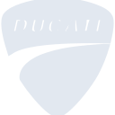
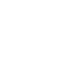

# ducati

[← Back to main README](../../README.md)

<table><tr>
  <td></td>
  <td></td>
  <td></td>
</tr></table>

## 16 px

### black
```
https://georgegach.github.io/compatible-icons/simple-icons/compat/ducati/16/black.png
```

### slate
```
https://georgegach.github.io/compatible-icons/simple-icons/compat/ducati/16/slate.png
```

### white
```
https://georgegach.github.io/compatible-icons/simple-icons/compat/ducati/16/white.png
```

## 64 px

### black
```
https://georgegach.github.io/compatible-icons/simple-icons/compat/ducati/64/black.png
```

### slate
```
https://georgegach.github.io/compatible-icons/simple-icons/compat/ducati/64/slate.png
```

### white
```
https://georgegach.github.io/compatible-icons/simple-icons/compat/ducati/64/white.png
```

## 128 px

### black
```
https://georgegach.github.io/compatible-icons/simple-icons/compat/ducati/128/black.png
```

### slate
```
https://georgegach.github.io/compatible-icons/simple-icons/compat/ducati/128/slate.png
```

### white
```
https://georgegach.github.io/compatible-icons/simple-icons/compat/ducati/128/white.png
```

## 512 px

### black
```
https://georgegach.github.io/compatible-icons/simple-icons/compat/ducati/512/black.png
```

### slate
```
https://georgegach.github.io/compatible-icons/simple-icons/compat/ducati/512/slate.png
```

### white
```
https://georgegach.github.io/compatible-icons/simple-icons/compat/ducati/512/white.png
```

## 1024 px

### black
```
https://georgegach.github.io/compatible-icons/simple-icons/compat/ducati/1024/black.png
```

### slate
```
https://georgegach.github.io/compatible-icons/simple-icons/compat/ducati/1024/slate.png
```

### white
```
https://georgegach.github.io/compatible-icons/simple-icons/compat/ducati/1024/white.png
```

## 16 px in base64

### black
```
data:image/png;base64,iVBORw0KGgoAAAANSUhEUgAAABAAAAAQCAYAAAAf8/9hAAAABmJLR0QA/wD/AP+gvaeTAAABM0lEQVQ4jY3SzSuEURQG8N8wQz6m7BBZ2olsLP0L2Nj6Z+ysldjLH4HyUbJh4yvKwkcGIcMozLB4z9SYXs2cOr33vuc+z3nOvQ9J5DCHLZzhCs/4jnzBLS6wgVm0BNZIgD7w02QWcYzhDHYxgcfo1o62IP/EF7LRsSuUdaAVhy3oDnAJD7EuoowK+oPoBZlQWohm+Wz8qHbtikL1mw2SnlACg7HuxGkWOzFCfZQiC0EC73EHQuVeBuPYxFuMcIx9HOEJfRiNc4Mxey5UzYi5FqNY3U9jHZdBWkl5ifM4+yeGcIDXFEBtVrBSD87hpAGwmtcYoMZNGENvPWtKlLGNm/pCPmZu1P1c4p3UmJJc2n/ge0w2kjgvsWua/xeaGBGsSXxRC15tFkzyvssSF95hScqbwy/o1YOTvwwg1QAAAABJRU5ErkJggg==
```

### slate
```
data:image/png;base64,iVBORw0KGgoAAAANSUhEUgAAABAAAAAQCAYAAAAf8/9hAAAABmJLR0QA/wD/AP+gvaeTAAAB/0lEQVQ4jY2RP2uTURyFn3PztrVNQ6ttkipp8Q+4iaVLP4QgxU3cREHExU/g5jdwsKOb6KDg4iRFBZEOLkoHQW1rTE2oSRNTaPPe49C01qaoz3YP5xzO5SeARbtvotq8ElNfVXDRMGQ8HKwcCOMWxDZk2iIum3h/snjskaSolcr6OTs8NkxJHOF/EC3MSsiEOa2sNV5jZiPUJHewBoz7d3zeksI20YnlACEL8QfSoO0M5l3AHo64JtwWVIVrQW7KpJai7eMEtpDqYIE2HVnD6oSgXGLYBAaQ+mN0trsii+hgEnC0GTXaxiBRUmBb1lC0lxLEK5lZbKSd4V3agjawBkRhCPoJNoChKemNPpfrMwq8ALeEqkIfOsS3QXpPyrqliSTj82nKjEQJyID7hEbTyCXZ1kpl415IO3dLpbFV2/ryrTmXEbeseBoYthmTfk/r8nGyOHI2kWTgJkC5vD61+r3xVIEzhtze1Q5GhbEXJDnsaot233YIz22mtS98KKasJL0DkOxqhcrGNFDsGdpLGuBlaXz8K8DegsFka8mBxj/j8Kk/bF3ffewV5PP5plLfFqr9JVxNM5lrhUKh1VMAMHXi6BPHdB5R7826hXlwKp9b2K8e+uPlSv2h4IIhu+NyK1rPTk6MXj7oPbTAtpbXGvMBLlpY5mmpOHKje/I/+AVvV/TZ5vcp6QAAAABJRU5ErkJggg==
```

### white
```
data:image/png;base64,iVBORw0KGgoAAAANSUhEUgAAABAAAAAQCAYAAAAf8/9hAAAABmJLR0QA/wD/AP+gvaeTAAABUElEQVQ4jY2STSvEURTGf5cZ8jJlh8jSTmRj6Stga+e72Fmrib3kM8gCJRs23rJQoowRMpjyMj+LObPwb5h56nZP93ae85zznASg5oFFYAkYBHqBfqBAHa/Ae5xroAhspZRqqBPqhVq1fVTUU3U8qfvADPAAfAHdQFdU/gA+gRzQAfQBT0AP0Akcd4TUh5BXjrgCfAM1YDiInoEEVIFSFCvk4qFRtS8+GncuSAZCCcBoxL3AeQ7YixayaAytFCQAb4ARV4CDpE4DOzHpMnAKHAInwCMwBEwC01G9E8iHqgXUpK6qo2FpUufVbfVKLau1Jk5cqumXZnVMPVJfWthYU9ezyXn1rM09uFFHCG8bmKK+ha3wDeymlG6zCgrRcytcqv1NqdU560P7C/fq7L/61GX1qUlyRV1po0VQN9XXTPJGW8lBkNQ1taTeqUWzngd+AFlYrueJSQw9AAAAAElFTkSuQmCC
```

