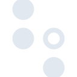

# dwavesystems

[← Back to main README](../../README.md)

<table><tr>
  <td></td>
  <td></td>
  <td></td>
</tr></table>

## 16 px

### black
```
https://georgegach.github.io/compatible-icons/simple-icons/compat/dwavesystems/16/black.png
```

### slate
```
https://georgegach.github.io/compatible-icons/simple-icons/compat/dwavesystems/16/slate.png
```

### white
```
https://georgegach.github.io/compatible-icons/simple-icons/compat/dwavesystems/16/white.png
```

## 64 px

### black
```
https://georgegach.github.io/compatible-icons/simple-icons/compat/dwavesystems/64/black.png
```

### slate
```
https://georgegach.github.io/compatible-icons/simple-icons/compat/dwavesystems/64/slate.png
```

### white
```
https://georgegach.github.io/compatible-icons/simple-icons/compat/dwavesystems/64/white.png
```

## 128 px

### black
```
https://georgegach.github.io/compatible-icons/simple-icons/compat/dwavesystems/128/black.png
```

### slate
```
https://georgegach.github.io/compatible-icons/simple-icons/compat/dwavesystems/128/slate.png
```

### white
```
https://georgegach.github.io/compatible-icons/simple-icons/compat/dwavesystems/128/white.png
```

## 512 px

### black
```
https://georgegach.github.io/compatible-icons/simple-icons/compat/dwavesystems/512/black.png
```

### slate
```
https://georgegach.github.io/compatible-icons/simple-icons/compat/dwavesystems/512/slate.png
```

### white
```
https://georgegach.github.io/compatible-icons/simple-icons/compat/dwavesystems/512/white.png
```

## 1024 px

### black
```
https://georgegach.github.io/compatible-icons/simple-icons/compat/dwavesystems/1024/black.png
```

### slate
```
https://georgegach.github.io/compatible-icons/simple-icons/compat/dwavesystems/1024/slate.png
```

### white
```
https://georgegach.github.io/compatible-icons/simple-icons/compat/dwavesystems/1024/white.png
```

## 16 px in base64

### black
```
data:image/png;base64,iVBORw0KGgoAAAANSUhEUgAAABAAAAAQCAYAAAAf8/9hAAAABmJLR0QA/wD/AP+gvaeTAAAA2UlEQVQ4jaXTTUoDQRCG4SeTH6KbEAiIkhOIN3GpuyxdeIjkEjmMV3DjRsEDJMIgxJWiIoKaRfckk5AhdvJCQTfV1V1VXzVLDvGAD8wwlsgA3/iLNkVzW1BWWr/GCwp+8ZOSQYYb5HjCVUpwmR7aKa+u74/Q3XD2GKcbYhY0cSsokGNY8o3whmfcqWjuJb6sqlCP9ok+anjERVUJe1GU8PKPEhpVl2Q4Exq2zkn07Zz1gSDxTlwLw5ULw5aURYaJpTrvOC87t1EX5CtooZOSAeFrz+Lr90I/wBxK7CzP6c5aRwAAAABJRU5ErkJggg==
```

### slate
```
data:image/png;base64,iVBORw0KGgoAAAANSUhEUgAAABAAAAAQCAYAAAAf8/9hAAAABmJLR0QA/wD/AP+gvaeTAAABjklEQVQ4jY1STWtTQRQ9ZyaVNloegjEfVt24sXSl/o5qV/0HunSvLsUf4R9wqV3UnYggiBCFghS6sc1rGF/6pOZVnpYkM8dNEpIYyDurOXPvPffeM0MM4Zwre1v+JOEWxJzEq+u16DEWwIwOPVzcEngbQBlUBdCDprRUWKBkmFHqjbjAcBfwhQWuVVffBuADIAfhOHg9JxkWCfwH586uHB5quWi+mSSSTJ/9Ki/9uTybeJTm9daP3+uSpmrGpCkttTvZR9K+N37QjF336SjWTrJn9L0DwL877mSfJ80dC9TS7H4Q7gCoAGqAeCjJSrIBemIHYf1GLWoIXKmeZJtzVyiGaV/HAkkl2jHEV0g/QToIL0l6kt6AL3zJ7MedzBH8u3Y12pmrLcnEyenGUZrXZ2Nxmjbi5HRj1sTSJBm++7d54jw//2Vt1Jv9G4U8aLnuI5VWDwbG77WS7u7kFFxULMm0O9l3ATeHV7kRt9fq0W6hCb4AdqoRcWEgRIVXuEf2Q+AbiCmBnMK+9WevR/F/9++6UMSQ4YUAAAAASUVORK5CYII=
```

### white
```
data:image/png;base64,iVBORw0KGgoAAAANSUhEUgAAABAAAAAQCAYAAAAf8/9hAAAABmJLR0QA/wD/AP+gvaeTAAAA4klEQVQ4jaXSMUqDQRAF4MkfI4mNCAGJ5ATiTSy1s7TwEHqJHMYr2NhE8AAq/AhaKVEkoJ/NBpew4iYOLOzwZt6+tzMRKbCFG7zhCZNYJXCCuZ+4R++vvia7v0TEPMu/IuJzFQUNLtHiAafVzUtEQ/Rr63MLgSYidiNip0A8wn6qKb7cw1WaQIvzDLvAKx5xXfxcHONjaQrddN4xRge3OCpa+FdkFp4rLGz8RtLgAKMCtpew9VRjgOG6zWdpudq0bPUqkq27bDozHC7wGqZuRHSyfDMitqsVJBWTtGAzTDFYYN9YKxX0D5kXxgAAAABJRU5ErkJggg==
```

