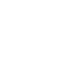

# dwm

[← Back to main README](../../README.md)




## 16 px

### black
```
https://georgegach.github.io/compatible-icons/simple-icons/dwm/16/black.png
```

### slate
```
https://georgegach.github.io/compatible-icons/simple-icons/dwm/16/slate.png
```

### white
```
https://georgegach.github.io/compatible-icons/simple-icons/dwm/16/white.png
```

## 64 px

### black
```
https://georgegach.github.io/compatible-icons/simple-icons/dwm/64/black.png
```

### slate
```
https://georgegach.github.io/compatible-icons/simple-icons/dwm/64/slate.png
```

### white
```
https://georgegach.github.io/compatible-icons/simple-icons/dwm/64/white.png
```

## 128 px

### black
```
https://georgegach.github.io/compatible-icons/simple-icons/dwm/128/black.png
```

### slate
```
https://georgegach.github.io/compatible-icons/simple-icons/dwm/128/slate.png
```

### white
```
https://georgegach.github.io/compatible-icons/simple-icons/dwm/128/white.png
```

## 512 px

### black
```
https://georgegach.github.io/compatible-icons/simple-icons/dwm/512/black.png
```

### slate
```
https://georgegach.github.io/compatible-icons/simple-icons/dwm/512/slate.png
```

### white
```
https://georgegach.github.io/compatible-icons/simple-icons/dwm/512/white.png
```

## 1024 px

### black
```
https://georgegach.github.io/compatible-icons/simple-icons/dwm/1024/black.png
```

### slate
```
https://georgegach.github.io/compatible-icons/simple-icons/dwm/1024/slate.png
```

### white
```
https://georgegach.github.io/compatible-icons/simple-icons/dwm/1024/white.png
```

## 16 px in base64

### black
```
data:image/png;base64,iVBORw0KGgoAAAANSUhEUgAAABAAAAAQCAYAAAAf8/9hAAAABmJLR0QA/wD/AP+gvaeTAAAAkklEQVQ4je3QMQrCQBCF4Y+YJmCXVs9gm4t4CFuv4w1yBEGwSu5ga6uVQspYZAIqW4S0+mDYXd78s7uPvxZf5wo11jjPGbhFj2YqkM255V05bugS3gkb7HDAI9FTZChRpMzwBLyM/Sq8AuX4hTv2hgAFOMJVrM/ogUsUhtCm1NVnyA36HG3i+Sl1MaTFcSLzE3oBcxYijSw3m6sAAAAASUVORK5CYII=
```

### slate
```
data:image/png;base64,iVBORw0KGgoAAAANSUhEUgAAABAAAAAQCAYAAAAf8/9hAAAABmJLR0QA/wD/AP+gvaeTAAAAyklEQVQ4je2RPU5CcRDEf7PSvMTu30pLS4sX8C627wTewxtwBA/AuwMdQiImGCWYvModC94LfhUEO+M0m5lkZjez8I9PWK23k+XjdrZ4eL451hMfyZs9tH0ZEVcnBZwC3a9fNhJtL9hcSGqwW8PY5hpxG2L31WxTBVAw1fdoVUABCLEznPcLMFXnKdGJT5nUTk0BnC5OFwChyX7ymkndhc+R5gCDvcBIMAXT88Mlrm2QWP3UwUBSc1RbdnsmLS2azLwDiPj1D/4E3gELMk1iYLhFlAAAAABJRU5ErkJggg==
```

### white
```
data:image/png;base64,iVBORw0KGgoAAAANSUhEUgAAABAAAAAQCAYAAAAf8/9hAAAABmJLR0QA/wD/AP+gvaeTAAAAk0lEQVQ4je2QMQrCQBBFHyHNgt223sE2F/EQtjlB7uENPELANt7BNq1WCil/inxhAyssafXBsDv8+bOzA39WSGokDZK6rQ2OWhhKPdWmlxJqSQ9gykxzBQ7ACTgDr4w/VEAEQk60hs073/fWAhA/X3gCLXBxHhNz4/PtGoC7A1TOmC7ZoRq4fV/RigkYXd8Xen6CGf4/agGewCZzAAAAAElFTkSuQmCC
```

