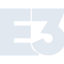

# e3

[← Back to main README](../../README.md)

<table><tr>
  <td></td>
  <td></td>
  <td></td>
</tr></table>

## 16 px

### black
```
https://georgegach.github.io/compatible-icons/simple-icons/compat/e3/16/black.png
```

### slate
```
https://georgegach.github.io/compatible-icons/simple-icons/compat/e3/16/slate.png
```

### white
```
https://georgegach.github.io/compatible-icons/simple-icons/compat/e3/16/white.png
```

## 64 px

### black
```
https://georgegach.github.io/compatible-icons/simple-icons/compat/e3/64/black.png
```

### slate
```
https://georgegach.github.io/compatible-icons/simple-icons/compat/e3/64/slate.png
```

### white
```
https://georgegach.github.io/compatible-icons/simple-icons/compat/e3/64/white.png
```

## 128 px

### black
```
https://georgegach.github.io/compatible-icons/simple-icons/compat/e3/128/black.png
```

### slate
```
https://georgegach.github.io/compatible-icons/simple-icons/compat/e3/128/slate.png
```

### white
```
https://georgegach.github.io/compatible-icons/simple-icons/compat/e3/128/white.png
```

## 512 px

### black
```
https://georgegach.github.io/compatible-icons/simple-icons/compat/e3/512/black.png
```

### slate
```
https://georgegach.github.io/compatible-icons/simple-icons/compat/e3/512/slate.png
```

### white
```
https://georgegach.github.io/compatible-icons/simple-icons/compat/e3/512/white.png
```

## 1024 px

### black
```
https://georgegach.github.io/compatible-icons/simple-icons/compat/e3/1024/black.png
```

### slate
```
https://georgegach.github.io/compatible-icons/simple-icons/compat/e3/1024/slate.png
```

### white
```
https://georgegach.github.io/compatible-icons/simple-icons/compat/e3/1024/white.png
```

## 16 px in base64

### black
```
data:image/png;base64,iVBORw0KGgoAAAANSUhEUgAAABAAAAAQCAYAAAAf8/9hAAAABmJLR0QA/wD/AP+gvaeTAAAA+ElEQVQ4jcXSMS+DURgF4Kfahlg0PmKkq0W6CL/GYjYZJToJFn6An2A1mgxqFAOKaJowSMQgpAZq+G6TmxtfjT3Jm9zznvuem3vyMmqU8IhegX6DJXwV6JMVLAx54ANV1Av0h0rS6OEn6U3gM+LVUN84LqEfiSc4jPgrsogvYwNz6KKRGnRxFfEz7IVzBZdYDLyFVcGgqFqR2bY8zIH2hp0ymorxhKNwLuNOnlGGGuppiG2cR/wiGh7HPnbDvRqy1KArD3KAF2xhDTM4xTWmgt5PQ0xxj3c0CvTO2JBhmMUtOn9oz1j/b5VhGgeYx4p8/dvYlH95xPgFq7E9Jg+Vxd0AAAAASUVORK5CYII=
```

### slate
```
data:image/png;base64,iVBORw0KGgoAAAANSUhEUgAAABAAAAAQCAYAAAAf8/9hAAAABmJLR0QA/wD/AP+gvaeTAAABZUlEQVQ4jcWSMUubURiFn3PzBaWDtRiNSmNacHAppUtxcfF/iIt0LA5uDt1KdbFd+xv8BaKTg/gLbIOlMWqIgvLRUlEw93TQpH70i6Oe7b4HHs573guPLTVa6U+hy3zX36L9OhCu8uy245MEeGHci/9HdtHyyzy3EPQjuTuwuZQcswz1gy/uDIpAEWhfx7ieAQR5K0qfu0D5TGgIdLsRb4H3QBl8nFwXVjMA0KtgLXZeUWG7Wh5YuUnn5PAk/QIqA4jQrFSenmdXgAnwRDeRKQErAEen6TIOk8iddFONZvox5JWTp7a1bfkDsIGUYgYpMJdJIFMz3vnXAbu38QtHrV99z0cHViV9OmilNcEg9pAarbR7Q8Mm5mt3BXzaVpgJ8ryhFGDL9p4I74xHgIsMIEf7Er9t3vTw6/d2YBi2+Q6u/+fZzQALCVDv9ZVvru/ZiNdkVRWYti1JtSR6aXzsWeO+AA+jv2tFmasaEHM6AAAAAElFTkSuQmCC
```

### white
```
data:image/png;base64,iVBORw0KGgoAAAANSUhEUgAAABAAAAAQCAYAAAAf8/9hAAAABmJLR0QA/wD/AP+gvaeTAAABBUlEQVQ4jcXSvy+DURjF8c+lQixEiRGrRboIf4xYzCajpJtg4Q+xWiSmDmoUgx8hmg4GiZAIaQceQ9vkzZu+7cZJ7nCeb3Kee08u/60UEU9oFfBbrKBdwCdLWByw4BNjWCrgj6XcoIWf3GwCXxk/1j3fOEkRERl4iuOMf0U541exjXk0UckHNHGd8bWU0gFERAlXWO6yekppXQxWvZcUEdWIaGfYW0TsjRSU0081VHGGd0xjI1/iPS4y/rK7fRTjOEwp7UfEfTegnA9o6hTZ00tE7GITsziPiBtM9V6WLzGvB3ygUsAbwzqYwx0afdgztoZ9ZZjBERawhqTT1U5KqTnkAn+gX+JWhCFQvIGAAAAAAElFTkSuQmCC
```

