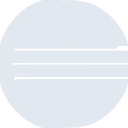

# eclipseide

[← Back to main README](../../README.md)

<table><tr>
  <td></td>
  <td></td>
  <td></td>
</tr></table>

## 16 px

### black
```
https://georgegach.github.io/compatible-icons/simple-icons/compat/eclipseide/16/black.png
```

### slate
```
https://georgegach.github.io/compatible-icons/simple-icons/compat/eclipseide/16/slate.png
```

### white
```
https://georgegach.github.io/compatible-icons/simple-icons/compat/eclipseide/16/white.png
```

## 64 px

### black
```
https://georgegach.github.io/compatible-icons/simple-icons/compat/eclipseide/64/black.png
```

### slate
```
https://georgegach.github.io/compatible-icons/simple-icons/compat/eclipseide/64/slate.png
```

### white
```
https://georgegach.github.io/compatible-icons/simple-icons/compat/eclipseide/64/white.png
```

## 128 px

### black
```
https://georgegach.github.io/compatible-icons/simple-icons/compat/eclipseide/128/black.png
```

### slate
```
https://georgegach.github.io/compatible-icons/simple-icons/compat/eclipseide/128/slate.png
```

### white
```
https://georgegach.github.io/compatible-icons/simple-icons/compat/eclipseide/128/white.png
```

## 512 px

### black
```
https://georgegach.github.io/compatible-icons/simple-icons/compat/eclipseide/512/black.png
```

### slate
```
https://georgegach.github.io/compatible-icons/simple-icons/compat/eclipseide/512/slate.png
```

### white
```
https://georgegach.github.io/compatible-icons/simple-icons/compat/eclipseide/512/white.png
```

## 1024 px

### black
```
https://georgegach.github.io/compatible-icons/simple-icons/compat/eclipseide/1024/black.png
```

### slate
```
https://georgegach.github.io/compatible-icons/simple-icons/compat/eclipseide/1024/slate.png
```

### white
```
https://georgegach.github.io/compatible-icons/simple-icons/compat/eclipseide/1024/white.png
```

## 16 px in base64

### black
```
data:image/png;base64,iVBORw0KGgoAAAANSUhEUgAAABAAAAAQCAYAAAAf8/9hAAAABmJLR0QA/wD/AP+gvaeTAAABKElEQVQ4jZXTzy4DURgF8F/N0CKCBRFhIRIPwkq8hLDxGnbewkpi4Q0kHkHCSiLoQlJEJdTftspivkmqaaU9ycnM5OZ899xz7vAXKzhGEz94xDUucY49TOqBLbyihUoM6GQTZax3ijdRwwfeeojbeYeNXLyIWzzhuQ9xzjLm4AB1VAcQ5zws4AZDeEADwyiihCTW4DvW6/jEF+oF3IfookuwI0F4j4Db0UoxLavrNHaewDhGY/f82a2+UhovRSyFkxLSECbx3QvFVJb8B/bDzSSmZO3MYyZcdcN7HmIiyyLBWJw7DevJPw5G4EiW7JPBKmyFawuyi1QdcEgZs7mVbbxEFrU+xBWsdZ5nJ8Qt2aXqJmxEZqu9QlnGSWTyE4OuZL/zGXZ1NPILMUKLFtXfDgAAAAAASUVORK5CYII=
```

### slate
```
data:image/png;base64,iVBORw0KGgoAAAANSUhEUgAAABAAAAAQCAYAAAAf8/9hAAAABmJLR0QA/wD/AP+gvaeTAAAB30lEQVQ4jY2TO26TQQCEv9n9/QwhtpGRgxwRFMQREAUNF+ACNIhUXICWEgoKBKJCCHEDGqCihgauEGLZSpwQkZcSiP3vUARbMcEiU6xW2v12Z2a14oS6m7vXUp6/QLqFiYItwy4id/Jhwu9TiUdLjcbOiNFo0tnYvUfKn4GqoD64xWnlxl3b9xfnGx/GB3TWftxFPAdlmISo/gM+qX5yWl6cb7xTr7e1kMf4yaaKHIXO/wceWV8dhuxGyBUfI10U+KwwgOFyTMOn6qxvrwgCsJHMQFAAlwgqYyLHa3/yMwj4yNZPoV/IR5mhiigI9cJxpQPQANi3XMQuAiTrIAYlEDrel9kOmUQd67uVvtoqCWYVNINdwQSbSlAIUczhyRgBlTMssEsiXAEXsMspkQVRAaKksv8mxz2olIF3wIcp8JpEXWhOUHPyAtIlkpsEzU6p8kCra9srgijRx0QCVZsikCECKE57CdnFjMAXo9vgc0B9wq3Hw2lY2NIbdbtb7VSInzEVJGHXp904md+rA7Lrod2+0JV5KFzAVCT2z8CvR7R8tTW7EQAWWrVXTnqAPLSZwWxOsT20/S3AnXar9hFO/EaATn97yfZLKdzELshsWuwBCTiQ/LYchk+azebeiPkNZDvUKmOxkEYAAAAASUVORK5CYII=
```

### white
```
data:image/png;base64,iVBORw0KGgoAAAANSUhEUgAAABAAAAAQCAYAAAAf8/9hAAAABmJLR0QA/wD/AP+gvaeTAAABT0lEQVQ4jZWTzS6DQRSGn7YfrfopCxthIRKXINasROIahI3bsHMXYiFxDxJbNiRsxd9C/IQFrb+2+lj0NGn5SL3JZCaZOec878wZaJM6re6qdZt6UM/VU/VE3VBLpEldUStqQ70xXXX1Ul34HrysltU39eWX4HbdqosAGXUC2AeKQA4YSkX8qStgFnVbraqPXVT+rp2MegFkgXugBvQAeaAQRNmo+Bn7VeAd+ACqSaD3ANdxsBajAvTGAHgFGm0WEiCbACPAA3AUlQeBfqAvqrfmtOcrJLHIA5NBUojsfWGh8MdF5hPgCXgDNoOmBAwDE8AYMBpUaXptXWIOuIu5GL6TQM/9QdCbAIfAEjAQBN1KYCujjgMHND1n/pHkCphpptJV9TlaudxFA92o8508uhbBDfX+l8CaeqHOpZvSKXUvWttIdGbzOx+r62rHi3wBndd7hQAqsrwAAAAASUVORK5CYII=
```

