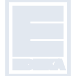
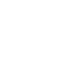

# edeka

[← Back to main README](../../README.md)





## 16 px

### black
```
https://georgegach.github.io/compatible-icons/simple-icons/edeka/16/black.png
```

### slate
```
https://georgegach.github.io/compatible-icons/simple-icons/edeka/16/slate.png
```

### white
```
https://georgegach.github.io/compatible-icons/simple-icons/edeka/16/white.png
```

## 64 px

### black
```
https://georgegach.github.io/compatible-icons/simple-icons/edeka/64/black.png
```

### slate
```
https://georgegach.github.io/compatible-icons/simple-icons/edeka/64/slate.png
```

### white
```
https://georgegach.github.io/compatible-icons/simple-icons/edeka/64/white.png
```

## 128 px

### black
```
https://georgegach.github.io/compatible-icons/simple-icons/edeka/128/black.png
```

### slate
```
https://georgegach.github.io/compatible-icons/simple-icons/edeka/128/slate.png
```

### white
```
https://georgegach.github.io/compatible-icons/simple-icons/edeka/128/white.png
```

## 512 px

### black
```
https://georgegach.github.io/compatible-icons/simple-icons/edeka/512/black.png
```

### slate
```
https://georgegach.github.io/compatible-icons/simple-icons/edeka/512/slate.png
```

### white
```
https://georgegach.github.io/compatible-icons/simple-icons/edeka/512/white.png
```

## 1024 px

### black
```
https://georgegach.github.io/compatible-icons/simple-icons/edeka/1024/black.png
```

### slate
```
https://georgegach.github.io/compatible-icons/simple-icons/edeka/1024/slate.png
```

### white
```
https://georgegach.github.io/compatible-icons/simple-icons/edeka/1024/white.png
```

## 16 px in base64

### black
```
data:image/png;base64,iVBORw0KGgoAAAANSUhEUgAAABAAAAAQCAYAAAAf8/9hAAAABmJLR0QA/wD/AP+gvaeTAAAA3klEQVQ4ja3TMUoDQRQG4C+6IUE7EYKIRSzEwgt4AY/gGSytPYCH8QJKGlt7bRYxIqLYWWlQEVPkLSxxZx3FH4b55/0z/7xh3uuY4RYnfod9DItYPOMCx/j44WAXR9iDoiYMsJ15+6AiC5kHkihatEtcJ7SrHINVrDTE+xjlGKy1aJ0cg9dEfLG+aDMY4yahlTkGOzGacFaRf/3GCe6k315hKfZ+M3jAI97MyrXEJnp4wWfM6zjH4bzBFnaDfwWff+I9NnDQlMFTZPEe8XFs7kXKEyzjVK1nqoL4cztPATdwJhyE1fejAAAAAElFTkSuQmCC
```

### slate
```
data:image/png;base64,iVBORw0KGgoAAAANSUhEUgAAABAAAAAQCAYAAAAf8/9hAAAABmJLR0QA/wD/AP+gvaeTAAABOUlEQVQ4ja2TTy6EQRTEf/W+TwgbRCIWE7ERCxsrcQFHcAZncAA3sXEBYmOJNYmIGEFGxgYrkzDdZTHziT/jQ6I2ne7qV139Kk8AV+3HS8Q2f8Pa7PT4XAmA/eDMYRHaNH6pqxIaStkbClYByoooC01nswCqfdb9u8kGIP5o+wvKbxlzLDgfRKWIE5x+EJCnDJMDmBG63T1CPwigme+YopCqHtQI8NRr2UcYFTllfuHATeDiiy9MSGepv6/7wiKwOJAKdvn3GFOOTihfGT3VFQiPphwdlD46KCO3kG6F71C+Fz6AfCfxiNxCvpZ8atQecnd/gIM8j2IFAMvGK6Cw3yfhG6CRI9arhN4EstWOcAvruXeuJqIBHgZ1ZHeMxiTtZLxQJdwTkCYULBu2Ps3SUTVcVn+tKqUlgFcwq32KQ9P7EwAAAABJRU5ErkJggg==
```

### white
```
data:image/png;base64,iVBORw0KGgoAAAANSUhEUgAAABAAAAAQCAYAAAAf8/9hAAAABmJLR0QA/wD/AP+gvaeTAAAA30lEQVQ4ja3TMUoEQRAF0Nc6sotmIiwiBmsgBl7AC3gEz2Bo7AE8jBdQNjE112QRV0QUMyNdVGQMrIFhnRlb9EPTVfWrflfR3QnKsrzBsd9hL6U0LMJ5wjmO8P5D4QIOsQtFjRhgK/P0QWXMZRa0oujgLnDVwl3mCKxguSHexyhHYLWDSzkCLy3x+brTJTDBdQs3zhHYjtWE08r412uc4lb77BUWI/ebwD0e8OrruY6xgR6e8RH7Gs5wMCuwiZ2wy7BnR7zDOvabOniMLt4iPonkXrQ8xRJO1P5M4m/f+RMF4ywcGXx0/QAAAABJRU5ErkJggg==
```

