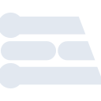

# edgeimpulse

[← Back to main README](../../README.md)





## 16 px

### black
```
https://georgegach.github.io/compatible-icons/simple-icons/edgeimpulse/16/black.png
```

### slate
```
https://georgegach.github.io/compatible-icons/simple-icons/edgeimpulse/16/slate.png
```

### white
```
https://georgegach.github.io/compatible-icons/simple-icons/edgeimpulse/16/white.png
```

## 64 px

### black
```
https://georgegach.github.io/compatible-icons/simple-icons/edgeimpulse/64/black.png
```

### slate
```
https://georgegach.github.io/compatible-icons/simple-icons/edgeimpulse/64/slate.png
```

### white
```
https://georgegach.github.io/compatible-icons/simple-icons/edgeimpulse/64/white.png
```

## 128 px

### black
```
https://georgegach.github.io/compatible-icons/simple-icons/edgeimpulse/128/black.png
```

### slate
```
https://georgegach.github.io/compatible-icons/simple-icons/edgeimpulse/128/slate.png
```

### white
```
https://georgegach.github.io/compatible-icons/simple-icons/edgeimpulse/128/white.png
```

## 512 px

### black
```
https://georgegach.github.io/compatible-icons/simple-icons/edgeimpulse/512/black.png
```

### slate
```
https://georgegach.github.io/compatible-icons/simple-icons/edgeimpulse/512/slate.png
```

### white
```
https://georgegach.github.io/compatible-icons/simple-icons/edgeimpulse/512/white.png
```

## 1024 px

### black
```
https://georgegach.github.io/compatible-icons/simple-icons/edgeimpulse/1024/black.png
```

### slate
```
https://georgegach.github.io/compatible-icons/simple-icons/edgeimpulse/1024/slate.png
```

### white
```
https://georgegach.github.io/compatible-icons/simple-icons/edgeimpulse/1024/white.png
```

## 16 px in base64

### black
```
data:image/png;base64,iVBORw0KGgoAAAANSUhEUgAAABAAAAAQCAYAAAAf8/9hAAAABmJLR0QA/wD/AP+gvaeTAAAAyUlEQVQ4jdXSMW4CQQwF0LdkKUAoF6Chp8kBgAvQ5TJRjkDJFQgngJYiEpBIaVJxg9RLQdoAxcxKo2iLhQbxJUtjj/099nxujQwzDFHgrUbNFz7SQIHTBbZLixtXvLqLp9LJscAIe6xqkrTLwwO2keinIvEXU2zQRyvGe1gLI/nEUfW8x9jg/V/OAWPCDnLhN6qQoRktzengRSx+jk6nguCACf7wisfkrkBW6mAgLLGODlJsSqZLdJDa9zU6SNHLsRSkvMc8Mt8RzkRTQyZyp6dHAAAAAElFTkSuQmCC
```

### slate
```
data:image/png;base64,iVBORw0KGgoAAAANSUhEUgAAABAAAAAQCAYAAAAf8/9hAAAABmJLR0QA/wD/AP+gvaeTAAABGklEQVQ4jcWSsUoDYRCEZ/b+U5EQuEohIPY2djYmrdY+hPgCEnwEn8BefYKInaUIprKyV1RQ5A41jeT+HYtgTIxgjEW2W3b221kYYNrFm4fikMa6hBzk0W8LgWzXFqoXfcDt40sOKRv/pq6XFrOVz84A/dV07e6pWO07AtkC1ICjkOFsLISS+T4gjbb7br5DU2XErKszo+QgRrmn2gaRAUAJbUi6JBlDl7GVCGsC+B1gpKJpU+Zdgg2opyHUuX9+bQM4NQLhp2UAEEBIqYAUAxoBFS+9CQDBYtyKITThPvICaW8sy33NzkWL5Z7k1a8hckns5SDhuhzFODkYOuA6nyAHQy9eTZCDAQfAcoDzBKa6HAXJY/2HOJX6AAgHf7m0oB5kAAAAAElFTkSuQmCC
```

### white
```
data:image/png;base64,iVBORw0KGgoAAAANSUhEUgAAABAAAAAQCAYAAAAf8/9hAAAABmJLR0QA/wD/AP+gvaeTAAAA2klEQVQ4jcXSPUoEQRQE4K9lTWQRDIxMPIIHUC9g5iHEG4ipmScwV0+gqcEG/oCRideYDdbAZKcMdkYG2YXZFbSgoav7veK9ovhvlCTXOECFmx49r6WU52+WpMpyeO+qra0w9U6SvZYMcIdDjPHQU2SjvZQk2zjFcE7hB65Q4wRbzfsnLkopU0lektQL9q2TPCUZ/aiZJDli5sEAZcGoBevN6dYMcdZ6cNyQeStMcIkpzrHZ+auSlDYH+2Ym9slBF48lSdUxZ1m8rZKDLnYHuDeL8hi3yC9F/xhfTf2a2diKxoUAAAAASUVORK5CYII=
```

