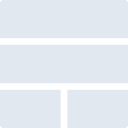
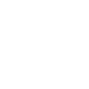

# elasticstack

[← Back to main README](../../README.md)





## 16 px

### black
```
https://georgegach.github.io/compatible-icons/simple-icons/elasticstack/16/black.png
```

### slate
```
https://georgegach.github.io/compatible-icons/simple-icons/elasticstack/16/slate.png
```

### white
```
https://georgegach.github.io/compatible-icons/simple-icons/elasticstack/16/white.png
```

## 64 px

### black
```
https://georgegach.github.io/compatible-icons/simple-icons/elasticstack/64/black.png
```

### slate
```
https://georgegach.github.io/compatible-icons/simple-icons/elasticstack/64/slate.png
```

### white
```
https://georgegach.github.io/compatible-icons/simple-icons/elasticstack/64/white.png
```

## 128 px

### black
```
https://georgegach.github.io/compatible-icons/simple-icons/elasticstack/128/black.png
```

### slate
```
https://georgegach.github.io/compatible-icons/simple-icons/elasticstack/128/slate.png
```

### white
```
https://georgegach.github.io/compatible-icons/simple-icons/elasticstack/128/white.png
```

## 512 px

### black
```
https://georgegach.github.io/compatible-icons/simple-icons/elasticstack/512/black.png
```

### slate
```
https://georgegach.github.io/compatible-icons/simple-icons/elasticstack/512/slate.png
```

### white
```
https://georgegach.github.io/compatible-icons/simple-icons/elasticstack/512/white.png
```

## 1024 px

### black
```
https://georgegach.github.io/compatible-icons/simple-icons/elasticstack/1024/black.png
```

### slate
```
https://georgegach.github.io/compatible-icons/simple-icons/elasticstack/1024/slate.png
```

### white
```
https://georgegach.github.io/compatible-icons/simple-icons/elasticstack/1024/white.png
```

## 16 px in base64

### black
```
data:image/png;base64,iVBORw0KGgoAAAANSUhEUgAAABAAAAAQCAYAAAAf8/9hAAAABmJLR0QA/wD/AP+gvaeTAAAAdUlEQVQ4jcXSsQ2DQAwF0Gd0YhWajJJhMg6DZJhESokYgoKjuZIgcYfElyz/wv62vg0TVuSTsWKKQkIdchS1anQtzZDwxVLZ3yeMLRvc78H9AoFXq8DH/hkD78Kf9s3uE4aDAb+SH/8KLjGx5Q9yh7lSJGPeABgaIYRiRIXoAAAAAElFTkSuQmCC
```

### slate
```
data:image/png;base64,iVBORw0KGgoAAAANSUhEUgAAABAAAAAQCAYAAAAf8/9hAAAABmJLR0QA/wD/AP+gvaeTAAAAlklEQVQ4jcWSsQ3CQBAEZ4+Xi3ADJJRCIaR0QyE0g0RkoZdDx0j8EgARJuCMxEWXzJy0txrG6QL0gPhujKhhp2AAudGHlIIfBqHIwq8pze0U0jUDN7sr0urg5HUJNIxTlgdgcQb/FxSj/TKBb7v5N0puHAEUbMFvYTe7K6FYf7IrfH5um7m2h/SDEG3SPbBxKKhJiSXXO9APNACsHs58AAAAAElFTkSuQmCC
```

### white
```
data:image/png;base64,iVBORw0KGgoAAAANSUhEUgAAABAAAAAQCAYAAAAf8/9hAAAABmJLR0QA/wD/AP+gvaeTAAAAgUlEQVQ4jcXSwQkCUQyE4e8tjy3CBrxYis3YjYVYjIJH2SI8OB4UD6KCG8FckkPmT5ikJTlhgea7CKaW5DJD/IAMBTG0oSAGHQecZ+rHjm1lg5YkFUDZg/8DOjYVQEuy9/qMDbt7vXZ73ecYO5YfBhzvefWu4ScmVv4gA6aZkGC6AvOQH61gVAM4AAAAAElFTkSuQmCC
```

