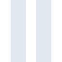
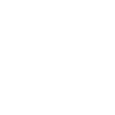

# elevenlabs

[← Back to main README](../../README.md)





## 16 px

### black
```
https://georgegach.github.io/compatible-icons/simple-icons/elevenlabs/16/black.png
```

### slate
```
https://georgegach.github.io/compatible-icons/simple-icons/elevenlabs/16/slate.png
```

### white
```
https://georgegach.github.io/compatible-icons/simple-icons/elevenlabs/16/white.png
```

## 64 px

### black
```
https://georgegach.github.io/compatible-icons/simple-icons/elevenlabs/64/black.png
```

### slate
```
https://georgegach.github.io/compatible-icons/simple-icons/elevenlabs/64/slate.png
```

### white
```
https://georgegach.github.io/compatible-icons/simple-icons/elevenlabs/64/white.png
```

## 128 px

### black
```
https://georgegach.github.io/compatible-icons/simple-icons/elevenlabs/128/black.png
```

### slate
```
https://georgegach.github.io/compatible-icons/simple-icons/elevenlabs/128/slate.png
```

### white
```
https://georgegach.github.io/compatible-icons/simple-icons/elevenlabs/128/white.png
```

## 512 px

### black
```
https://georgegach.github.io/compatible-icons/simple-icons/elevenlabs/512/black.png
```

### slate
```
https://georgegach.github.io/compatible-icons/simple-icons/elevenlabs/512/slate.png
```

### white
```
https://georgegach.github.io/compatible-icons/simple-icons/elevenlabs/512/white.png
```

## 1024 px

### black
```
https://georgegach.github.io/compatible-icons/simple-icons/elevenlabs/1024/black.png
```

### slate
```
https://georgegach.github.io/compatible-icons/simple-icons/elevenlabs/1024/slate.png
```

### white
```
https://georgegach.github.io/compatible-icons/simple-icons/elevenlabs/1024/white.png
```

## 16 px in base64

### black
```
data:image/png;base64,iVBORw0KGgoAAAANSUhEUgAAABAAAAAQCAYAAAAf8/9hAAAABmJLR0QA/wD/AP+gvaeTAAAAQ0lEQVQ4je2MMQoAIAwDT32ar++PuogughF1cG+gcKThYKUCDvR5Jj+T3ucWgMyeJtwfrJtD8J0QhCAEd0ERTg/WDQNa+gwjBn2A8gAAAABJRU5ErkJggg==
```

### slate
```
data:image/png;base64,iVBORw0KGgoAAAANSUhEUgAAABAAAAAQCAYAAAAf8/9hAAAABmJLR0QA/wD/AP+gvaeTAAAAY0lEQVQ4je2MoRJAQBgG9yOoFxXjLXgA0fOKHoC3MMrFq4L5BcYwrui3acPOiovFh05oACsABHNVuhZg9WEyaM5Sm2F9XboRIOOF7bdKFvVn8x38Jw3SIA2iA+W3minqzwY4AK+jGSBKXobZAAAAAElFTkSuQmCC
```

### white
```
data:image/png;base64,iVBORw0KGgoAAAANSUhEUgAAABAAAAAQCAYAAAAf8/9hAAAABmJLR0QA/wD/AP+gvaeTAAAAQklEQVQ4je2MMQ4AEBAED0/zej/SyGiIFRT6m2pyexmzAZCByqLIVuRegTy3aDtNnIfrzxH4xgMe8MA9kMTDw/XHOgvEKgVgD2quAAAAAElFTkSuQmCC
```

