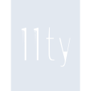
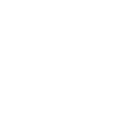

# eleventy

[← Back to main README](../../README.md)

<table><tr>
  <td></td>
  <td></td>
  <td></td>
</tr></table>

## 16 px

### black
```
https://georgegach.github.io/compatible-icons/simple-icons/compat/eleventy/16/black.png
```

### slate
```
https://georgegach.github.io/compatible-icons/simple-icons/compat/eleventy/16/slate.png
```

### white
```
https://georgegach.github.io/compatible-icons/simple-icons/compat/eleventy/16/white.png
```

## 64 px

### black
```
https://georgegach.github.io/compatible-icons/simple-icons/compat/eleventy/64/black.png
```

### slate
```
https://georgegach.github.io/compatible-icons/simple-icons/compat/eleventy/64/slate.png
```

### white
```
https://georgegach.github.io/compatible-icons/simple-icons/compat/eleventy/64/white.png
```

## 128 px

### black
```
https://georgegach.github.io/compatible-icons/simple-icons/compat/eleventy/128/black.png
```

### slate
```
https://georgegach.github.io/compatible-icons/simple-icons/compat/eleventy/128/slate.png
```

### white
```
https://georgegach.github.io/compatible-icons/simple-icons/compat/eleventy/128/white.png
```

## 512 px

### black
```
https://georgegach.github.io/compatible-icons/simple-icons/compat/eleventy/512/black.png
```

### slate
```
https://georgegach.github.io/compatible-icons/simple-icons/compat/eleventy/512/slate.png
```

### white
```
https://georgegach.github.io/compatible-icons/simple-icons/compat/eleventy/512/white.png
```

## 1024 px

### black
```
https://georgegach.github.io/compatible-icons/simple-icons/compat/eleventy/1024/black.png
```

### slate
```
https://georgegach.github.io/compatible-icons/simple-icons/compat/eleventy/1024/slate.png
```

### white
```
https://georgegach.github.io/compatible-icons/simple-icons/compat/eleventy/1024/white.png
```

## 16 px in base64

### black
```
data:image/png;base64,iVBORw0KGgoAAAANSUhEUgAAABAAAAAQCAYAAAAf8/9hAAAABmJLR0QA/wD/AP+gvaeTAAAAy0lEQVQ4ja3STWoCQRCG4ccxC4PZJIKQRUSMJLlVruAJPIHHywWyzEKFEA0Zyc+iKzqIM7bgB81XU1S9U9UzJF1jjt/MM48ehZ0+5WtbWzRV5ejsgAVesQov8YZNLmCNGdqYBqDEVy7gNk4HY1zgBT/SzZf4aAK0cBfxE74xjOdlABfHADcR96RvXkReTNG4Qkva/z+ueheT8FoAjMIH0dyRLreP58qESDvt6yH8vvJmeMdjZaJaQJ26uNpPngJoH0qe9Ve+PKFvW/sHhdcnzEwqI7sAAAAASUVORK5CYII=
```

### slate
```
data:image/png;base64,iVBORw0KGgoAAAANSUhEUgAAABAAAAAQCAYAAAAf8/9hAAAABmJLR0QA/wD/AP+gvaeTAAABAklEQVQ4ja2STUoDYRBEX/UMEhkXGkHIQiMa1Ft5BU/gCTyey2xm6SITEY04Ml+5iGh+cPwW6VXTXfXoghZAXT8faY8pYkhOmcYtk/H4cB4/Q/k9y7yhjT5dTu0c0Ahq8Jtwjd0CT8BnHkBeROhBRJHMvaQW3II/Mi+IUZc8Mh4omBhKKR5BCZgZtYjXvwEpyfYpgNAN0Nk+B4OYi1Sm5KYnghSKIUAyx4AlhZCwwZqF1BcB2V3xvZAwYCUbRCXpDqj6AEBxAWB0ZiSbgRQL0Inxrb3+reWWX75aNr5cgqiEMbwEXCPUD9jk/WarkA7w+v5fwAqqsLenO3xlaz/btaL9AvipZNwpiHuqAAAAAElFTkSuQmCC
```

### white
```
data:image/png;base64,iVBORw0KGgoAAAANSUhEUgAAABAAAAAQCAYAAAAf8/9hAAAABmJLR0QA/wD/AP+gvaeTAAAAzElEQVQ4ja3STUoDQRCG4WcSF5G4SQTBhSIaNLfyCp7AE3g8L+DSxSQg/mAklosp4xCcpAP5oPmqi6q3u5oGETGKiDrKVUfECHr+9KFcq9repqoS7R0wwxPe0hd4xlcp4B0P6OM+AQt8lgJOcw0wwQEe8Y06Ya+bABXOMp5iiYvczxM42wYYZ3yMyJoqc/W2ESrN/L9x24e4S+8EwGX6eTYPNI97gtvWDdHMtK7r9KvWyfCCm9aNOgFdGuJoPbkLoP9fcq9f+XCHvlXtD0oiUaLW85s5AAAAAElFTkSuQmCC
```

