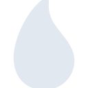

# elixir

[← Back to main README](../../README.md)





## 16 px

### black
```
https://georgegach.github.io/compatible-icons/simple-icons/elixir/16/black.png
```

### slate
```
https://georgegach.github.io/compatible-icons/simple-icons/elixir/16/slate.png
```

### white
```
https://georgegach.github.io/compatible-icons/simple-icons/elixir/16/white.png
```

## 64 px

### black
```
https://georgegach.github.io/compatible-icons/simple-icons/elixir/64/black.png
```

### slate
```
https://georgegach.github.io/compatible-icons/simple-icons/elixir/64/slate.png
```

### white
```
https://georgegach.github.io/compatible-icons/simple-icons/elixir/64/white.png
```

## 128 px

### black
```
https://georgegach.github.io/compatible-icons/simple-icons/elixir/128/black.png
```

### slate
```
https://georgegach.github.io/compatible-icons/simple-icons/elixir/128/slate.png
```

### white
```
https://georgegach.github.io/compatible-icons/simple-icons/elixir/128/white.png
```

## 512 px

### black
```
https://georgegach.github.io/compatible-icons/simple-icons/elixir/512/black.png
```

### slate
```
https://georgegach.github.io/compatible-icons/simple-icons/elixir/512/slate.png
```

### white
```
https://georgegach.github.io/compatible-icons/simple-icons/elixir/512/white.png
```

## 1024 px

### black
```
https://georgegach.github.io/compatible-icons/simple-icons/elixir/1024/black.png
```

### slate
```
https://georgegach.github.io/compatible-icons/simple-icons/elixir/1024/slate.png
```

### white
```
https://georgegach.github.io/compatible-icons/simple-icons/elixir/1024/white.png
```

## 16 px in base64

### black
```
data:image/png;base64,iVBORw0KGgoAAAANSUhEUgAAABAAAAAQCAYAAAAf8/9hAAAABmJLR0QA/wD/AP+gvaeTAAAA00lEQVQ4jZ3Su0pDQRRG4S+KhZURIYVFHiJVChEbG1u7PEvewrfRIrVpAim8RCxESSBNEC8IIYzNOeQQzkxGf9jV7LVmz4V42rjHc6InmkM8IGDyH8E1VoXgDUd/gS+xKOCAJfq58C4eK3BZL2jlCHr4qBEEDIsNkrmNwAGfuErBTbwmBAFznMYEF/jeIgi4Q6OEdiqCLva3nRHHOKsTZN0yDnBeJ5hnCqhMWhXc4D0D/sKgbqFh/f9T9YS9mP0E0wQ8lXjGMl2MMcNPUTOM0Nls/gVKl1JkRl0LcQAAAABJRU5ErkJggg==
```

### slate
```
data:image/png;base64,iVBORw0KGgoAAAANSUhEUgAAABAAAAAQCAYAAAAf8/9hAAAABmJLR0QA/wD/AP+gvaeTAAABRklEQVQ4jY2RvU4CQRSFz50hGH+IEIMgiTT+xFhLQiyMjU9gwQNgY+WrWBrfwN7EqIWNtaWtAVZ22cJdNCZG2Tk2ZCXsDuvpZu653z1zR2BRv/9Wj0TdUpCvV4sbNp9Ku+x0wlIk6o6CHQEiW7MVoOdwBYUtACCw4DjvK/8G9AbhcSRokHGtMspFpzaATB5I6p4/fAaxPeXrfkM3NqsFf2YCZxC0ANRSBtXziK5J6tlPEHUGYskSdbfnhedWwEsQFGlSpwMACCxCpNX1Pw5SAbkvtQ+hddtjlWmiC5Lx7mIAYZqAzGcAIEDt1QsPEwCIrGY1j7VsRI6SADLxRTNyxEknAfcAhtm9+ATkIQFYXys9GhovE0C4fqVwkwCICEXnTiDi2qfTHSnd3hP5+Qs0JccbNg14CaAMojR2BQJ4WqNdKxefJv2/i+ts2pPk/MkAAAAASUVORK5CYII=
```

### white
```
data:image/png;base64,iVBORw0KGgoAAAANSUhEUgAAABAAAAAQCAYAAAAf8/9hAAAABmJLR0QA/wD/AP+gvaeTAAAA1klEQVQ4jZ3SO0qDQRgF0BuDhZWKYGHhIqxSiNjY2Nq5FnfhbrSw1kawiC8sREkgjYgPBJFjkUh+zP/SC9MMcw/DN5NUBOu4xF3VmcpgGVfGufkPcISvCfCIlb+U9/Bkmk8ctC13cW0291htA+zjpQSAM3SbgNOKMrzisK68hIcaAEbYqgJ28d4AQB+dn95cweglWWgcVLKWZLsMaJ7yOItJdsqAUUsgKdy0CBwneW5RfktyMrOLjun/r8st5ktpbGJQUx5UPmMB6eECQ3xM1hDn2Ph9/hvjZXRQXDzhVwAAAABJRU5ErkJggg==
```

