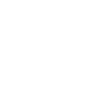

# emberdotjs

[← Back to main README](../../README.md)




## 16 px

### black
```
https://georgegach.github.io/compatible-icons/simple-icons/emberdotjs/16/black.png
```

### slate
```
https://georgegach.github.io/compatible-icons/simple-icons/emberdotjs/16/slate.png
```

### white
```
https://georgegach.github.io/compatible-icons/simple-icons/emberdotjs/16/white.png
```

## 64 px

### black
```
https://georgegach.github.io/compatible-icons/simple-icons/emberdotjs/64/black.png
```

### slate
```
https://georgegach.github.io/compatible-icons/simple-icons/emberdotjs/64/slate.png
```

### white
```
https://georgegach.github.io/compatible-icons/simple-icons/emberdotjs/64/white.png
```

## 128 px

### black
```
https://georgegach.github.io/compatible-icons/simple-icons/emberdotjs/128/black.png
```

### slate
```
https://georgegach.github.io/compatible-icons/simple-icons/emberdotjs/128/slate.png
```

### white
```
https://georgegach.github.io/compatible-icons/simple-icons/emberdotjs/128/white.png
```

## 512 px

### black
```
https://georgegach.github.io/compatible-icons/simple-icons/emberdotjs/512/black.png
```

### slate
```
https://georgegach.github.io/compatible-icons/simple-icons/emberdotjs/512/slate.png
```

### white
```
https://georgegach.github.io/compatible-icons/simple-icons/emberdotjs/512/white.png
```

## 1024 px

### black
```
https://georgegach.github.io/compatible-icons/simple-icons/emberdotjs/1024/black.png
```

### slate
```
https://georgegach.github.io/compatible-icons/simple-icons/emberdotjs/1024/slate.png
```

### white
```
https://georgegach.github.io/compatible-icons/simple-icons/emberdotjs/1024/white.png
```

## 16 px in base64

### black
```
data:image/png;base64,iVBORw0KGgoAAAANSUhEUgAAABAAAAAQCAYAAAAf8/9hAAAABmJLR0QA/wD/AP+gvaeTAAAA8ElEQVQ4jbXTsUoDQRDG8d8JllYSrLTXwkIIdilsFbSxtLCxslIfwWcQO9P5APoGQmqLNJJowEIwGEylhYRY3JzImTsPgx8sLLOz/9n5djfB2BSamWZzFcAYb38FPOAYOzjHc1mV/OiihmWcYg7NgtwfgdeouohHjHCCg6qADpJvFYfYwvUkQObBCIOY92JxDX1cRgv1Mg/u0cAZNiK+jXVchIFZ1Se85FsY4g4t7AZgL07zETnvaGMVV2UetAKwGYAebnGIWRxFa4WAPvYntLqCG+ktfeUnGSWngfQK25jHkvRdLOQTiwCV9e+f6Vd9AqkrY7euFF+eAAAAAElFTkSuQmCC
```

### slate
```
data:image/png;base64,iVBORw0KGgoAAAANSUhEUgAAABAAAAAQCAYAAAAf8/9hAAAABmJLR0QA/wD/AP+gvaeTAAABT0lEQVQ4jbWTPUucYRBFz519JVqsERZdRNbSQixiICRWNimsFrEO+BtEo5WVjWU6EywsY5vO/IGkDiSQxogi+B0WBBWz73NT7CqyuNFEcsth5sydYUY7+zXzAMVDiu8ECFlw9q+AH3XSbBKTmLdIB38D2Oxw4YVStlEQ413Zr3lg47bE7BbfNfKYS77sjCh8TImBcz2qOa9/UsT03Q7McaW/+CHPsiVExXBq8x2p+ocRnAMnDQfakmTZT40PZd6LejEUz9oCJG0TnkpOK8lebiBjMYiqw52i8Ma4r9ls77rZFcCmRK5VKZ5kQQnAyrtNWg/0qlGsC/A3yRNCn1t38BgxJBhzYqYB8M8mfBf4IvP6sNwz6lwvbT+/3nnrKQuOHLEw2Ne9djO+vXc6LOrvCI1getoCmjqx2YnQ15RckhgE9YLLrYntAPfW/32m++g3RziKX+kTsx4AAAAASUVORK5CYII=
```

### white
```
data:image/png;base64,iVBORw0KGgoAAAANSUhEUgAAABAAAAAQCAYAAAAf8/9hAAAABmJLR0QA/wD/AP+gvaeTAAABB0lEQVQ4jbWTvUpDQRSEvxULm2AhwUKw18JCkHQW1oI2liI+gJU+gs8QFATtLFImjbWQJ0gj/gREhASj10YLkc9mL1zCGi8JDiycPczOnB04QZUJMDXJ4zICAh/jCjwAh8A2cAL00hZp3KlVdUk9VivqRYo4ndDMgCNgBrgCFmKvDeyVmeBWDQXHTN1UW6kJ8gy+gUGsuyEEgVWgD1wCFWBtVAb36rpaVzdif0utqedqr2D6rL7kl1wgU2/UtroTBXbVrvoVOZ9qR11Rm8MhzsaTowG8xvoJeAfOgFPgAKiNCrGv7ie+uqxeq29FctDkLgyAR6ADzAGLQBWYHyb+JlAa/75Mf+IHCGk7MiwqaNsAAAAASUVORK5CYII=
```

