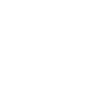

# empirekred

[← Back to main README](../../README.md)

<table><tr>
  <td></td>
  <td></td>
  <td></td>
</tr></table>

## 16 px

### black
```
https://georgegach.github.io/compatible-icons/simple-icons/compat/empirekred/16/black.png
```

### slate
```
https://georgegach.github.io/compatible-icons/simple-icons/compat/empirekred/16/slate.png
```

### white
```
https://georgegach.github.io/compatible-icons/simple-icons/compat/empirekred/16/white.png
```

## 64 px

### black
```
https://georgegach.github.io/compatible-icons/simple-icons/compat/empirekred/64/black.png
```

### slate
```
https://georgegach.github.io/compatible-icons/simple-icons/compat/empirekred/64/slate.png
```

### white
```
https://georgegach.github.io/compatible-icons/simple-icons/compat/empirekred/64/white.png
```

## 128 px

### black
```
https://georgegach.github.io/compatible-icons/simple-icons/compat/empirekred/128/black.png
```

### slate
```
https://georgegach.github.io/compatible-icons/simple-icons/compat/empirekred/128/slate.png
```

### white
```
https://georgegach.github.io/compatible-icons/simple-icons/compat/empirekred/128/white.png
```

## 512 px

### black
```
https://georgegach.github.io/compatible-icons/simple-icons/compat/empirekred/512/black.png
```

### slate
```
https://georgegach.github.io/compatible-icons/simple-icons/compat/empirekred/512/slate.png
```

### white
```
https://georgegach.github.io/compatible-icons/simple-icons/compat/empirekred/512/white.png
```

## 1024 px

### black
```
https://georgegach.github.io/compatible-icons/simple-icons/compat/empirekred/1024/black.png
```

### slate
```
https://georgegach.github.io/compatible-icons/simple-icons/compat/empirekred/1024/slate.png
```

### white
```
https://georgegach.github.io/compatible-icons/simple-icons/compat/empirekred/1024/white.png
```

## 16 px in base64

### black
```
data:image/png;base64,iVBORw0KGgoAAAANSUhEUgAAABAAAAAQCAYAAAAf8/9hAAAABmJLR0QA/wD/AP+gvaeTAAABLElEQVQ4jZXSuy5EURQG4M8EBYlL0CipVAoJ3kFH5QU0WpGQKFFQegFeQCQSjWKikbh0ROJSIITBIELEzKCYfeKYnOPyJzvZe631r73+tVYV6jGLfmT8De/YxCRso4iPf54itiAfDO/YwXks6ApruMNbQpJ8Bs2hrA/MYD28bzCObPDVJEhpTtP8hGm0YQwtac2oTrC9YC5UkkVrGpnkrs/jCPfYVe4N5GK2mzghakgJgxjCLTbQhJPg38cCLvAc8TJ4rahgQFlzN4YxEvuxC+2oi+RmcJ0irwETOMAyGlFbEZODPpwFrYe49H3Wp9jDY5AWt/dGmTrDTwW/b2AhxHZUllyPFV+bmXQesBpiUzGaICNa66mfiHH04Fh5tKVw7/krOUIjlrAY7on4BPckd79L5Z2YAAAAAElFTkSuQmCC
```

### slate
```
data:image/png;base64,iVBORw0KGgoAAAANSUhEUgAAABAAAAAQCAYAAAAf8/9hAAAABmJLR0QA/wD/AP+gvaeTAAABxUlEQVQ4jY2RMWvTYRjEf/f+kxat2KS1hIhaJV2cRC3od+gs6hdwEZxEUEdRB93UryCKg4uIQoduDhJXB9vaVqFJI2lCoQaT/3sOjbVJGuht7/s8d9zdo0qlMtYOhx47+jIicBCYqKBP2fj7nlbXG58lzgPJgcj/RVKkL0FQ6pKNKGN+7i5JVaQPhjpSu0dAJNgzAZH/pyn8iKD5nTk1x3jH0kIAY2cHXIj8vpkFWxE9dEimFH3bMDksSWbgJ3rbQU+InflAsgAc640O2vMecBDF0yTwTZm4iSgjIoCtDYlNmbKgNlQgiVxIUz8njrxKR3wNs9KV/uXol0hFYGyvQKvHojwHTNo+l/zRdXe4Aa7tdJOcBR83HO6ubwfb1f3KERyVuavR9lehtyFoPJKO9PWxoR+V5iU7vkE6ASyCj4CKu0JmzdKW8UlBm+5FBGtYVwSwVm2UFHmHNGM8eJkeZ+pgL8bA3HQhtxwAThVyS1m1Zg3vkTeHkQ3NCB+zas1OF3LLXSe9WFmv3wwhuY9d7GNXI35xuph/0NfVIFZrjYt0/FrSGQDb38no6vRUrjwYaQiW6vXxTEvPpOD2aHqrNDHR3G/vL/iHvPcDCvgeAAAAAElFTkSuQmCC
```

### white
```
data:image/png;base64,iVBORw0KGgoAAAANSUhEUgAAABAAAAAQCAYAAAAf8/9hAAAABmJLR0QA/wD/AP+gvaeTAAABQklEQVQ4jY2TTyuEURjFf2awMGUSFiyxsRJT+A6+AF/AxlaKssSCpS/AQnZSFhYWs7MQK6WwQBIzkz+pSU0zP4u56vX2vsypu7jnnnPu8zy326bmgA1gGsjQGhrAKbDSpp4B40C2RfMP6sBFBhgOZoFz4DEiegGOgVegFgvIAiMZoCcQAuvASdiXgSWgGM46EqroSev5E1gD+oFFoDetj/YErgpshkqKQF+aGZKnvgXcAG80Z9IIfCnClf8KmAC2gX1gFrgLfAXYAwaAXDTgKxYwQ7PnMWAOmI/cOAoMAl1hX83QfKokdAPLwBVwAOSBzpimhDqlPqgN9Vp98jfu1Uv1Q63E+EkA1GH1Sq35P2pBO/SrFjWnHqqvf5jf1aPwf5KhLiS0ofqsrqYaYyEF9Vath3WrFloyR0Ly6q66o+bTdN+a3xPCea/xmgAAAABJRU5ErkJggg==
```

