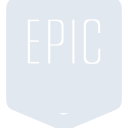
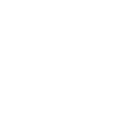

# epicgames

[← Back to main README](../../README.md)





## 16 px

### black
```
https://georgegach.github.io/compatible-icons/simple-icons/epicgames/16/black.png
```

### slate
```
https://georgegach.github.io/compatible-icons/simple-icons/epicgames/16/slate.png
```

### white
```
https://georgegach.github.io/compatible-icons/simple-icons/epicgames/16/white.png
```

## 64 px

### black
```
https://georgegach.github.io/compatible-icons/simple-icons/epicgames/64/black.png
```

### slate
```
https://georgegach.github.io/compatible-icons/simple-icons/epicgames/64/slate.png
```

### white
```
https://georgegach.github.io/compatible-icons/simple-icons/epicgames/64/white.png
```

## 128 px

### black
```
https://georgegach.github.io/compatible-icons/simple-icons/epicgames/128/black.png
```

### slate
```
https://georgegach.github.io/compatible-icons/simple-icons/epicgames/128/slate.png
```

### white
```
https://georgegach.github.io/compatible-icons/simple-icons/epicgames/128/white.png
```

## 512 px

### black
```
https://georgegach.github.io/compatible-icons/simple-icons/epicgames/512/black.png
```

### slate
```
https://georgegach.github.io/compatible-icons/simple-icons/epicgames/512/slate.png
```

### white
```
https://georgegach.github.io/compatible-icons/simple-icons/epicgames/512/white.png
```

## 1024 px

### black
```
https://georgegach.github.io/compatible-icons/simple-icons/epicgames/1024/black.png
```

### slate
```
https://georgegach.github.io/compatible-icons/simple-icons/epicgames/1024/slate.png
```

### white
```
https://georgegach.github.io/compatible-icons/simple-icons/epicgames/1024/white.png
```

## 16 px in base64

### black
```
data:image/png;base64,iVBORw0KGgoAAAANSUhEUgAAABAAAAAQCAYAAAAf8/9hAAAABmJLR0QA/wD/AP+gvaeTAAABI0lEQVQ4jY3RyUpDQRAF0JNnjJooBlwYAqIGxIUgfoXf4z/le0Q3ZiOCG4eIojjg8DK46DI+Hhq90HR1Vd3bNUALFxhh/M8zCs5qhk3UUfF/VILTqcbji3wa6ts4jN928YAnPGIZnS9eVlK+wTruMIMMtfBfYSfsCcoC8BykcamtSvg2pgm84w3zOEY/WvoVZYE5NHGNPexH6UVc/FVBH+2IZVF2Fi2c4aNIqJYEdjCQ5rAWvqa0snb423+1UIuT4d73IF+whHxaBc24BxGbjXejkDOeJnCHRWnyr2GPSzl5+CcCOYbxXikkLvgZc3EPkVelfR9JA2xF8EnquYiGNAPSmk+CO8EWujiPqvrSzi/DziPWjdxfUccBeriN0wtfvZz8CW5zT7JPPtJjAAAAAElFTkSuQmCC
```

### slate
```
data:image/png;base64,iVBORw0KGgoAAAANSUhEUgAAABAAAAAQCAYAAAAf8/9hAAAABmJLR0QA/wD/AP+gvaeTAAABoElEQVQ4jZWSzWpTURSFv7XzZ2O0QaHUK0UtiIOCiHOnPkofw4GP0ddxXNp5EQfSJL1Q/5Ja9SZ7OcjlmigR3XDgnMNea397n6N35Wy3ldUx6B4g/i1sebyg8zw6zkdI/f8QA0io3yX323OQjAQgzpxKyU9sjgUGPZX8yTC1+CKzDezbaC4Uv4GVEg+wLiNoEQ7krqHEHss+wJSrknWDZR8zy10SRw22zAxhGenhRgPR+o79DXTD+DTRhSAbQP05qDUDs+g5GApPBM+wXxqPfxUQts//SmD7QqJABBBIBoWdAt5K/FjVtNcJ8kAwt5kBewCkh4g+UkHmzKECbyAA9UBdoIsiJD4iCYPsK4VuYaqNBOBhvZmD2zadurebIOwadLMBl0IDk4njGhhg19/M2CBRAYPGINIVYlGf7xqzfCxv1dWbovWv6NXXC6WrKHdvnwpOLCbNJGCKNFldgmnTqJgITmrtMt6Xnx9n8gr8QnDf8EFoblKBWsCdhPNAbwhe7+1snzWAqzEajfoZW4eJDoGd5QhUBj6KvD4qiuLrav5Pk8DBlqMGjRcAAAAASUVORK5CYII=
```

### white
```
data:image/png;base64,iVBORw0KGgoAAAANSUhEUgAAABAAAAAQCAYAAAAf8/9hAAAABmJLR0QA/wD/AP+gvaeTAAABNklEQVQ4jY3TzWpUQRAF4G+uY6ITxQEXhgFRA8FFQHwKn8d3yvOIbsxGBDdRRwyKUfy5yRwXXYmXi5nkQNP1dw5V1bQk20kOk6xydayKc6/DI8wwcXVMirMzLeeM/AYrPMYLBE/wFcf4hjvYOeN1I+VPeIAjXEOHjYp/wF7Z5xgLwPciZTTWpGIP1wn8xi/cwCssa6QLMRbYxBwf8RTPqvUhDi/rYIlF5bpqu6sR3uLPkDAdCezhRNvD/YrNtSdbVHxx2QgbdTp88W+RP3Ab/boO5nWfVO56+VuDmqwTOMItbfM/y86opq/4uUCP0/LvDgpv+j826z5FP9Xe+6W2wO1KHmszD7Gl7YD2zK+L25BkN8l+kndJ+iTL+nHvy+4rt59k94LuSDJL8jzJQZLPdQ4qNhvX/wWMlrtGGpDPvwAAAABJRU5ErkJggg==
```

