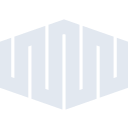
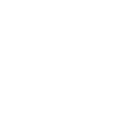

# equinixmetal

[← Back to main README](../../README.md)





## 16 px

### black
```
https://georgegach.github.io/compatible-icons/simple-icons/equinixmetal/16/black.png
```

### slate
```
https://georgegach.github.io/compatible-icons/simple-icons/equinixmetal/16/slate.png
```

### white
```
https://georgegach.github.io/compatible-icons/simple-icons/equinixmetal/16/white.png
```

## 64 px

### black
```
https://georgegach.github.io/compatible-icons/simple-icons/equinixmetal/64/black.png
```

### slate
```
https://georgegach.github.io/compatible-icons/simple-icons/equinixmetal/64/slate.png
```

### white
```
https://georgegach.github.io/compatible-icons/simple-icons/equinixmetal/64/white.png
```

## 128 px

### black
```
https://georgegach.github.io/compatible-icons/simple-icons/equinixmetal/128/black.png
```

### slate
```
https://georgegach.github.io/compatible-icons/simple-icons/equinixmetal/128/slate.png
```

### white
```
https://georgegach.github.io/compatible-icons/simple-icons/equinixmetal/128/white.png
```

## 512 px

### black
```
https://georgegach.github.io/compatible-icons/simple-icons/equinixmetal/512/black.png
```

### slate
```
https://georgegach.github.io/compatible-icons/simple-icons/equinixmetal/512/slate.png
```

### white
```
https://georgegach.github.io/compatible-icons/simple-icons/equinixmetal/512/white.png
```

## 1024 px

### black
```
https://georgegach.github.io/compatible-icons/simple-icons/equinixmetal/1024/black.png
```

### slate
```
https://georgegach.github.io/compatible-icons/simple-icons/equinixmetal/1024/slate.png
```

### white
```
https://georgegach.github.io/compatible-icons/simple-icons/equinixmetal/1024/white.png
```

## 16 px in base64

### black
```
data:image/png;base64,iVBORw0KGgoAAAANSUhEUgAAABAAAAAQCAYAAAAf8/9hAAAABmJLR0QA/wD/AP+gvaeTAAAA6ElEQVQ4jcXSvUoDQRQF4G83YsAETBAFK2Pq1BYKNr6EZWofSFIEYulL2Fgkb2ARYqE2gigsqOAaf4pcJQouUUQPHJiZe87lzJ3hv5EU1JbQjvUBrmdpUMUulrGHVbzgEvu4wiFup01ltHCEczxggFMMgyP0o3YW2hbKpehaxw6e8IibSHOPMeZxh0qkXkMN3TTMSXCAvGAueWje9PW0QDwTfq1B4wfeBswhw5biP/EZC+HJUmyggwuTISVoYnHKUMN61PLQdsL7ASvombx7hpNgFme90Lzjq9gptrEZ+z6O8fyNa/4RXgGmRDBOM4MR0QAAAABJRU5ErkJggg==
```

### slate
```
data:image/png;base64,iVBORw0KGgoAAAANSUhEUgAAABAAAAAQCAYAAAAf8/9hAAAABmJLR0QA/wD/AP+gvaeTAAABTElEQVQ4jcWSwUqUYRiFn/P+oz+ITg7hr9IsLPIKBlwkdR0tW7sR3HgNLtuEy5ZdR0HuuoFx54TDL1EzCuEP8x43M6GEDEbUA9/qe8/5znv44H+j+y4Gg/HjXOBN5oTWpHjf7ba/zTWo63r5OhdfJ7EmT/aQNiXZmUOreBfkRRnNh6qqrn4Z9Psuy5Xv2ybeCm9DrIO/ABUwAZCINLVQT3iYcCpy//qy04+yPT7HOhD0DC3BSODpAz+nZxZ3lHhB0MM6KNvj88DuTFeRzInJ5r5eTDYyJ7N57E7Ma3kef81g6w+0WwAt8MjSboA8RzFDsJTSrvAooih2Ah0bzkANChmegR/NBGmvhvQUhUCN4SzQcRTFzp2PdDq8rBadR4Rf2l4T8RXA5BNJF6Q+NYrD5xsr9a00v2M7BsMfryy9AJD9ubux+lFSPqymf8ENLn6B6HHfbasAAAAASUVORK5CYII=
```

### white
```
data:image/png;base64,iVBORw0KGgoAAAANSUhEUgAAABAAAAAQCAYAAAAf8/9hAAAABmJLR0QA/wD/AP+gvaeTAAAA9UlEQVQ4jcXSu0pDQRAG4G8PiiCCBjFiFwWfQLBQ8DksrW0E38RG0sXS57AwnaWN6SwiisUBQQjoWDhqiiReEP1hWHb+y+4Oy3+jjCMiYhF7uT0ppdx/GhARc9jFEvaxgsANjnGH01LKw3tARMxgHUe5LuMCTTylrsItNjKshwNcVejjMMkp1HkqPGa9ocZ0ag/Rr9DIpxR0MRg3l+S6Q/pGNUH8JfxaQOsH3hYfQ9s24U+MwGx66gqbaOPa65AK1jA/ZFjAanKD1LbT+4GIaEZEJyJ6EVFHxGVWnb1ORDSHPSOvHREVdrCVrXOclVKev/HMP8ILzNVWoEKGXI8AAAAASUVORK5CYII=
```

