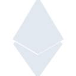
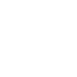

# ethereum

[← Back to main README](../../README.md)

<table><tr>
  <td></td>
  <td></td>
  <td></td>
</tr></table>

## 16 px

### black
```
https://georgegach.github.io/compatible-icons/simple-icons/compat/ethereum/16/black.png
```

### slate
```
https://georgegach.github.io/compatible-icons/simple-icons/compat/ethereum/16/slate.png
```

### white
```
https://georgegach.github.io/compatible-icons/simple-icons/compat/ethereum/16/white.png
```

## 64 px

### black
```
https://georgegach.github.io/compatible-icons/simple-icons/compat/ethereum/64/black.png
```

### slate
```
https://georgegach.github.io/compatible-icons/simple-icons/compat/ethereum/64/slate.png
```

### white
```
https://georgegach.github.io/compatible-icons/simple-icons/compat/ethereum/64/white.png
```

## 128 px

### black
```
https://georgegach.github.io/compatible-icons/simple-icons/compat/ethereum/128/black.png
```

### slate
```
https://georgegach.github.io/compatible-icons/simple-icons/compat/ethereum/128/slate.png
```

### white
```
https://georgegach.github.io/compatible-icons/simple-icons/compat/ethereum/128/white.png
```

## 512 px

### black
```
https://georgegach.github.io/compatible-icons/simple-icons/compat/ethereum/512/black.png
```

### slate
```
https://georgegach.github.io/compatible-icons/simple-icons/compat/ethereum/512/slate.png
```

### white
```
https://georgegach.github.io/compatible-icons/simple-icons/compat/ethereum/512/white.png
```

## 1024 px

### black
```
https://georgegach.github.io/compatible-icons/simple-icons/compat/ethereum/1024/black.png
```

### slate
```
https://georgegach.github.io/compatible-icons/simple-icons/compat/ethereum/1024/slate.png
```

### white
```
https://georgegach.github.io/compatible-icons/simple-icons/compat/ethereum/1024/white.png
```

## 16 px in base64

### black
```
data:image/png;base64,iVBORw0KGgoAAAANSUhEUgAAABAAAAAQCAYAAAAf8/9hAAAABmJLR0QA/wD/AP+gvaeTAAAA8ElEQVQ4jZXSPUpDQRTF8Z8mBAsRQTCFrsDODdikcQ8iuBM7V2Bp5xZsLGwFSxsNQmz8iKAiBKP4bTEzMIhv8t6B28yd/7kzZ4ayDnEyYU+lerjHCJtN4Tb6+Ik1wGwTgx28Zgaf2KsLL+M6g1PdYaWOwdE/cKqJga7joWAwwlYV3MFFAU51KQt0OjNYwHucUqWxEOhiWmhnzRd0cRUnLGX9bwzRir2bBLUygzc8YiNOGuIjrj9Hk3khg7PCKR3gSwizH6c9xevtl8CkOeHn/Q3vHDN1DGBN+DgJvsVqXThpVwh2jO2mMOEFTnGMqapNv9h5VHOxg4jyAAAAAElFTkSuQmCC
```

### slate
```
data:image/png;base64,iVBORw0KGgoAAAANSUhEUgAAABAAAAAQCAYAAAAf8/9hAAAABmJLR0QA/wD/AP+gvaeTAAABkUlEQVQ4jY2TwU4TYRSFv/tPUxUsBJoMGtQGTGPYQPQRdKOvYGKCKx/BPU/A1pVxaeLSjVsXRlfEBIyGBDKdNmWqDZ0KhRY6x41oYaYT7vL855ycc3N/yJla1PkQNDtf8jhu3ENQ7zwy8cCZloIofjaOZ1mgpEKtFW+auPcX2bnqTlZ83z+4VIKwGa+ZqIxAlX5SXL9Ugnq9fSspeJ+B+QvUSHIPKzdL33ITDD33Ji0G0JwxfJ1bIWzFj4GVrKgAMi3VmvurmRW2tlQsleNNoDrOAECwe80Nls8W+i/BpN8rgw2Abo780IzTIxX9VIWh1++B5kChQWBwOhI0ATUw9xvs+qA73UgZ3J2djUEvJRYTQOgHqIH4CbQkZGjKc/aiWrV+agdnE+7F70XyxHD7iemXSSXMJoBJk97evjFz7ipTBtvt9tSVE28DWDzXXnxPjqfvLyzY8SieuoNqudzFec8xov9qaxY8Pb0ozjQAuOOXPoLegY5APXPJq3l/ZiOLO3YkFcKo8zXYiz9Jyvx0AH8AlcuihWFh+cYAAAAASUVORK5CYII=
```

### white
```
data:image/png;base64,iVBORw0KGgoAAAANSUhEUgAAABAAAAAQCAYAAAAf8/9hAAAABmJLR0QA/wD/AP+gvaeTAAAA90lEQVQ4jZXSzyrEURjG8QeTLCYbxYIrsHMDNjY2LkHJjdi5Aks7t2BjYasslTIpUv6GUlNDTcPHwm/yC3PMPMvzvt9v57znTQrBAY5LPSV4BU9oY31UuIGW71ygOYpgG281QQ+7w8ILuPE7D1gcRnD4B9xPeaBYxXNB0MbGIHgS5wW4n8v6QMdrjpkk3STtwiU7SXpJZvsHjVrxNclckuskzSTztfpHkvskE1XtdtAzNvGKK5xWv/GIe1yjg7XCDRPs470aZgu3eEEXe0W4Ekz72ryfOcPUv4JKsuxrcfq5w9JQcE2yU82jg62R4ErQwAmOMDao7xMtDXH8iBmEXgAAAABJRU5ErkJggg==
```

