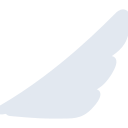

# ethiopianairlines

[← Back to main README](../../README.md)





## 16 px

### black
```
https://georgegach.github.io/compatible-icons/simple-icons/ethiopianairlines/16/black.png
```

### slate
```
https://georgegach.github.io/compatible-icons/simple-icons/ethiopianairlines/16/slate.png
```

### white
```
https://georgegach.github.io/compatible-icons/simple-icons/ethiopianairlines/16/white.png
```

## 64 px

### black
```
https://georgegach.github.io/compatible-icons/simple-icons/ethiopianairlines/64/black.png
```

### slate
```
https://georgegach.github.io/compatible-icons/simple-icons/ethiopianairlines/64/slate.png
```

### white
```
https://georgegach.github.io/compatible-icons/simple-icons/ethiopianairlines/64/white.png
```

## 128 px

### black
```
https://georgegach.github.io/compatible-icons/simple-icons/ethiopianairlines/128/black.png
```

### slate
```
https://georgegach.github.io/compatible-icons/simple-icons/ethiopianairlines/128/slate.png
```

### white
```
https://georgegach.github.io/compatible-icons/simple-icons/ethiopianairlines/128/white.png
```

## 512 px

### black
```
https://georgegach.github.io/compatible-icons/simple-icons/ethiopianairlines/512/black.png
```

### slate
```
https://georgegach.github.io/compatible-icons/simple-icons/ethiopianairlines/512/slate.png
```

### white
```
https://georgegach.github.io/compatible-icons/simple-icons/ethiopianairlines/512/white.png
```

## 1024 px

### black
```
https://georgegach.github.io/compatible-icons/simple-icons/ethiopianairlines/1024/black.png
```

### slate
```
https://georgegach.github.io/compatible-icons/simple-icons/ethiopianairlines/1024/slate.png
```

### white
```
https://georgegach.github.io/compatible-icons/simple-icons/ethiopianairlines/1024/white.png
```

## 16 px in base64

### black
```
data:image/png;base64,iVBORw0KGgoAAAANSUhEUgAAABAAAAAQCAYAAAAf8/9hAAAABmJLR0QA/wD/AP+gvaeTAAAA9ElEQVQ4jcXRO0oEQRSF4W/GV2BgZCJiKIibcBO6BEEDcxdgrIiZCzAQdAFmxoqhGBkIgvNw8K00TRvUDYrGGcYx8EInVf2fc+4p/nG2cDkqvI023kaBd9BFhc5vwAYO0Qu4wu2w8BhO8ZLB79gbBp7BOT4yuIujEB44S7hBGWCBRzxjE5oD4FWcYVHav4VPTMZ9qx/YxK70TBUeIn5e3lU/8wVcSAW1w7GdgV+4xlwdbGBDKucpHDsBlbjHawiv5+B47HiC5XAos68IwSlMSwXe1d2LWsRe7F1m51XABz9FX8Ea5jErtTyR/VNG/H0c1wX+PN8l3lJDIHAjsAAAAABJRU5ErkJggg==
```

### slate
```
data:image/png;base64,iVBORw0KGgoAAAANSUhEUgAAABAAAAAQCAYAAAAf8/9hAAAABmJLR0QA/wD/AP+gvaeTAAABmElEQVQ4jaWSPWuTcRTFf+f/JG1QMaEmlIKGDlpQR/Eb6OSqTgVXXRzc/ACOIjj6BRyUojgIOvoB7OLoS03IW+nTvFhsXp7/cUgEC1prvOOF87v3nHvhP0vzCrcau3cl3ZoLUG/170fiPfCxfwbUW90HmX1b0hKwkzuq0Lbq7d6TKK4LlWbtwZEAtpNau/sccQXrxLTJdyV6+VcLH9O0mB8nrxx9WaIwA6aS3pxZLq4fusGXxuB8GGYvFHwWEQQTiwFSHvROUhb+JN5q7twISfYWsWYjQcdiH3sBQ5A78Js/sB1q2/2HZF5HlI06wicR+5jS1D6b1eXiJUnxgIVGI61+bfU2JF+Qwp7xMOBgKGAKwMjmk3Lja5IiQJhN1edmemcSwnvEOQgyFrBoWEJuAnuILAnJo2ql0vg5NFff7q/V2t2NROGiYQjOgMwmkzQG97AWgeOYdOJY+3XrnGP8AMrZBgUhRjIjRBkcgDLTtHZj9NPVldLrAwCir0Z0M8BpcAVYMM4D7VlgmRS+OU4er66cenbY2eeqH9EYuodgLeHrAAAAAElFTkSuQmCC
```

### white
```
data:image/png;base64,iVBORw0KGgoAAAANSUhEUgAAABAAAAAQCAYAAAAf8/9hAAAABmJLR0QA/wD/AP+gvaeTAAABCUlEQVQ4jcXRO0pDQRiG4XcSL4WFlY2IZUDchJvQJQha2LsAa4PYuQALQRdgZ61YipWFIJjLCdEYEw6H18IBx+MtxsIPpptn/plv4L+ibqkX4+Jttak+jYN31Lavaf0GBvVA7fiWm1FxVT1RHxPcV+uj4Fn1TH1OcFs9VKs/4SX1Wi0izNVMfVA3ASrf4FXgFKgBAWgAA2Aqbml8BSvqbvwm1ft4/bS8S/XjcHVRPY8FNdVBcpDqUL1S58swqBuxnG6c2IqoUO/UXjx4PbUTag04BpaBIVAkKwe6wDQwA2TAbXl6XrpiJ7678H0ydb/87KCuAGvAAjAXW55M9hRAD9gLIRx92vxf8gJxo1ZQh7hdcAAAAABJRU5ErkJggg==
```

