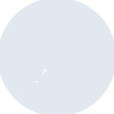

# exordo

[← Back to main README](../../README.md)





## 16 px

### black
```
https://georgegach.github.io/compatible-icons/simple-icons/exordo/16/black.png
```

### slate
```
https://georgegach.github.io/compatible-icons/simple-icons/exordo/16/slate.png
```

### white
```
https://georgegach.github.io/compatible-icons/simple-icons/exordo/16/white.png
```

## 64 px

### black
```
https://georgegach.github.io/compatible-icons/simple-icons/exordo/64/black.png
```

### slate
```
https://georgegach.github.io/compatible-icons/simple-icons/exordo/64/slate.png
```

### white
```
https://georgegach.github.io/compatible-icons/simple-icons/exordo/64/white.png
```

## 128 px

### black
```
https://georgegach.github.io/compatible-icons/simple-icons/exordo/128/black.png
```

### slate
```
https://georgegach.github.io/compatible-icons/simple-icons/exordo/128/slate.png
```

### white
```
https://georgegach.github.io/compatible-icons/simple-icons/exordo/128/white.png
```

## 512 px

### black
```
https://georgegach.github.io/compatible-icons/simple-icons/exordo/512/black.png
```

### slate
```
https://georgegach.github.io/compatible-icons/simple-icons/exordo/512/slate.png
```

### white
```
https://georgegach.github.io/compatible-icons/simple-icons/exordo/512/white.png
```

## 1024 px

### black
```
https://georgegach.github.io/compatible-icons/simple-icons/exordo/1024/black.png
```

### slate
```
https://georgegach.github.io/compatible-icons/simple-icons/exordo/1024/slate.png
```

### white
```
https://georgegach.github.io/compatible-icons/simple-icons/exordo/1024/white.png
```

## 16 px in base64

### black
```
data:image/png;base64,iVBORw0KGgoAAAANSUhEUgAAABAAAAAQCAYAAAAf8/9hAAAABmJLR0QA/wD/AP+gvaeTAAABXklEQVQ4jXXT3U4UQRAF4I+dBYkCA0bEB/Ad9Mr4c+GzkXBHvPMhfJ8lgUTxb3f9ycLugrDrxZyBdoKVVKamu09VndPV/GvbeIcBvmGKOa7xEe9R+4+9wHd8xrLwa8yKeISXd4G/5tDvDvgcw/wP8SNFXrfghzgpQIsinmOCcbq4SNIljrFV4QBvsJKEyyL+GdAu/sTXs7eFPTjqcB4XVcbxYURddvyoj82OHtN0UBeUKjzqCofNftFSa70kmRWg1TvANwlWcaZRew8b4V1jLetrBWiiEfcSdS8LG2n7DPc1ok3C/UEOn+JXKNehtehp7h0ep/0+rvK9V1RdSbLWnmBU4Smedbj2ok0/emyncpX9SiPuB2mnncJp4kV4zjWzcJX9kdsrPMFO287bYvM8idqDwyI+jcAzxSi39gpfNENUzv5lQO3bGOB5F9zaOvbxSfMyL9w+6QEONSN8Y38BoX6F2SfYTmMAAAAASUVORK5CYII=
```

### slate
```
data:image/png;base64,iVBORw0KGgoAAAANSUhEUgAAABAAAAAQCAYAAAAf8/9hAAAABmJLR0QA/wD/AP+gvaeTAAACFElEQVQ4jV2QvU7TYRjFf+fpFxZrSQsIRCGGOBtvgKiD3oBODibegqOTMa5ehoNxVxbDFbg7KApCUD5KaQVa2vc4/P/V1jO8efLkPc/5EGPYbLVmdK5XId03viK7hiLAJcSuzHq/nJ6tNhrtEUejYWu3s0YM3kEMwItjdxOoD54yJKHW0PHwxmJtAyAAvv7qrDmGb0FzlqcnyZwbdwFkHdmOQgze/Ng7vgeg7e12I5XSJ6GVnOSRM1s9KV0I9Q1VUEgu2oTxt34p3QoX/RJ0fUzVoyfkE6SuoQFYuGdnroWWKxfxOpAeKI+S4xhIyo4UMGXgQNAx1Mb+BehOWBNLEKeYNigZLBiCwzDPfzDUithTk1sH0iniTNZsspGilCeb1LJrEVACd0E/8/VlQRkzCy4jLjIjf1U7mH3jHcQwQJ2MZAl3JVUNc+AOsC+YBvURO8CxoGZUFypYSpGS2/nleZuwXQQGFkVDJavFHSwhpgGU+VmQdRDg9/9CqZpPRZl6ZISuoQlewpTyIGUgQdrQl6Ojeqkfn4GrmDNLJ8LzmH7e1Jmkmk0BOASamWN/p6fbsdpotEnDJ9iHiEvCNfA5ooKoCAY5GVAP1MecF9DTlZWZVgAsLzXXAx4Be5gp4Hde+YGlOmRuJBbAW8Oh7l5bmPmY9TOGzU1PRbX9IvBjJ5UNdclDWyFpG6cPvXJ6frPZPBlx/gCxb/zpXfZV+QAAAABJRU5ErkJggg==
```

### white
```
data:image/png;base64,iVBORw0KGgoAAAANSUhEUgAAABAAAAAQCAYAAAAf8/9hAAAABmJLR0QA/wD/AP+gvaeTAAABaUlEQVQ4jW2Ty04UURRFV7dFQxAo8IHOjf/gyKgTv82xccZ/OPU/WiOJ4oNuUYR+EaqXA3fppVInqdxd5559HvfuC4Wp++obdax+V+fqUm3UT+qRWtNn6lP1VP3iTWvURYGn6rM+8rcEnXfIM3WS/4l6liIvWvId9bggrQu8VC/UH+lilaSqH9U9MnNTkEp8qn4Nnqu/O3FHA/U98KiY6AzYB4bBAOt8h52j+1ABux3nHBgANWCIt4B7PWe/WwFbHecwSRYFaaP36pJgA7gEZsADYAdYpYNR/KOCdAEsgSugHsaxk7YvgW3gfvwT4HaCT4BfGbnOWOshcJ7Mh2m/Aq6zbhZVB0nW2kNgWgFvgcdxbmetUqVJV3c7s4/4e7jvUOtChfPgdUS0VH+q19mfFjo4Vg8AUF8Wm7Mkam1S4JOocfFPyq2pz6O6xpvavwqpVd9YfdJzpaBuqa/Uz5Hxyv9Peqy+VvdKzh9nyPCGOo+WuwAAAABJRU5ErkJggg==
```

