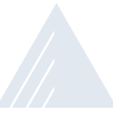
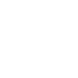

# exoscale

[← Back to main README](../../README.md)

<table><tr>
  <td></td>
  <td></td>
  <td></td>
</tr></table>

## 16 px

### black
```
https://georgegach.github.io/compatible-icons/simple-icons/compat/exoscale/16/black.png
```

### slate
```
https://georgegach.github.io/compatible-icons/simple-icons/compat/exoscale/16/slate.png
```

### white
```
https://georgegach.github.io/compatible-icons/simple-icons/compat/exoscale/16/white.png
```

## 64 px

### black
```
https://georgegach.github.io/compatible-icons/simple-icons/compat/exoscale/64/black.png
```

### slate
```
https://georgegach.github.io/compatible-icons/simple-icons/compat/exoscale/64/slate.png
```

### white
```
https://georgegach.github.io/compatible-icons/simple-icons/compat/exoscale/64/white.png
```

## 128 px

### black
```
https://georgegach.github.io/compatible-icons/simple-icons/compat/exoscale/128/black.png
```

### slate
```
https://georgegach.github.io/compatible-icons/simple-icons/compat/exoscale/128/slate.png
```

### white
```
https://georgegach.github.io/compatible-icons/simple-icons/compat/exoscale/128/white.png
```

## 512 px

### black
```
https://georgegach.github.io/compatible-icons/simple-icons/compat/exoscale/512/black.png
```

### slate
```
https://georgegach.github.io/compatible-icons/simple-icons/compat/exoscale/512/slate.png
```

### white
```
https://georgegach.github.io/compatible-icons/simple-icons/compat/exoscale/512/white.png
```

## 1024 px

### black
```
https://georgegach.github.io/compatible-icons/simple-icons/compat/exoscale/1024/black.png
```

### slate
```
https://georgegach.github.io/compatible-icons/simple-icons/compat/exoscale/1024/slate.png
```

### white
```
https://georgegach.github.io/compatible-icons/simple-icons/compat/exoscale/1024/white.png
```

## 16 px in base64

### black
```
data:image/png;base64,iVBORw0KGgoAAAANSUhEUgAAABAAAAAQCAYAAAAf8/9hAAAABmJLR0QA/wD/AP+gvaeTAAABD0lEQVQ4jZ3SSytFYRjF8d9xZILCxCUGPoGSCRliYuZLMPdlKFMpZgZGYuI2kaIoci/33BIp2gb7OdHp7MOx6qld7/NfrXe9m/Jqi/m3FmL+pV484A19lcI5bOMOSXznKjEYxStOw+AFY3+F63AS8HoYJDiOs181Ib33jLSDgsEHJn+DO3GNXez57qAwF7GTqWU8YS5SHBQZJFjKggfxjDWcSe+8UcLgHkPFcD4iX2FR+gLTkabYIInd6gII4xjBCnpwjnbUoLZE2lq8YxUaAjjCZkScjQ72MxIk0mduzGMK3VFOL7bQhUfpD9SS0Vk9OnJR3OGPxR30Yx7DqMowgM8cBnCJVtygKaBbNJeBwReCN1wtp3YQCgAAAABJRU5ErkJggg==
```

### slate
```
data:image/png;base64,iVBORw0KGgoAAAANSUhEUgAAABAAAAAQCAYAAAAf8/9hAAAABmJLR0QA/wD/AP+gvaeTAAABrElEQVQ4jZWTTW+MYRSGr/t5R1ViUcX0I8RUEBaiSRcMNhIsiL/Bmt/BwseCBD/C2rohVlJdNu28w3TmHc1M2umXep/bwvd0ZsJZPcm5z3Wus3hgQKXN5mTabE4OyhQGNfm65/mP141+kdCv8bGxWiZQRrryqbF68b8AthWdP8Pk4OHc+VPb+mdA+rlzW9YJ7HUApOPVrHOnV3YXNcuy/Zv50AdhIdWACwDGS/vCztlisdgZaLAVh+4LxlCYFZz+Y9PRzVh4MNBgqd6eStCbaK8ESbYPIw7+Tng5okul8ZHFngbBfml5OATmDSUFWl37JhJ40fOESqN9TUEzNvOOnLdj3ZGVbmXb02mtff0vgO0E8yhGNgJsAIekMGv5TDcA6YDEQ9uFX4BqtnZXUAryO8M5ywu2ZwLa3gUALI6l2do9AC22WiPJFnOGHQW1BFPAa1u3JKq2T/aCyE7jF02HwnZ4gjSaJOGtzCnMe+MyuBbzuN5r+LuFjrDXj1Wpt1aRFmSNGxCeA1/GeiVx07jvfzHKVWm0rxLzZUIyEYgZUaO5FBJiMyqM9Rv+Wd8AtYfJ4pnGxLYAAAAASUVORK5CYII=
```

### white
```
data:image/png;base64,iVBORw0KGgoAAAANSUhEUgAAABAAAAAQCAYAAAAf8/9hAAAABmJLR0QA/wD/AP+gvaeTAAABI0lEQVQ4jZ2RPS+DYRiFr7eMHbCgkdDFSmKQihGLH8LKX2HgB4iEzdBJGEXEoEIT4iuSqu8QH5GQy9Cn8Yb2pa71ec65z31uSEDNqJmkP4moeTX/X3FOvVdf1aFGxZFaUG+sUFCjRgwm1Bf1LBg8qZN/FafV0yDe8IsTNf0Xg7mw92LooMq7Ov+bOKteqvtqMdZBlZKaTTJYVx/U5ZDi0J+sxTWpmHgUGAD2gEGgDNzWmNOvjn2f3BQil9XVcIGFkKYWRbU5nmAK6AG2gD7gKKR5q7NtNzBdnd6inqvH6rZ6py6FDg7qJNDKmVtTwCzQBmwCvcAOkANKwHPdxqELmInUxxC5IzzsAsPACjAeL7oGH5E6AlwAncBVSJMCroH2BDEAn9E8YxbYi6ekAAAAAElFTkSuQmCC
```

